# 快速开始

<!-- tabs:start -->

#### **Windows**

1. 将相机安装在一个合适的固定装置中，例如相机支架。

   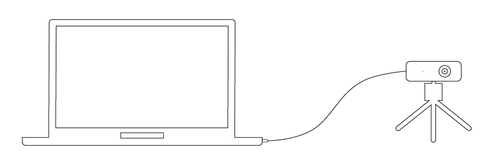

2. 通过多功能线为相机提供 12~24V 电源（典型值：12V 3A）。部分型号可选用 PoE+供电模式，具体请参考产品规格书。

3. 设置主机 IP 地址与相机在同一网段，设备默认 IP 为 **192.168.1.101**。

   设置 Windows 端的**本地连接**，子网掩码设为 255.255.255.0，IP 地址设为同一网段（如 192.168.1.100）。

   <div class="center">

   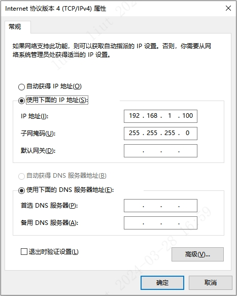

   </div>

   **注意：**

   ① 主机端使用的网卡、路由器、交换机都要满足**千兆**要求。

   ③ 当使用多个网卡时，需要设置不同的 IP 网段。当多个网卡被配置为相同的 IP 地址段时，这会导致网络冲突和连接问题。在这种情况下，如果主机与相机之间的连接中断，由于 IP 地址冲突，其他设备也可能无法与主机建立或维持连接。为了避免这种情况，每个网卡应该被分配不同的 IP 网段，确保网络中的每一台设备都能稳定地通信。

4. 用户可通过下述链接下载 **ScepterGUITool**：

   <https://github.com/ScepterSW/ScepterGUITool>

   镜像加速地址：<https://gitee.com/ScepterSW/ScepterGUITool>

   ScepterGUITool 包含 ScepterGUITool 可执行文件及相关动态链接库。

   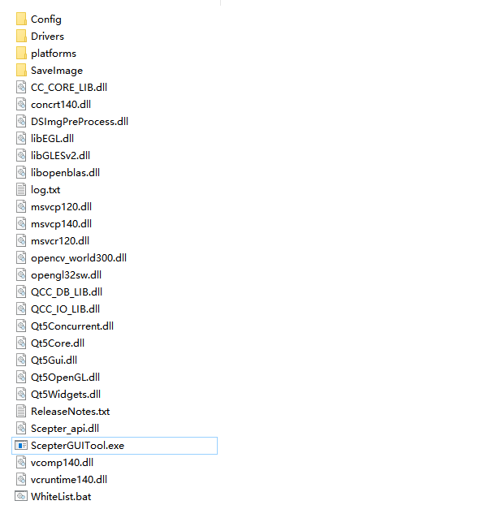

5. 双击 ScepterGUITool 可执行文件，运行 ScepterGUITool，按照以下步骤连接设备：

   ① 搜索设备

   ② 选中设备的 SN

   ③ 点击 Open 打开设备，或者双击设备 SN 打开设备

   

   ② 在首次运行 ScepterGUITool 时，要为程序设置通过系统防火墙的权限，如下图所示。

   <div class="center">

   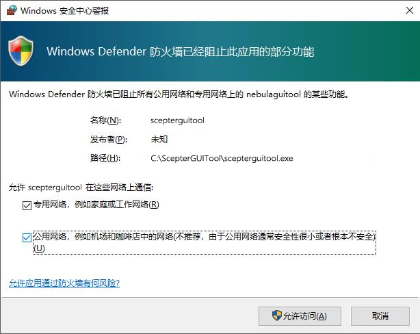

   </div>

   ③ 打开成功后，图像在右侧正常显现。

6. 您可以参考[**Scepter 图形化工具介绍**](/zh-cn/ScepterGUITool/Overview.md)了解相机的详细功能，开始探索相机。

#### **Ubuntu**

1. 将相机安装在一个合适的固定装置中，例如相机支架。

   

2. 通过多功能线为相机提供 12~24V 电源（典型值：12V 3A）。部分型号可选用 PoE+供电模式，具体请参考产品规格书。

3. 设置主机 IP 地址与相机在同一网段，设备默认 IP 为 **192.168.1.101**。

   设置 Linux 端的**本地连接**，子网掩码设为 255.255.255.0，IP 地址设为同一网段（如 192.168.1.100）。

   <div class="center">

   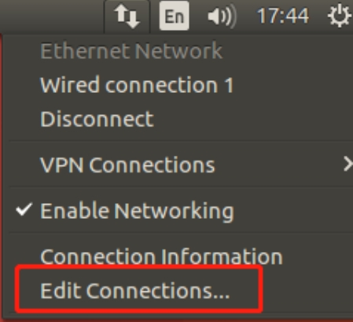

   </div>

   <div class="center">

   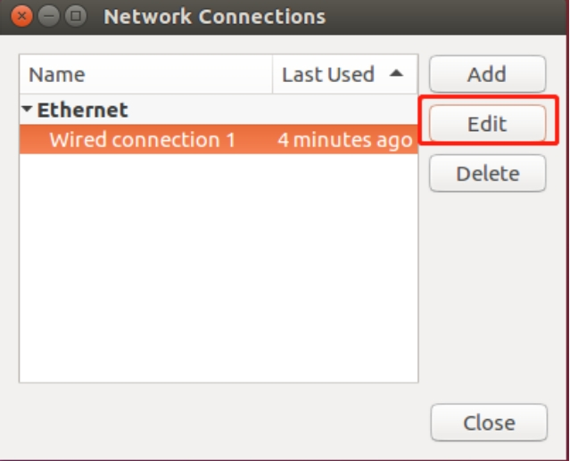

   </div>

   <div class="center">

   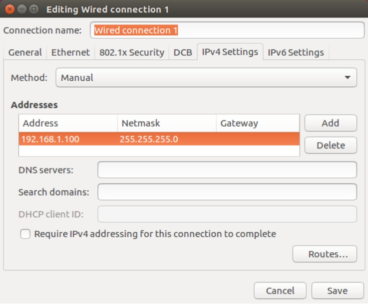

   </div>

   **注意：**

   ① 主机端使用的网卡、路由器、交换机都要满足**千兆**要求。

   ② 当使用多个网卡时，需要设置不同的 IP 网段。当多个网卡被配置为相同的 IP 地址段时，这会导致网络冲突和连接问题。在这种情况下，如果主机与相机之间的连接中断，由于 IP 地址冲突，其他设备也可能无法与主机建立或维持连接。为了避免这种情况，每个网卡应该被分配不同的 IP 网段，确保网络中的每一台设备都能稳定地通信。

4. 用户可通过下述链接下载 **ScepterGUITool**，

   ScepterGUITool 支持 Ubuntu18.04(x86/x64) 及以上操作系统：

   <https://github.com/ScepterSW/ScepterGUITool>

   镜像加速地址：<https://gitee.com/ScepterSW/ScepterGUITool>

   ScepterGUITool 包含 ScepterGUITool 可执行文件，用户手册文档及相关动态链接库。

   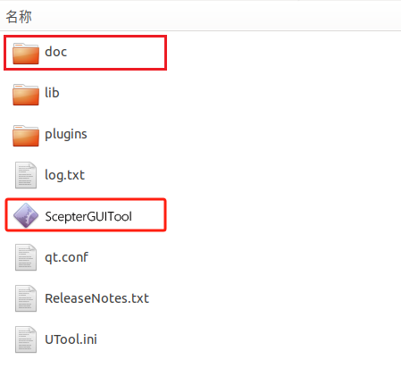

5. 双击 ScepterGUITool 可执行文件，运行 ScepterGUITool，按照以下步骤连接设备：

   ① 搜索设备

   ② 选中设备的 SN

   ③ 点击 Open 打开设备，或者双击设备 SN 打开设备

   

   ② 打开成功后，图像在右侧正常显现。

6. 您可以参考[**Scepter 图形化工具介绍**](/zh-cn/ScepterGUITool/Overview.md)了解相机的详细功能，开始探索相机。

#### **ARM-Linux**

1. 将相机安装在一个合适的固定装置中，例如相机支架。

   

2. 通过多功能线为相机提供 12~24V 电源（典型值：12V 3A）。部分型号可选用 PoE+供电模式，具体请参考产品规格书。

3. 设置主机 IP 地址与相机在同一网段，设备默认 IP 为 **192.168.1.101**。

   设置 ARM-Linux 端的**本地连接**，子网掩码设为 255.255.255.0，IP 地址设为同一网段（如 192.168.1.100）。可选用numtui进行设置。

   ```consle
   sudo numtui
   ```
   <div class="center">

   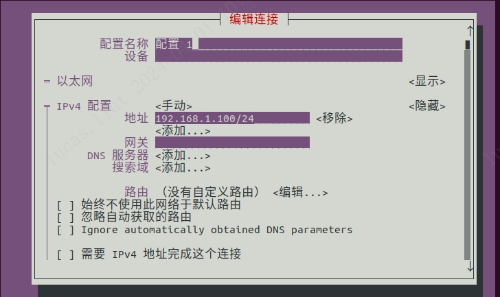

   </div>

   **注意：**

   ① 主机端使用的网卡、路由器、交换机都要满足**千兆**要求。

   ② 当使用多个网卡时，需要设置不同的 IP 网段。当多个网卡被配置为相同的 IP 地址段时，这会导致网络冲突和连接问题。在这种情况下，如果主机与相机之间的连接中断，由于 IP 地址冲突，其他设备也可能无法与主机建立或维持连接。为了避免这种情况，每个网卡应该被分配不同的 IP 网段，确保网络中的每一台设备都能稳定地通信。

4. ARM-Linux 端常用 headless 模式，用户可通过下述链接下载 **ScepterSDK**探索相机，

   <https://github.com/ScepterSW/ScepterSDK>

   镜像加速地址：<https://gitee.com/ScepterSW/ScepterSDK>

   ScepterSDK 包含一系列友好的 API ，应用示例程序及相关动态链接库。

   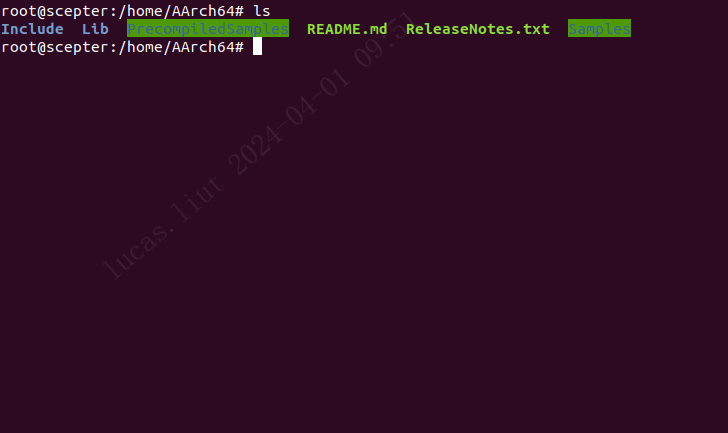

5. 进入 AArch64/PrecompiledSamples 文件夹，使用终端打开对应相机的预编译好的程序：

   ```consle
    cd PrecompiledSamples
    ./XXXX_OpenCVSample
   ```

   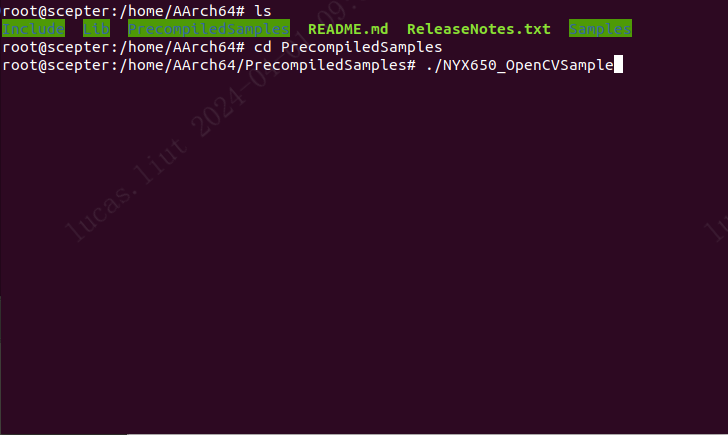

6. 您可以参考[**Scepter 软件开发包介绍**](/zh-cn/ScepterSDK/Overview.md)了解相机的详细功能，开始探索相机。

<!-- tabs:end -->

<style>
.center
{
  width: auto;
  display: table;
  margin-left: auto;
  margin-right: auto;
}
</style>
