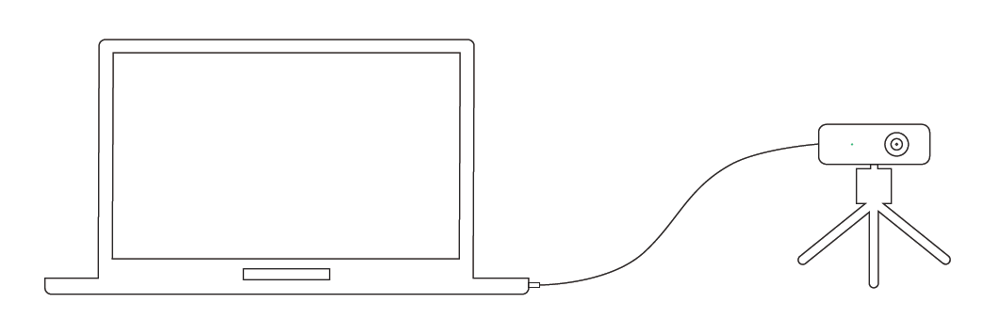

# 快速开始<!-- {docsify-ignore} -->

## 1 操作指南

1. 通过电源线或多功能线给相机提供 12~24V 电源（典型值：12V 3A）。

   **备注：** DS87/DS77 Pro/DS77C Pro 支持 PoE+供电模式。

   **推荐的 PoE+供电器**

   | 供应商  | 型号        |
   | :------ | :---------- |
   | H3C     | EWPAM2NPoE+ |
   | TP LINK | TL-PoE+170S |

2. 通过以太网线/航插网线将相机连接至主机。
   
3. 设置主机 IP 地址与相机在同一网段，设备默认 IP 为 **192.168.1.101**，可以通过 NebulaGUITool 更改相机的 IP 地址：

<!-- tabs:start -->

#### **Windows**

设置 Windows 端的**本地连接**，子网掩码设为 255.255.255.0，IP 地址设为同一网段（如 192.168.1.100）。

**注意：**

1、PC 端使用的网卡、路由器、交换机都要满足**千兆**要求。

2、在首次运行 NebulaGUITool 时，要为程序设置通过系统防火墙的权限，如下图所示。

#### **Linux**

设置 Linux 端的**本地连接**，子网掩码设为 255.255.255.0，IP 地址设为同一网段（如 192.168.1.100）。

**注意：**

PC 端使用的网卡、路由器、交换机都要满足**千兆**要求。

<!-- tabs:end -->

4. 运行 NebulaGUITool，扫描并连接相机；
5. 按照 NebulaGUITool 与 NebulaSDK 使用指导，开始探索相机。

## 2 下载链接

用户可通过下述链接下载 **NebulaGUITool** 与 **NebulaSDK**

**NebulaGUITool:** <https://gitee.com/Vzense/NebulaGUITool>

**NebulaSDK:** <https://gitee.com/Vzense/NebulaSDK>
