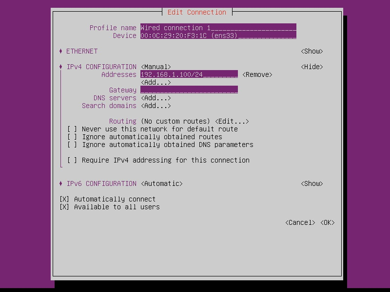
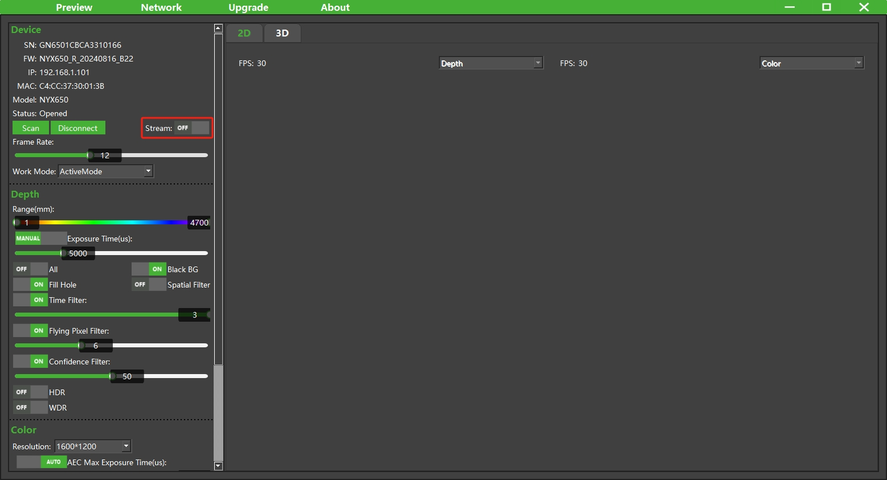

## 1. 设备连接<!-- {docsify-ignore-all} -->

1. 将相机安装在一个合适的固定装置中，例如相机支架。


2. 通过多功能线为相机提供 12~24V 电源（典型值：12V 3A）。部分型号可选用 PoE+供电模式，具体请参考产品规格书。

3. 通过以太网电缆将产品连接到主机。此时设备处于以太网广播无连接建立的状态，侧面用于显示相机的状态的 LED 指示灯会呈**蓝色**并且反复闪烁。


4. 设置主机 IP 地址与相机在同一网段，设备默认 IP 为 **192.168.1.101**。

<!-- tabs:start -->

#### **Windows**

设置 Windows 端的本地连接，子网掩码设为 255.255.255.0，IP 地址设为同一网段（如 192.168.1.100）。

<div class="center">


</div>

<div class="center">


</div>

<div class="center">


</div>

<!-- <div class="center">


</div> -->

#### **Ubuntu**

设置 Linux 端的本地连接，子网掩码设为 255.255.255.0，IP 地址设为同一网段（如 192.168.1.100）。

<div class="center">


</div>

<div class="center">


</div>

<div class="center">


</div>

#### **AArch64**

设置 ARM-Linux 端的本地连接，子网掩码设为 255.255.255.0，IP 地址设为同一网段（如 192.168.1.100）。可选用 numtui 进行设置。

```consle
sudo nmtui
```

   <div class="center">



   </div>

<!-- tabs:end -->

> ① 主机端使用的网卡、路由器、交换机都要满足**千兆**要求。
>
> ② 当使用多个网卡时，需要设置不同的 IP 网段。当多个网卡被配置为相同的 IP 地址段时，这会导致网络冲突和连接问题。在这种情况下，如果主机与相机之间的连接中断，由于 IP 地址冲突，其他设备也可能无法与主机建立或维持连接。为了避免这种情况，每个网卡应该被分配不同的 IP 网段，确保网络中的每一台设备都能稳定地通信。

## 2. 打开设备

Windows 端 和 Ubuntu18.04/20.04/22.04/24.04 端用户可下载 **ScepterGUITool**探索相机，

Ubuntu16.04 端无图形化工具，AArch64 端常用 headless 模式，用户可下载 **ScepterSDK**探索相机：

 <!-- tabs:start -->

#### **ScepterGUITool**

ScepterGUITool 下载链接：

<https://github.com/ScepterSW/ScepterGUITool>

或

<https://gitee.com/ScepterSW/ScepterGUITool>

您可以通过以下两种下载方式下载 ScepterGUITool 软件：

方式一通过 git clone 下载到本地；

方式二通过下载压缩包到本地。

方式三通过下载发行版中的安装包。

<!-- tabs:start -->

#### **方式一**

① 打开下载链接，点击 Code，复制链接；

```
git clone https://github.com/ScepterSW/ScepterGUITool
```


② 打开终端，输入复制代码回车，等待下载完成。


#### **方式二**

打开下载链接，点击 Code，再点击 Download ZIP。


或通过发行版，下载最新版本。


下载链接

<https://github.com/ScepterSW/ScepterGUITool/releases> 

或

<https://gitee.com/ScepterSW/ScepterGUITool/releases>

以v24.9.2为例，点击Source code，即可下载。


#### **方式三**

通过发行版，下载最新版本。


下载链接

<https://github.com/ScepterSW/ScepterGUITool/releases> 

或

<https://gitee.com/ScepterSW/ScepterGUITool/releases>

<!-- tabs:start -->

#### **Windows**

**下载：**

以v24.9.2为例，点击 点击 ScepterGUITool_v24.9.2_windows_install.exe，即可将 ScepterGUITool安装包到本地。


**安装：**

双击xxx_install.exe进行安装，默认安装路径是**C:\Users\user.name\AppData\Roaming\ScepterGUITool**。


> 如需更改安装路径可点击Browse，选择路径后点击OK。
>
> 
>
> 如重复安装会提示已安装，可覆盖安装或者选择其他路径。
>
> 

点击Next。


点击Next。


点击Install。


点击Finish，可通过桌面快捷方式或是到安装目录下运行ScepterGUITool。


#### **Ubuntu**

**下载：**

以v24.9.2为例，点击 ScepterGUITool_v24.9.2_ubuntu_install.run，即可将 ScepterGUITool安装包到本地。


**安装：**

打开终端，进入下载目录，给run文件增加执行权限

```
> sudo chmod +x ScepterGUITool_vXX.XX.XX_ubuntu_install.run
```


```
> ./ScepterGUITool_vXX.XX.XX_ubuntu_install.run
```


安装到Home目录下的ScepterGUITool文件夹，左侧工具栏会出现应用图标。


运行ScepterGUITool，可以点击ScepterGUITool图标，或搜索栏中输入ScepterGUITool然后点击，或在安装目录下运行。


<!-- tabs:end -->

<!-- tabs:end -->

ScepterGUITool 包含 ScepterGUITool 可执行文件及相关动态链接库。

<!-- tabs:start -->

#### **Windows**


> 在首次运行 ScepterGUITool 时，要为程序设置通过系统防火墙的权限，如下图所示。
>
>  <div class="center">
>
> 
>
>  </div>

#### **Ubuntu**


<!-- tabs:end -->

双击 ScepterGUITool 可执行文件，运行 ScepterGUITool，按照以下步骤连接设备：

① 搜索设备。


② 选中需要打开的设备。


③ 点击 Connect 连接设备。


④ 设备连接成功后，点击 Stream 右侧的开关，启动相机的视频流。



⑤ 启动成功后，图像在右侧正常显现。


⑥ 此时设备处于以太网广播连接建立的状态，侧面用于显示相机的状态的 LED 指示灯会呈**蓝色**并且常亮。


您可以参考[Scepter 图形化工具介绍](/zh-cn/ScepterGUITool/Overview.md)了解相机的详细功能，开始探索相机。

#### **ScepterSDK**

ScepterSDK 下载链接：

<https://github.com/ScepterSW/ScepterSDK>

或

<https://gitee.com/ScepterSW/ScepterSDK>

您可以通过以下两种下载方式下载 ScepterSDK 开发包：

方式一通过 git clone 下载到本地；

方式二通过下载压缩包到本地。

<!-- tabs:start -->

#### **方式一**

① 打开下载链接，点击 Code，复制链接；

```
git clone https://github.com/ScepterSW/ScepterSDK
```


② 打开终端，输入复制代码回车，等待下载完成。


#### **方式二**

打开下载链接，点击 Code，再点击 Download ZIP，即可将 ScepterSDK 压缩包下载到本地。

如需在 Ubuntu 系统下使用，请确保下载后的压缩包是在 Ubuntu 系统下解压，请勿在 Windows 系统解压后复制使用。


<!-- tabs:end -->

ScepterSDK 包含一系列友好的 API ，应用示例程序及相关动态链接库。


进入 AArch64/PrecompiledSamples 文件夹，使用终端打开对应相机的预编译好的程序：

```consle
cd PrecompiledSamples
./XXXX_OpenCVSample
```


此时设备处于以太网广播连接建立的状态，侧面用于显示相机的状态的 LED 指示灯会呈**蓝色**并且常亮。


您可以参考[Scepter 软件开发包介绍](/zh-cn/ScepterSDK/Overview.md)了解相机的详细功能，开始探索相机。

<!-- tabs:end -->

<style>
.center
{
  width: auto;
  display: table;
  margin-left: auto;
  margin-right: auto;
}
</style>
