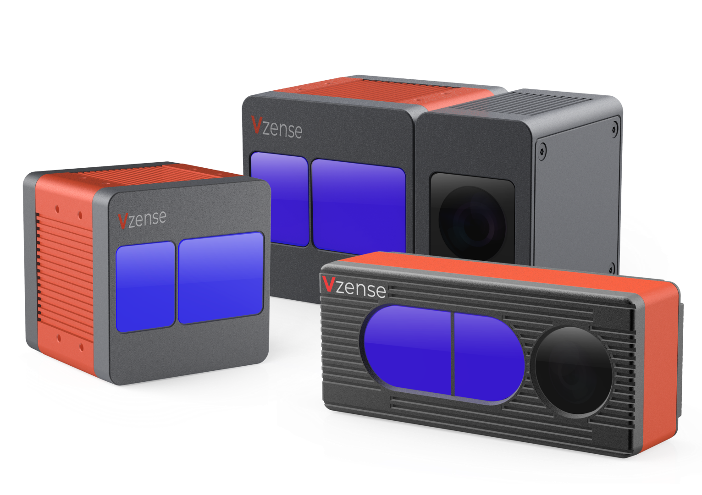

# Vzense 技术文档

青岛维感科技有限公司，成立于 2020 年 5 月，公司致力于 ToF 技术领域的产品研发和定制化方案开发。维感科技核心团队自 2016 年开始从事三维图像，计算机视觉，图像处理，传感器融合，及手势识别的研究，针对几大核心应用场景，维感科技陆续推出多款标准化工业产品，同时，结合具体应用需求，与客户协同开发了多款定制化的产品和软件。

本文档主要提供产品规格书、快速使用指南、Windows 平台图形界面工具使用指南、SDK 开发者指南、应用笔记等信息。

