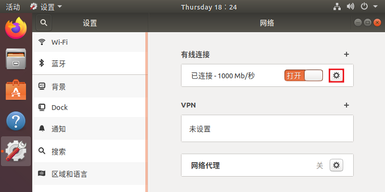

# 2. 设备连接

## 2.1. 推荐系统配置

<!-- tabs:start -->

#### **Windows**

| **配置项** |            **推荐配置**             |
| :--------: | :---------------------------------: |
|  操作系统  | Windows10 64 位 Windows11 64 位 |
|    内存    |               4g 以上               |

#### **Ubuntu**

| **配置项** |                           **推荐配置**                           |
| :--------: | :--------------------------------------------------------------: |
|  操作系统  | Ubuntu 18.04 64 位 Ubuntu 20.04 64 位 Ubuntu 22.04 64 位 |
|    内存    |                             4g 以上                              |

<!-- tabs:end -->

## 2.2. 设备连接

硬件模组安装示意图

1、通过以太网线/航插网线将相机连接至主机；

2、将电源线连接至相机，等待相机指示灯闪烁，完成设备连接。

> 网线连接分为固定 IP 地址直连与 DHCP 连接两种方式，设备默认使用固定 IP 地址方式连接，如需更改 IP 地址、子网掩码、DHCP，可以使用 ScepterGUITool 进行更改。

### 2.2.1. 固定地址

固定地址连接可以设备与电脑直连，也可以配置在同一网段的交换机中使用。

直连：一端连接设备，另一端连接 PC 主机的网线接口。设备默认 IP 为 **192.168.1.101**，在 PC 端将“本地连接”的，子网掩码设为 255.255.255.0，IP 地址设为同一网段（如 192.168.1.100）。

多个相机连接：需要注意，因为相机默认 IP 地址都为 192.168.1.101 连接同一个 PC 主机是会出现 IP 冲突，所以要更改相机的默认 IP 地址（如相机 1 的 IP 地址：192.168.1.101，相机 2 的 IP 地址：192.168.1.102），可参考[3.5. 设备网络设置](/zh-cn/ScepterGUITool/FunctionIntroduction#_35-设备网络设置)更改相机 IP。

<!-- tabs:start -->

#### **Windows**

#### **Ubuntu**

<!-- tabs:end -->

### 2.2.2. DHCP

DHCP 连接方式，需要将相机连接在开启 DHCP 功能的路由器上，使用在相同局域网中的 PC 进行连接。设置相机 DHCP 的方法，请参考 ScepterGUITool 的文档。推荐将 PC 的“本地连接”设置为自动获取 IP 地址。

<!-- tabs:start -->

#### **Windows**

#### **Ubuntu**

<!-- tabs:end -->

> 注意：PC 端使用的网卡、路由器、交换机都要满足**千兆**要求。

