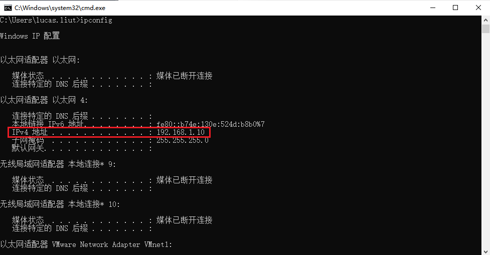

# 4. FAQ

**Q1：为什么可以搜索到网口类设备但却打不开相机？**

**A1**: 1.确认相机的连接和供电没有问题，相机的蓝色指示灯闪烁

2.查看相机 IP（默认 192.168.1.101）是否能 ping 通：

<!-- tabs:start -->

#### **Windows**

①Win+R 打开运行命令，输入'cmd'点击确定，打开命令行程序；

② 输入'ping 192.168.1.101'回车等待，即可查看相机是否 ping 通(相机默认 ip 地址为 192.168.1.101)；

③ 若无法 ping 通，打开 cmd，输入'ipconfig'查看主机端的 IP 是否和相机默认 IP 处于同一网段；

④ 若可以 ping 通，查看防火墙是否关闭，或允许工具使用公用网络和专用网络

如以上措施均不能解决问题，请用 ipconfig 指令查看 PC 端网络状态，将除与相机同一网段之外的网络禁用再次搜索设备。

#### **Ubuntu**

① 打开 Ubuntu 终端，输入'ping -c 5 192.168.1.101'回车等待，即可查看相机是否 ping 通(相机默认 ip 地址为 192.168.1.101)；

② 若无法 ping 通，打开终端，输入'ifconfig'查看主机端的 IP 是否和相机默认 IP 处于同一网段；

如以上措施均不能解决问题，请用 ifconfig 指令查看 PC 端网络状态，将除与相机同一网段之外的网络禁用再次搜索设备。

<!-- tabs:end -->

**Q2:  通过 GUI 保存的 IR 图和深度图为什么打不开？点云图如何查看？**

**A2**: ScepterGUITool 保存的 IR 和 Depth 图像是 16bit 图片数据，可以使用 ImageJ 打开查看；GUITool 保存的点云图是.txt 格式，可使用 CloudCompare 进行查看。

**Q3:  如何改善相机对黑色物体的检测**

**A3**:  可以尝试下述方法：1.将产品帧率降低（例如 5 帧），调整曝光时间到当前帧率下的最大值；2.将 Confidence 滤波阈值更改为 2 或 5
