# 3. 功能介绍

## 3.1. 目录结构

ScepterGUITool 包含 ScepterGUITool 可执行文件及相关动态链接库。

<!-- tabs:start -->

#### **Windows**


> 在首次运行 ScepterGUITool 时，要为程序设置通过系统防火墙的权限，如下图所示。
>
> <div class="center">
>
> 
>
> </div>

#### **Linux**

Open in Terminal 输入下面代码或者双击ScepterGUIToo打开。

```copy
./ScepterGUITool

```

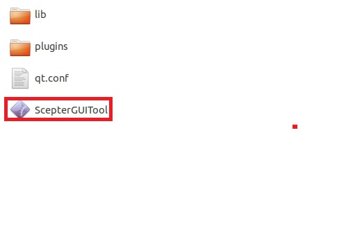

<!-- tabs:end -->

## 3.2. 设备连接管理

设备连接管理用于介绍设备的搜索与连接。本软件出于展示目的只打开一台相机；

多个软件可以支持打开多台相机，SDK 也支持多台同时工作。

<!-- tabs:start -->

#### **Windows**


#### **Linux**


<!-- tabs:end -->

### 3.2.1. 设备打开

① 连接好设备后，等待设备蓝灯闪烁，开始搜索设备。

<!-- tabs:start -->

#### **Windows**


#### **Linux**


<!-- tabs:end -->

② 选中需要打开的设备。

<!-- tabs:start -->

#### **Windows**

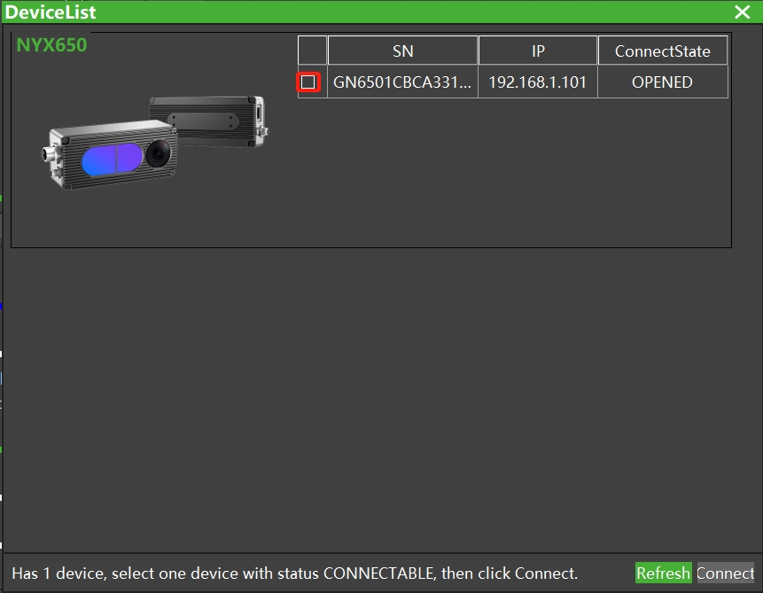

#### **Linux**


<!-- tabs:end -->

③ 点击 Connect 连接设备。

<!-- tabs:start -->

#### **Windows**

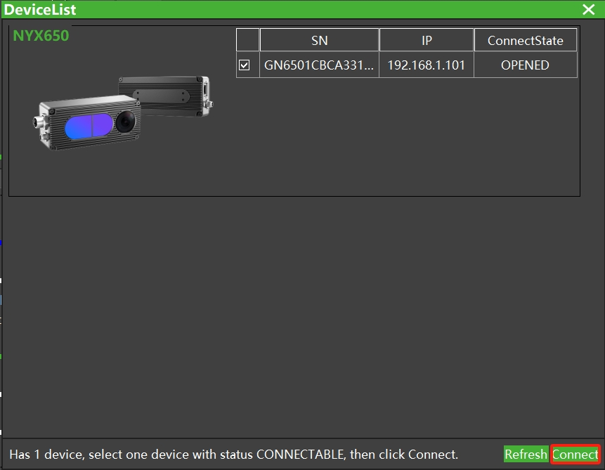

#### **Linux**


<!-- tabs:end -->

④ 设备连接成功后，点击 Stream 右侧的开关，启动相机的视频流。

<!-- tabs:start -->

#### **Windows**

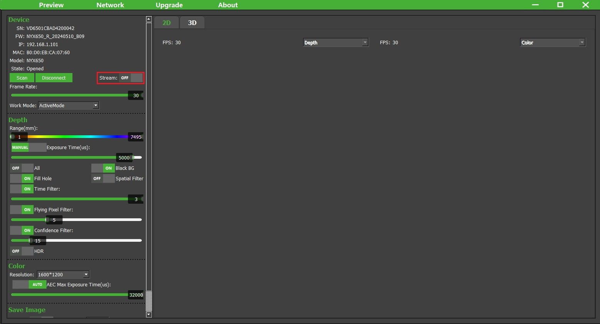

#### **Linux**


<!-- tabs:end -->

⑤ 启动成功后，图像在右侧正常显现。

<!-- tabs:start -->

#### **Windows**

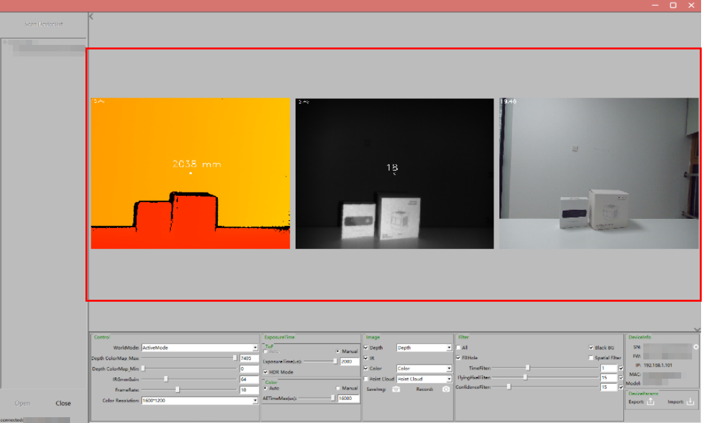

#### **Linux**

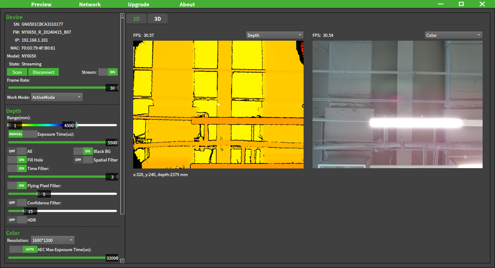

<!-- tabs:end -->

### 3.2.2. 设备信息

<!-- tabs:start -->

#### **Windows**


#### **Linux**


<!-- tabs:end -->

SN：设备序列号。

FW：设备固件版本。

IP：设备当前 IP 地址。

MAC：设备 MAC 地址。

Model：设备类型。

State：设备当前状态。

### 3.2.3. 设备关闭

<!-- tabs:start -->

#### **Windows**

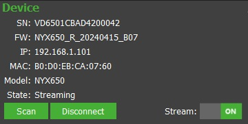

#### **Linux**

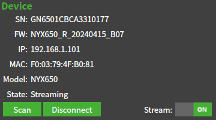

<!-- tabs:end -->

点击 Disconnect 按钮，断开 GUITool 与相机连接。

点击 Stream 右侧的开关，关闭相机的视频流。

## 3.3. 设备图像显示

设备图像显示用于介绍图像显示的方式，可以从标签页处选择 2D 图像或 3D 点云:

<!-- tabs:start -->

#### **Windows**


#### **Linux**

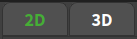


<!-- tabs:end -->

### 3.3.1. 图像显示

默认的 2D 图像从左到右依次为深度图视窗、彩色图视窗。

深度图视窗可以通过下拉选项菜单选择深度图视窗、对齐到彩色像素空间的深度图视窗。


彩色图视窗可以通过下拉选项菜单选择彩色图视窗、对齐到深度像素空间的彩色图视窗、IR（红外）图视窗。


<!-- tabs:start -->

#### **Windows**

深度图视窗下显示数值为白点处实时像素点的坐标值和深度值，深度值单位为 mm，如图该点深度值为 2894mm 。

IR 视窗下显示数值为白点处实时像素点的灰度值，如图该点灰度值为 39 。

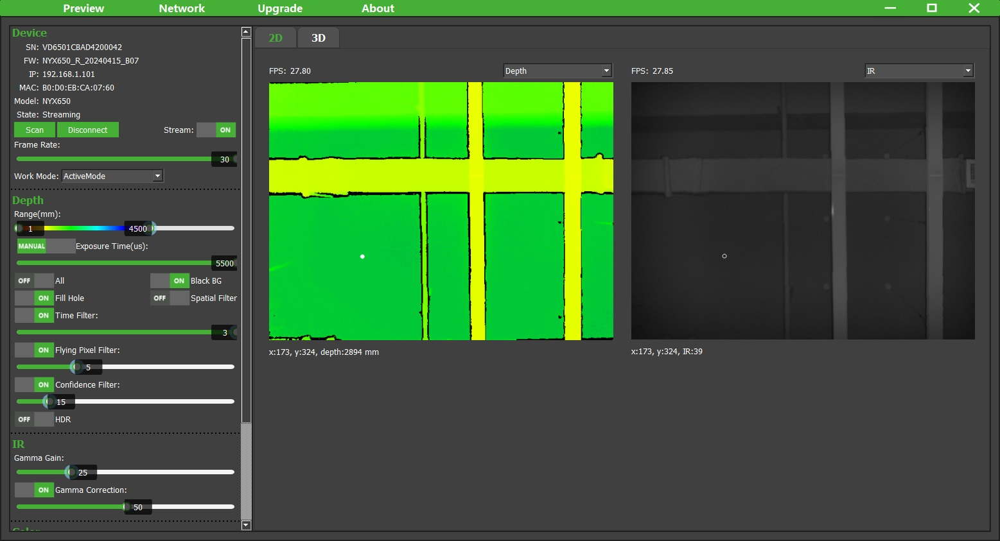

#### **Linux**

深度图视窗下显示数值为白点处实时像素点的坐标值和深度值，深度值单位为 mm，如图该点深度值为 2385mm 。

IR 视窗下显示数值为白点处实时像素点的灰度值，如图该点灰度值为 44 。

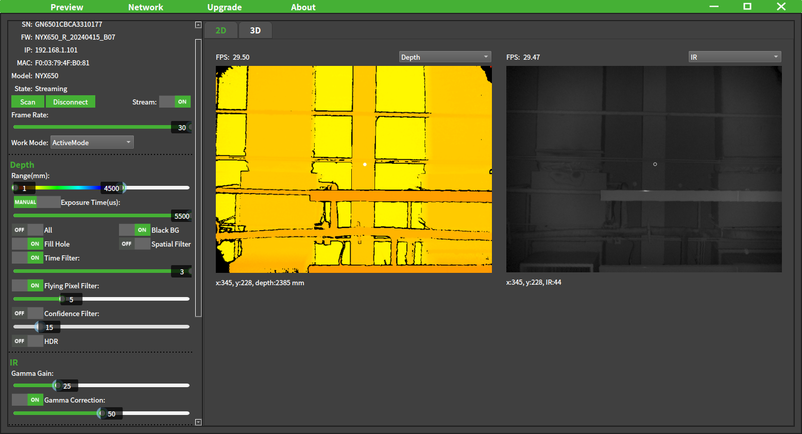

<!-- tabs:end -->

> 鼠标左键单击可自行选择白点位置，同时显示对应点的深度值和灰度值。

### 3.3.2. RGBD 对齐

**1. DepthImgToColorSensor 和 Color 的对齐**


设定 Depth 图像对齐到 Color 域的功能。启用后将输出并显示 Depth 像素点对齐到 Color 像素空间的图像，即与 Color 像素逐一对应的 Depth 图像。

#### 原理：


Tof 镜头和 Color 摄像头二者有安装距离，所以从实际采集的图像上看存在视差。

为了把深度和 Color 图像对齐，消除视差，得到一个真正的 RGB-D 图像，即物体表面的颜色和它的深度在二维图像上像素级精确对应，需要做一个转换：

首先把红外相机坐标系下的深度先换为空间点云，再通过刚性变换转换到 Color 摄像头的坐标系，并最终投影到 Color 图像的二维图像坐标系，形成一张在 Color 相机坐标系下的深度图。

<!-- tabs:start -->

#### **Windows**

|  |  |
| :---------------------------------------------------------------: | :-------------------------------: |
|                        对齐后的 Depth 图像                        |            Color 图像             |

#### **Linux**

|  |  |
| :---------------------------------------------------------------: | :-------------------------------: |
|                        对齐后的 Depth 图像                        |            Color 图像             |

<!-- tabs:end -->

**2. ColorImgToDepthSensor 和 Depth 的对齐**


设定 Color 图像对齐到 Depth 域的功能。启用后将输出并显示 Color 像素点对齐到 Depth 像素空间的图像，即与 Depth 像素逐一对应的 Color 图像。

<!-- tabs:start -->

#### **Windows**

|  |  |
| :-------------------------------: | :---------------------------------------------------------------: |
|            Depth 图像             |                        对齐后的 Color 图像                        |

#### **Linux**

|  |  |
| :-------------------------------: | :---------------------------------------------------------------: |
|            Depth 图像             |                        对齐后的 Color 图像                        |

<!-- tabs:end -->


**3. Depth 和 IR 的对齐**

除了深度图像，相机还能够输出一个分辨率为 640\*480 的 IR 图像。由于 IR 图像和深度图像出自同一 sensor，所以 IR 图像与深度图在时间和像素上都实现了严格的对齐。

<!-- tabs:start -->

#### **Windows**

|  |  |
| :-------------------------------: | :-------------------------: |
|            Depth 图像             |           IR 图像           |

#### **Linux**

|  |  |
| :-------------------------------: | :-------------------------: |
|            Depth 图像             |           IR 图像           |

<!-- tabs:end -->

### 3.3.3 点云图

从标签页处选择 3D 可以显示点云，点云默认使用深度伪彩显示。

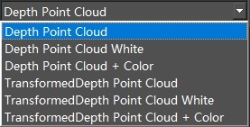

Depth Point Cloud：设定点云使用深度伪彩显示。

Depth Point Cloud White：设定点云使用白色单色显示。

Depth Point Cloud + RGB：设定点云填充 RGB 映射。

TransformedDepth Point Cloud：设定对齐到彩色像素空间的点云使用深度伪彩显示。

TransformedDepth Point Cloud White：设定对齐到彩色像素空间的点云使用白色单色显示。

TransformedDepth Point Cloud + RGB：设定对齐到彩色像素空间的点云填充 RGB 映射。

**点云控件操作：**

<!-- tabs:start -->

#### **Windows**

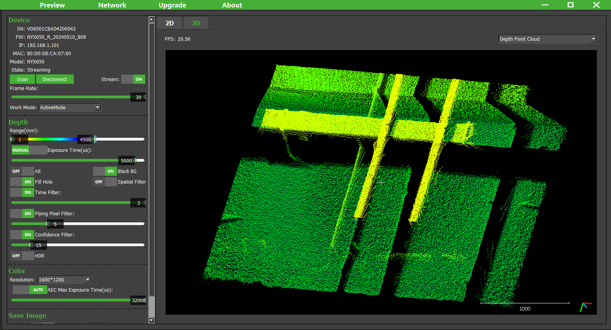

#### **Linux**


<!-- tabs:end -->

按住鼠标左键并拖动：旋转点云

按住鼠标右键并拖动：平移点云

鼠标滚轮：缩放点云

## 3.4. 设备参数操作

<!-- tabs:start -->

#### **Windows**

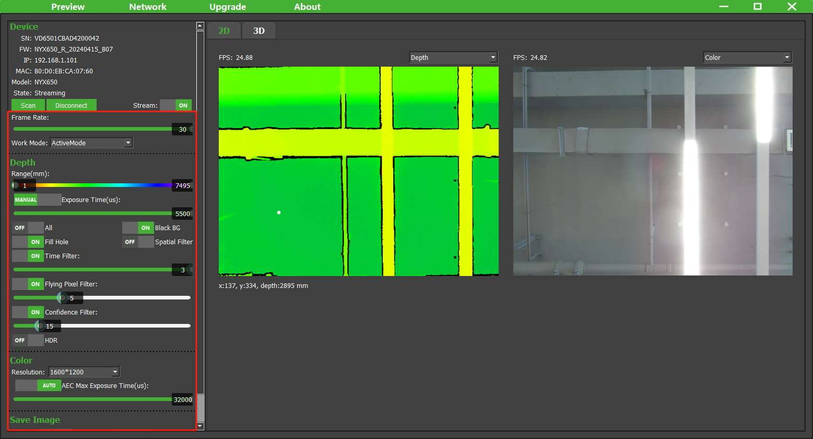

#### **Linux**


<!-- tabs:end -->

设备参数操作用于介绍控制设备的工作模式与参数，设置图像处理算法等功能。

### 3.4.1 设备帧率

通过左右滑动 Frame Rate 下方的滑块控制条可以调节相机的帧率，不同设备的最大帧率可能会有差异，请参考对应设备的产品规格书。

<!-- tabs:start -->

#### **Windows**

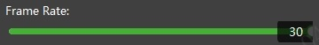

#### **Linux**


<!-- tabs:end -->

### 3.4.2 工作模式


ActiveMode：主动出图模式。

HardwareTriggerMode：硬触发模式，通过硬件信号触发出图，具体请参考对应产品规格书。

SoftwareTriggerMode：软触发模式，通过调用软件接口触发出图，单击按钮发送软触发指令。

#### 3.4.2.1 硬触发模式

<!-- tabs:start -->

#### **Windows**


#### **Linux**


<!-- tabs:end -->

开启硬触发模式后，点击 Settings 按钮可配置触发信号参数，如下图所示：

<!-- tabs:start -->

#### **Windows**


#### **Linux**


<!-- tabs:end -->


① polarity：信号有效性检测极性。0 代表低电平有效，1 代表高电平有效。

取值范围：\[0,1]

②width： 信号宽度有效性检测，小于宽度设置的信号不予响应。16-bit，单位为 μs。

取值范围：\[1,65535]

③interval： 连续信号间隔有效性检测，小于间隔设置的信号不予响应。

取值范围：\[34000,65535]

#### 3.4.2.2 软触发模式

<!-- tabs:start -->

#### **Windows**


#### **Linux**


<!-- tabs:end -->

开启软触发模式后，点击 Trigger 按钮可触发设备出图。

### 3.4.3 深度图像参数配置

#### 3.4.3.1. 伪彩色图映射

<!-- tabs:start -->

#### **Windows**


#### **Linux**


<!-- tabs:end -->

深度图采用伪彩色图映射显示，将单通道 16 位的原始深度图在范围 ColorMap_Min 至 ColoMap_Max 的深度值线性映射到 0-255 的值域范围，再将单通道 8 位的深度图映射到伪彩色空间（即色度图）COLORMAP_RAINBOW，如下示意图：


您可以通过调整 Range(mm) 下方的滑块控制条调整伪彩色图映射效果，如下图所示：

<!-- tabs:start -->

#### **Windows**


#### **Linux**


<!-- tabs:end -->

#### 3.4.3.2. ToF 曝光时间

设定 ToF 传感器的曝光模式与时间。ToF 传感器默认使用手动曝光模式，可以设定的最大曝光时间与帧率有关。

不同设备的最大帧率可能会有差异，请参考对应设备的产品规格书。

Manual：ToF 传感器设置为手动曝光，通过滑条对曝光时间进行手动调节。

<!-- tabs:start -->

#### **Windows**


#### **Linux**


<!-- tabs:end -->

Auto：ToF 传感器设置为自动曝光，设备会根据图像距离进行曝光时间调节。

<!-- tabs:start -->

#### **Windows**

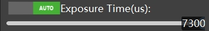

#### **Linux**


<!-- tabs:end -->

#### 3.4.3.3. 图像滤波

<!-- tabs:start -->

#### **Windows**


#### **Linux**


<!-- tabs:end -->

① **All**

开启/关闭所有滤波。

② **Black BG**

Black BG：开启/关闭黑色背景，仅用于显示效果，对实际数值无影响。效果如下：

|  |  |
| :-----------------------------------------: | :---------------------------------------: |
|                Black BG 关闭                |               Black BG 开启               |

③ **FillHole**

FillHole：数据填补，弥补部分空洞数据，默认开启。

④ **Spatial Filter**

Spatial Filter：平滑滤波，减少平面噪声与抖动。默认关闭。

|  |  |
| :-----------------------------------------------------: | :---------------------------------------------------: |
|                   Spatial Filter 关闭                   |                  Spatial Filter 开启                  |

⑤ **Time Filter**

Time Filter：时间滤波，降低图像帧间抖动。默认开启，值越大，滤波效果越强。

<!-- tabs:start -->

#### **Windows**


#### **Linux**


<!-- tabs:end -->

⑥ **Flying Pixel Filter**

Flying Pixel Filter：飞点消除滤波，消除边界的深度值飞点。默认开启，值越大，滤波效果越强。

<!-- tabs:start -->

#### **Windows**


#### **Linux**


<!-- tabs:end -->

|  |  |
| :---------------------------------------------------------------: | :----------------------------------------------------------------------: |
|                     Flying Pixel Filter 关闭                      |                       Flying Pixel Filter 值为 15                        |

⑦ **Confidence Filter**

<!-- tabs:start -->

#### **Windows**


#### **Linux**


<!-- tabs:end -->

Confidence Filter：置信度滤波，消除信号质量较差点。默认开启，值越大，信号质量要求越高。

|  |  |
| :-----------------------------------------------------------------: | :-----------------------------------------------------------------: |
|                      Confidence Filter 值为 15                      |                      Confidence Filter 值为 50                      |

⑧ **HDR Mode**

|  |    |   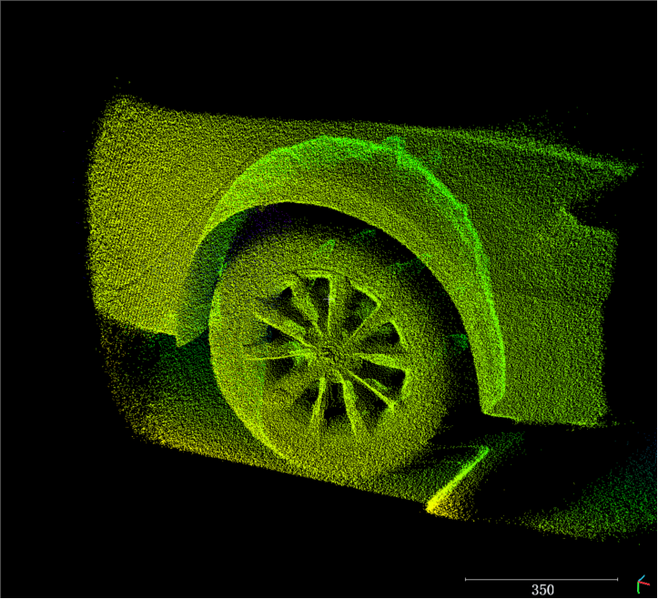 |
| :-------------------------------: | :-------------------------------------: | :-------------------: |
|           曝光时间 58us           |             曝光时间 1000us             |       HDR 模式        |

HDR(High Dynamic Range)即高动态范围功能通过设置多个不同曝光时间的方式，将采集到的多个图像合成到一帧中，完成对整个复杂场景的成像 **(参考产品介绍是否支持)** 。

### 3.4.4 IR 图像参数配置

<!-- tabs:start -->

#### **Windows**

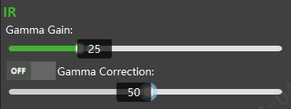

#### **Linux**

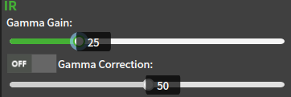

<!-- tabs:end -->

#### 3.4.4.1 Gamma Gain

设定 IR 图像的增益，通过更改传感器 Gamma 值参数调整图像亮度，表现为 Gamma Gain 值越高，IR 图像越亮。

| 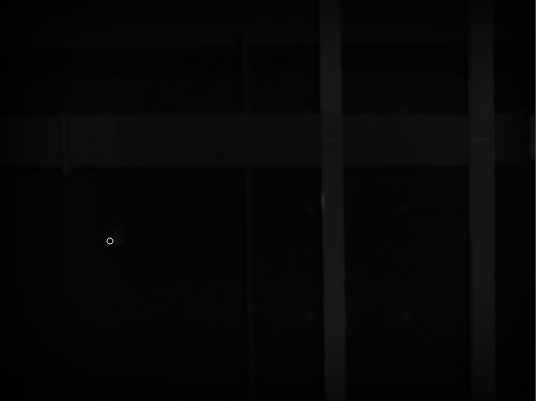 |  |
| :---------------------------------: | :-----------------------------------: |
|          Gamma Gain 值 25           |           Gamma Gain 值 100           |

#### 3.4.4.2 Gamma Correction

设定 IR 图像校正的开关和增益，通过软件后处理调整图像亮度，表现为 Gamma Correction 值越高，IR 图像越亮。

|  |  |  |
| :----------------------------------------: | :---------------------------------------------: | :-----------------------------------------------: |
|           Gamma Correction 关闭            |             Gamma Correction 值 50              |              Gamma Correction 值 100              |

### 3.4.5 彩色图像参数配置

<!-- tabs:start -->

#### **Windows**


#### **Linux**


<!-- tabs:end -->

#### 3.4.5.1. 彩色图像分辨率

<!-- tabs:start -->

#### **Windows**


#### **Linux**


<!-- tabs:end -->

彩色图像分辨率可根据实际列表显示进行切换，如上图示例的分辨率有三种：640\*480，800\*600，1600\*1200。

不同设备的彩色图像分辨率列表可能会有差异，请参考对应设备的产品规格书。

#### 3.4.5.2. 彩色图像曝光时间

设定 Color 传感器曝光模式与时间。Color 传感器的默认曝光模式为自动曝光。

**Auto:**

<!-- tabs:start -->

#### **Windows**


#### **Linux**


<!-- tabs:end -->

Color 传感器设置为自动曝光，下面会显示可以设置 AEC Max ExposureTime(us)的滑块控制条。

当相机作业时会自动调节曝光时间。

AEC Max ExposureTime(us) ：设置相机自动曝光模式下的最大曝光时间。

**Manual:**

<!-- tabs:start -->

#### **Windows**


#### **Linux**


<!-- tabs:end -->

Color 传感器设置为手动曝光，下面会显示 ExposureTime(us)和 Gain(dB)两行状态栏。

当相机作业时，需要手动调节相机曝光时间与相机 Color 图像的亮度。

ExposureTime(us)：设置 Color 相机的曝光时间，通过滑条对曝光时间进行手动调节。

Gain(dB): 设置 Color 图像的亮度，通过滑条对 Gain 值进行手动调节。

### 3.4.6. 保存图像

<!-- tabs:start -->

#### **Windows**


#### **Linux**


<!-- tabs:end -->

Record：录制当前所有显示区域的图像。如果显示区域未开启，则不会保存。录制无法保存点云。

Total Count：需要录制的图像的数量，取值范围：\[1,10000]。

Snapshot：保存一帧当前所有显示区域的图像。如果显示区域未开启，则不会保存。

> 保存的所有图像/点云会存储在同一文件夹，文件夹以当前时间命名，存放在 ScepterGUITool.exe 的同级目录下的 SaveImage 文件夹中。如下图目录所示：
>
> 

**文件格式：**

Depth 图存储格式为 16 位单通道 png 格式，数值单位 mm；

IR 图存储格式为 8 位单通道 png 格式；

Color 图存储格式为 8 位三通道彩色图，采用 JPG 格式保存；

PointCloud 数据以 txt 格式保存，每行数据表示一个点的三维坐标(Float: X, Y, Z)，单位 mm。保存后的文件可使用 CloudCompare 工具打开。

> ScepterGUITool 保存的深度图是 16bit 单通道 png 格式图像，每个 pixel 由 2 个字节表示。Windows 默认的图像显示工具只能显示 8bit 单通道的图像，所以看上去是黑色的。可以使用 Image J 来显示并查看像素距离值。

<!-- ### 3.4.7. 导出、导入参数


Export：导出通过 ScepterGUITool 设置的参数

Import：导入参数到 ScepterGUITool 中

导出的参数可以通过调用 API 函数在自编写的程序中直接使用。 -->

## 3.5. 设备网络设置

点击顶部菜单栏，弹出设备网络设置页面。


① **设置动态 IP：**

Obtain an IP address automatically(DHCP): 设置设备的 IP 地址为 DHCP 模式，由局域网内的路由器分配 IP 地址，使用该模式，主机端也需要设置为 DHCP 模式.

Step1:  选择“Obtain an IP address automatically（DHCP）”。

<!-- tabs:start -->

#### **Windows**


<!-- tabs:end -->

Step2: 点击 OK 保存。

Step3: 设备自动重启后生效。

② **设置静态 IP：**

Use the following IP address：设置设备的 IP 地址为固定地址。使用该模式，需要注意主机的 IP 地址以及子网掩码，确保主机和设备的 IP 地址在同一网段。

Step1:  选择“Use the following IP address”。

<!-- tabs:start -->

#### **Windows**


<!-- tabs:end -->

Step2:  更改 IP 地址和子网掩码。

Step3:  点击 OK 保存。

Step4: 设备自动重启后生效。

③ **设置相机 NTP 对时：**

相机默认没有开启任何对时功能，设置相机与NTP Sever对时。

Step1: 在 Time sync 一栏选择 NTP Server address。

<!-- tabs:start -->

#### **Windows**


<!-- tabs:end -->

Step2: 输入对时服务器的地址。

Step3: 点击Set设置成功。

③ **设置相机 PTP 对时：**

相机默认没有开启任何对时功能，设置相机PTP对时。

Step1: 在 Time sync 一栏选择 PTP。

<!-- tabs:start -->

#### **Windows**


<!-- tabs:end -->

Step2: 点击Set设置成功。

## 3.6. 设备固件升级

点击顶部菜单栏，进入设备固件升级设置页面。

<!-- tabs:start -->

#### **Windows**


设备固件升级操作方法：

1.  点击，选择固件镜像。

> 暂不支持中文路径

2.  点击“Upgrade”按钮，等待升级开始（升级过程中设备不可断电）。

3.  升级开始后，进度条会开始增长，增长到“100%”升级完成。

4.  提示设备重启，点击确定后设备重启并完成固件升级。

#### **Linux**


设备固件升级操作方法：

1.  点击，选择固件镜像。

> 暂不支持中文路径

2.  点击“Upgrade”按钮，等待升级开始（升级过程中设备不可断电）。

3.  升级开始后，进度条会开始增长，增长到“100%”升级完成。

4.  提示设备重启，点击确定后设备重启并完成固件升级。


<!-- tabs:end -->


## 3.7. 查看已保存图像/点云

1. 进入 ScepterGUITool 根目录下的 SaveImage 文件夹，选择想要查看的图像。

2. ScepterGUITool 保存的 Depth 和 IR 图像是 16bit 图片数据，可以使用 ImageJ 打开查看，鼠标指上去可以读出对应坐标下的深度值/IR 信号值。

   ImageJ 下载地址：<https://fiji.sc/>

   

   > 可以使用 ImageJ 中的 LUT 菜单给图片添加伪彩色，并通过菜单 Image->Adjust->Brightness/Contrast(**Ctrl+Shift+C**)进行效果的调整。

3. ScepterGUITool 保存的点云图是.txt 格式，可使用 CloudCompare 打开查看。

   CloudCompare 下载地址：<https://www.cloudcompare.org/>

   

   ScepterGUITool 保存的.txt 格式点云图，从上到下行依次为 pixel 0 至最后一个 pixel，每一行的数值依次为该 pixel 的 X,Y,Z 值(RGBD 相机保存的彩色点云依次为 X,Y,Z,R,G,B 值)，说明如下：

   ​

   ​
