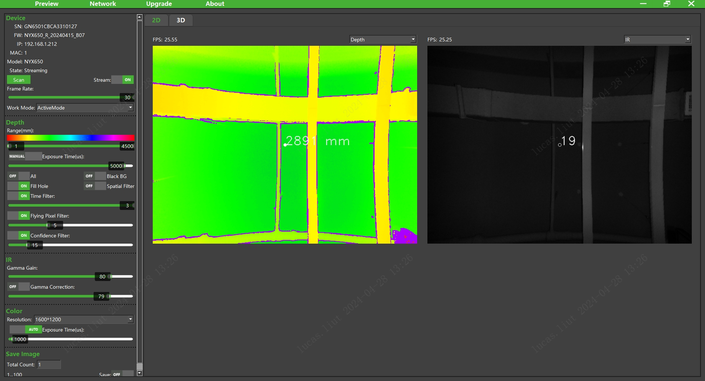

# 1. 概述



ScepterGUITool 是基于 Scepter SDK 开发的图形界面工具，提供 Depth 图像彩色映射显示、3D 点云显示、滤波参数调节、设备参数设置以及 RGB & Depth 对齐等功能，并且可以通过设置页面对设备进行 IP 地址设置与固件升级操作。

> 如果您需要同时操作多台设备，您需要为每台设备打开一个单独的 ScepterGUITool 实例。
>
> <div class="center">
>
> 
>
> </div>

ScepterGUITool 下载链接：

<https://github.com/ScepterSW/ScepterGUITool>

或

<https://gitee.com/ScepterSW/ScepterGUITool>

下面介绍两种下载方式：

<!-- tabs:start -->

#### **方式一**

也可以通过 git clone 到本地，方法如下：

Step1：打开下载链接，点击 Code，复制链接；

```
git clone https://github.com/ScepterSW/ScepterGUITool
```


Step2：打开终端，输入复制代码回车，等待下载完成。


#### **方式二**

打开下载链接，点击 Code，再点击 Download ZIP，即可将 ScepterGUIToo 工具压缩包下载到本地。


<!-- tabs:end -->

目前 ScepterGUITool 支持的产品有：

- NYX650/660

- VENO86/87

<style>
.center
{
  width: auto;
  display: table;
  margin-left: auto;
  margin-right: auto;
}
</style>
