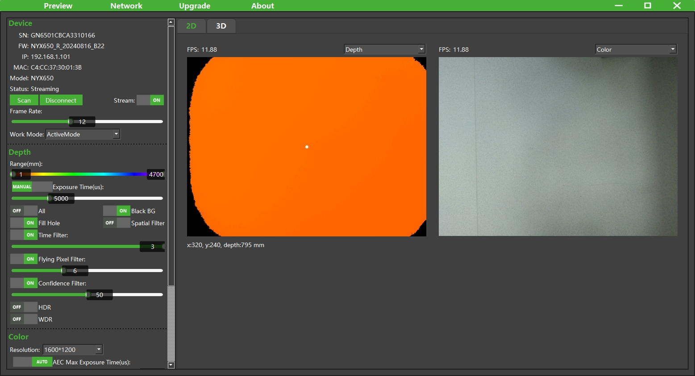

# 1. 概述



ScepterGUITool 是基于 ScepterSDK 开发的图形界面工具，提供 Depth 图像彩色映射显示、3D 点云显示、滤波参数调节、设备参数设置以及 RGB & Depth 对齐等功能，并且可以通过设置页面对设备进行 IP 地址设置与固件升级操作。

文中所述ScepterGUITool版本是**v24.10.3**


> 如果您需要同时操作多台设备，您需要为每台设备打开一个单独的 ScepterGUITool 实例。
>
> <div class="center">
>
> 
>
> </div>

ScepterGUITool 下载链接：

<https://github.com/ScepterSW/ScepterGUITool>

或

<https://gitee.com/ScepterSW/ScepterGUITool>

您可以通过以下两种下载方式下载 ScepterGUITool 软件：

方式一通过 git clone 下载到本地；

方式二通过下载压缩包到本地。

方式三通过下载发行版中的安装包。

<!-- tabs:start -->

#### **方式一**

① 打开下载链接，点击 Code，复制链接；

```
git clone https://github.com/ScepterSW/ScepterGUITool
```


② 打开终端，输入复制代码回车，等待下载完成。


#### **方式二**

通过发行版，下载最新版本。

下载链接

<https://github.com/ScepterSW/ScepterGUITool/releases> 

或

<https://gitee.com/ScepterSW/ScepterGUITool/releases>

以v24.9.2为例，点击Source code，即可下载。


#### **方式三**

通过发行版，下载最新版本。

下载链接

<https://github.com/ScepterSW/ScepterGUITool/releases> 

或

<https://gitee.com/ScepterSW/ScepterGUITool/releases>


<!-- tabs:start -->

#### **Windows**

**下载：**

以v24.9.2为例，点击 ScepterGUITool_v24.9.2_windows_install.exe，即可将 ScepterGUITool安装包到本地。


**安装：**

双击xxx_install.exe进行安装，默认安装路径是**C:\Users\user.name\AppData\Roaming\ScepterGUITool**。


> 如需更改安装路径可点击Browse，选择路径后点击OK。
>
> 
>
> 如重复安装会提示已安装，可覆盖安装或者选择其他路径。
>
> 

点击Next。


点击Next。


点击Install。


点击Finish，可通过桌面快捷方式或是到安装目录下运行ScepterGUITool。


#### **Ubuntu**

**下载：**

以v24.9.2为例，点击 ScepterGUITool_v24.9.2_ubuntu_install.run，即可将 ScepterGUITool安装包到本地。


**安装：**

打开终端，进入下载目录，给run文件增加执行权限

```
> sudo chmod +x ScepterGUITool_vXX.XX.XX_ubuntu_install.run
```


```
> ./ScepterGUITool_vXX.XX.XX_ubuntu_install.run
```


安装到Home目录下的ScepterGUITool文件夹，左侧工具栏会出现应用图标。


运行ScepterGUITool，可以点击ScepterGUITool图标，或搜索栏中输入ScepterGUITool然后点击，或在安装目录下运行。


<!-- tabs:end -->

<!-- tabs:end -->

目前 ScepterGUITool 支持的产品有：

- NYX650/660

- DS86/87

- DS77 Lite/DS77 Pro

- DS77C Lite/DS77C Pro

<style>
.center
{
  width: auto;
  display: table;
  margin-left: auto;
  margin-right: auto;
}
</style>
