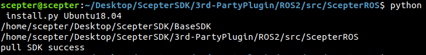
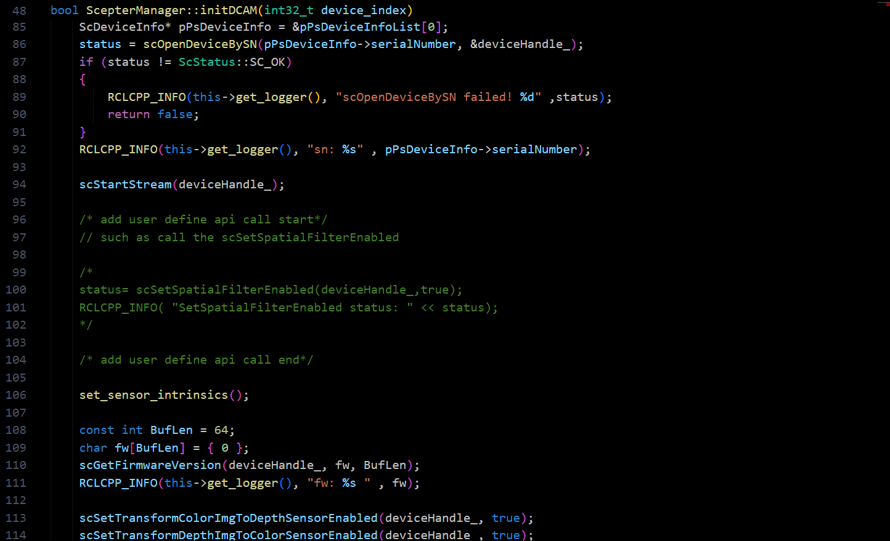

# 4.2. ROS2

该 ROS2 软件包可用于 ScepterSDK 的深度、IR 和 Color 数据的采集和处理。

## 4.2.1. 环境要求

**1. 为您的操作系统安装推荐的 ROS2 发行版(<http://wiki.ros.org/Distributions>)**

- ROS2 安装页面：<http://docs.ros.org/en/rolling/Installation.html>

- 您可以使用第三方插件 FishROS，实现快速安装 ROS：<https://github.com/fishros/install>

**2. 已验证的版本**

| 系统        | 详情            |
| ----------- | --------------- |
| Ubuntu20.04 | Foxy Fitzroy    |
| Ubuntu18.04 | Eloquent Elusor |

## 4.2.2. 安装 ROS 软件包

在 ScepterSDK 中，ScepterROS 可以用于连接单个设备，而 ScepterROS_MultiCameras 则适用于连接多个设备。

**1. 安装 ScepterSDK**

```console
git clone https://github.com/ScepterSW/ScepterSDK
```

  <div class="center">


  </div>

**2. 打开软件包**

```console
cd ROS2/src/ScepterROS
```

<div class="center">


</div>

**3. install.py**: 通过命令"**python install.py (您的操作系统)**"，可以将与您操作系统匹配的**ScepterSDK**拷贝到**dependencies**文件夹中, 这里我们以**Ubuntu18.04**为例：

```console
python install.py Ubuntu18.04
```

<div class="center">



</div>

**4. 构建 ScepterROS2 包**

如果没有安装 colcon，请先运行 cmd：

```console
sudo apt install python3-colcon-common-extensions

```

<!-- tabs:start -->

#### **ROS**

```
cd ../../
colcon build --packages-select ScepterROS
```

<div class="center">


</div>

#### **ROS_MultiCameras**

```console
cd ../../
colcon build --packages-select ScepterROS_MultiCameras
```

<div class="center">


</div>

<!-- tabs:end -->

**5.环境设置**

```console
source install/setup.bash
```

## 4.2.3. 使用方式

<!-- tabs:start -->

#### **ROS**

**1. 启动相机节点**

```console
ros2 run ScepterROS scepter_camera
```

<div class="center">


</div>

**2. 启动 Rviz 界面**

```console
ros2 run rviz2 rviz2
```

<div class="center">


</div>

<div class="center">


</div>

**3. 使用 Rviz 显示点云**

<div class="center">


</div>

<div class="center">


</div>

#### **ROS_MultiCameras**

**1. 启动相机节点**

```console
ros2 run ScepterROS_MultiCameras scepter_multicameras <nodename> <ip>
```

例如：

```console
ros2 run ScepterROS_MultiCameras scepter_multicameras cam1 192.168.1.102
```

<div class="center">


</div>

**2. 启动 Rviz 界面**

一次只能显示一个话题

```console
ros2 run rviz2 rviz2
```

<div class="center">


</div>

<div class="center">


</div>

**3. 使用 Rviz 显示点云**

一次只能显示一个话题

<div class="center">


</div>

<div class="center">


</div>

<!-- tabs:end -->

## 4.2.4. 发布的话题

<!-- tabs:start -->

#### **ROS**

Scepter_manager 发布由 [sensor_msgs](http://wiki.ros2.org/sensor_msgs) 包定义的以下话题

- /Scepter/color/camera_info
- /Scepter/color/image_raw
- /Scepter/depth/camera_info
- /Scepter/depth/image_raw
- /Scepter/depth/points
- /Scepter/depth/points/camera_info
- /Scepter/ir/camera_info
- /Scepter/ir/image_raw
- /Scepter/transformedColor/camera_info
- /Scepter/transformedColor/image_raw
- /Scepter/transformedDepth/camera_info
- /Scepter/transformedDepth/image_raw

#### **ROS_MultiCameras**

Scepter_manager 发布由 [sensor_msgs](http://wiki.ros2.org/sensor_msgs) 包定义的以下话题

- /**nodename**/color/camera_info
- /**nodename**/color/image_raw
- /**nodename**/depth/camera_info
- /**nodename**/depth/image_raw
- /**nodename**/depth/points
- /**nodename**/depth/points/camera_info
- /**nodename**/ir/camera_info
- /**nodename**/ir/image_raw
- /**nodename**/transformedColor/camera_info
- /**nodename**/transformedColor/image_raw
- /**nodename**/transformedDepth/camera_info
- /**nodename**/transformedDepth/image_raw

<div class="center">


</div>

<!-- tabs:end -->

## 4.2.5. 编程指南

如果开发者需要设置相机参数或算法开关，请参考以下流程。
以调用**scSetSpatialFilterEnabled**为例：

- 从 **/src/ScepterROS/dependencies/include/Scepter_api.h** 查找 api

<div class="center">


</div>

- 将代码添加到 **/src/ScepterROS/src/scepter_manager.cpp**

<div class="center">



</div>

<style>
.center
{
  width: auto;
  display: table;
  margin-left: auto;
  margin-right: auto;
}
</style>
