# 4.1. ROS

该 ROS 软件包可用于 ScepterSDK 的深度、IR 和 Color 数据的采集和处理。

## 4.1.1. 环境要求

**1. 为您的操作系统安装推荐的 ROS 发行版(http://wiki.ros.org/Distributions)**

- ROS 安装页面：<http://wiki.ros.org/ROS/Installation>

- 您可以使用第三方插件 FishROS，实现快速安装 ROS：<https://github.com/fishros/install>

**2. 已验证的版本**

| 系统        | 详情            |
| ----------- | --------------- |
| Ubuntu20.04 | Noetic Ninjemys |
| Ubuntu18.04 | Melodic Morenia |
| Ubuntu16.04 | Kinetic Kame    |

## 4.1.2. 安装 ROS 软件包

在 ScepterSDK 中，ScepterROS 可以用于连接单个设备，而 ScepterROS_MultiCameras 则适用于连接多个设备。

**1. 下载 Scepter ROS 包**

```console
> git clone https://github.com/ScepterSW/ScepterSDK
```

  <div class="center">


  </div>

**2. 安装 Scepter ROS SDK**

```console
> cd 3rd-PartyPlugin/ROS/src
> catkin_init_workspace
```

在运行**catkin_init_workspace**命令之后，其会在**ROS/src**文件夹下生成**CmakeLists.txt**

  <div class="center">


  </div>

<!-- tabs:start -->

#### **ROS**

```console
> cd ScepterROS
```

#### **ROS_MultiCameras**

```console
> cd ScepterROS_MultiCameras
```

<!-- tabs:end -->

<div class="center">

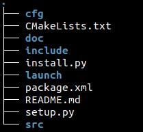

</div>

通过命令"**python install.py [您的操作系统]**"，可以将与您操作系统匹配的**ScepterSDK**拷贝到**dependencies**文件夹中, 这里我们以**Ubuntu18.04**为例：

```console
> python install.py Ubuntu18.04
```

<!-- tabs:start -->

#### **ROS**

<div class="center">


</div>

#### **ROS_MultiCameras**

<div class="center">

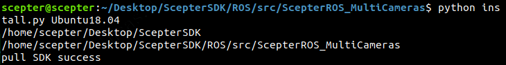

</div>

<!-- tabs:end -->

**3. 构建 ScepterROS 包**

<!-- tabs:start -->

#### **ROS**

```console
> cd ../../
> catkin_make -DCATKIN_WHITELIST_PACKAGES="ScepterROS"
```

<div class="center">

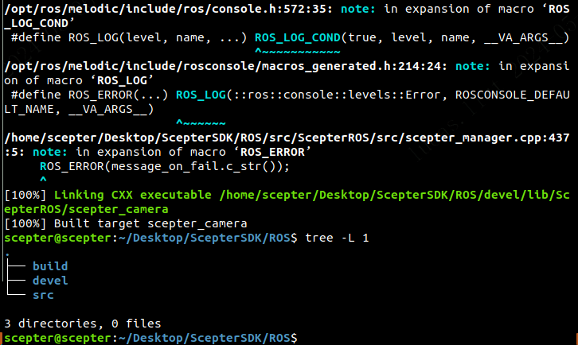

</div>

#### **ROS_MultiCameras**

```console
> cd ../../
> catkin_make -DCATKIN_WHITELIST_PACKAGES="ScepterROS_MultiCameras"
```

<div class="center">


</div>

<!-- tabs:end -->

```console
> source devel/setup.bash
```

## 4.1.3. 使用方式

<!-- tabs:start -->

#### **ROS**

**1. 启动相机节点**

```console
> cd src/ScepterROS/launch
> roslaunch ScepterROS scepter_camera.launch
```

<div class="center">

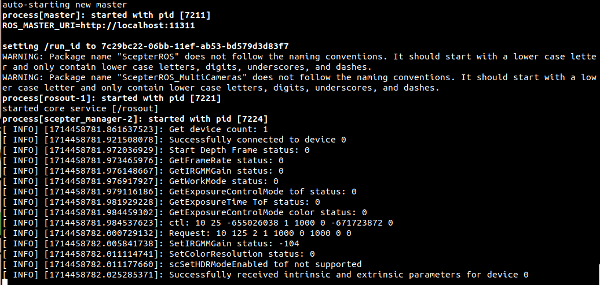

</div>

**2. 启动 Rviz 界面**

```console
> rviz
```

<div class="center">

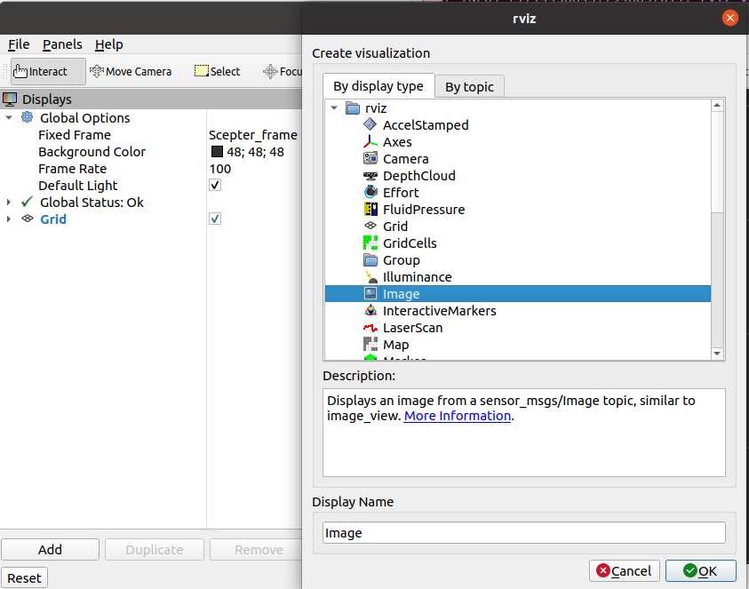

</div>

<div class="center">


</div>

**3. 使用 RQT 动态调整配置**

```console
> rosrun rqt_reconfigure rqt_reconfigure
```

<div class="center">


</div>

> **说明:**
>
> - 修改 FrameRate 将影响 ToFExposureTime 和 ColorExposureTime 的最大值
> - 当 ToFExposureTime 或 ColorExposureTime 设置高于最大值时，该值无效
> - HDRMode 仅在 ToFManual 为 True 时生效
> - ToFManual 设置为 false 时，HDRMode 为 True 时无效

**4. 显示点云**

打开一个新终端

```console
> cd 3rd-PartyPlugin/ROS
> source devel/setup.bash
> cd src/ScepterROS/launch
> roslaunch ScepterROS scepter_pointCloudxyz.launch
```

<div class="center">


</div>

<div class="center">

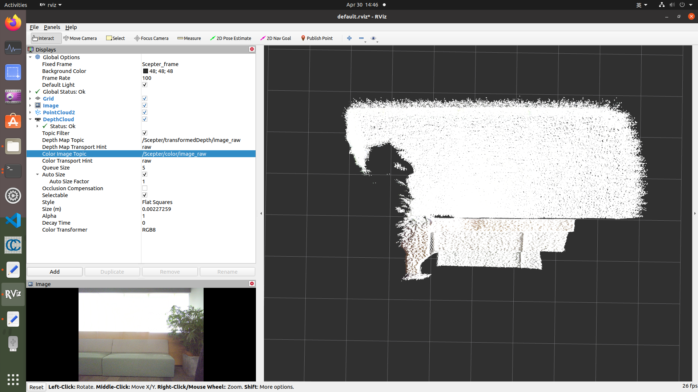

</div>

**5. 显示彩色点云**

```console
> roslaunch ScepterROS scepter_pointCloudxyzcolor.launch
```

<div class="center">


</div>

<div class="center">

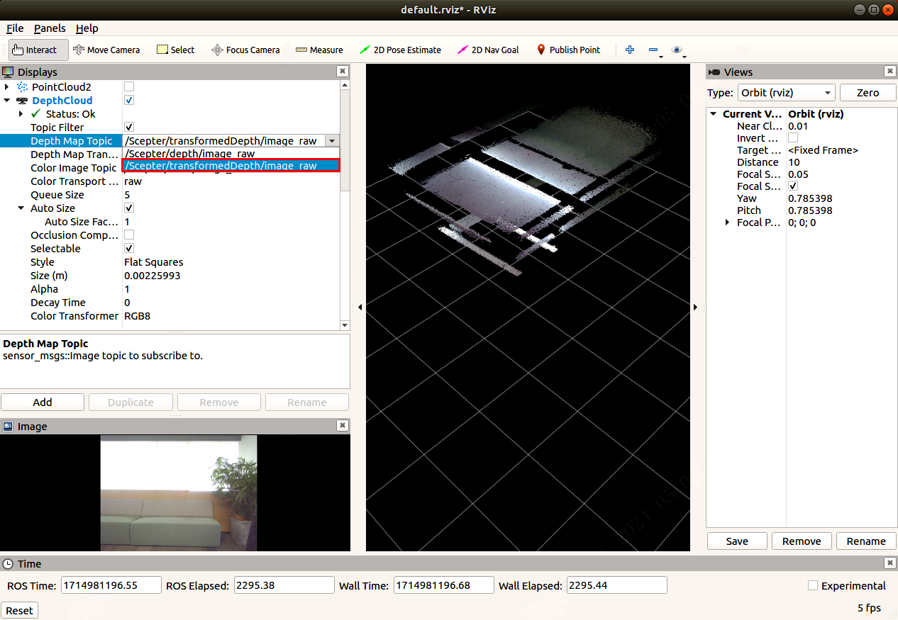

</div>

#### **ROS_MultiCameras**

**1. 修改启动项**

**scepter_xxxxx.launch**支持 2 个相机。修改**camera1.lauch**和**camera2.launch**中的 ip。

<div class="center">


</div>

<div class="center">

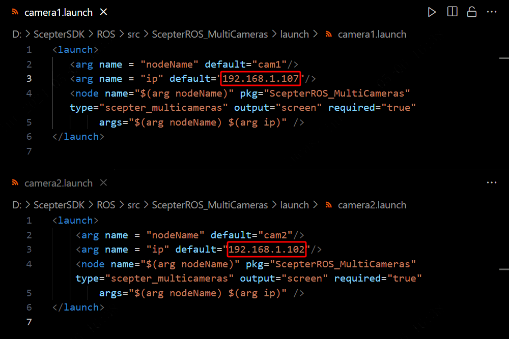

</div>

**2. 启动相机节点**

```console
cd src/ScepterROS_MultiCameras/launch
roslaunch ScepterROS_MultiCameras scepter_camera.launch
```

<div class="center">


</div>

**3. 启动 Rviz 界面**

Rviz 可以显示多个话题的界面

```console
> rviz
```

<div class="center">


</div>

<div class="center">


</div>

<div class="center">


</div>

**4. 使用 RQT 动态调整配置**

```console
> rosrun rqt_reconfigure rqt_reconfigure
```

<div class="center">


</div>

> **说明:**
>
> - 修改 FrameRate 将影响 ToFExposureTime 和 ColorExposureTime 的最大值
> - 当 ToFExposureTime 或 ColorExposureTime 设置高于最大值时，该值无效
> - HDRMode 仅在 ToFManual 为 True 时生效
> - ToFManual 设置为 false 时，HDRMode 为 True 时无效

**5. 显示点云**

打开一个新终端，Rviz 只能显示一个话题

```console
> cd 3rd-PartyPlugin/ROS
> source devel/setup.bash
> cd src/ScepterROS_MultiCameras/launch
> roslaunch ScepterROS_MultiCameras scepter_pointCloudxyz.launch
```

<div class="center">

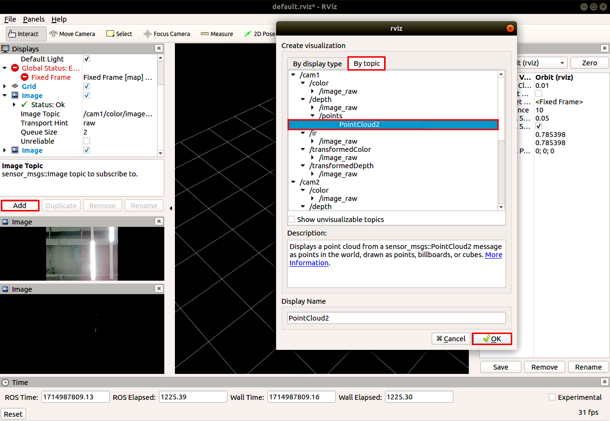

</div>

<div class="center">


</div>

<div class="center">

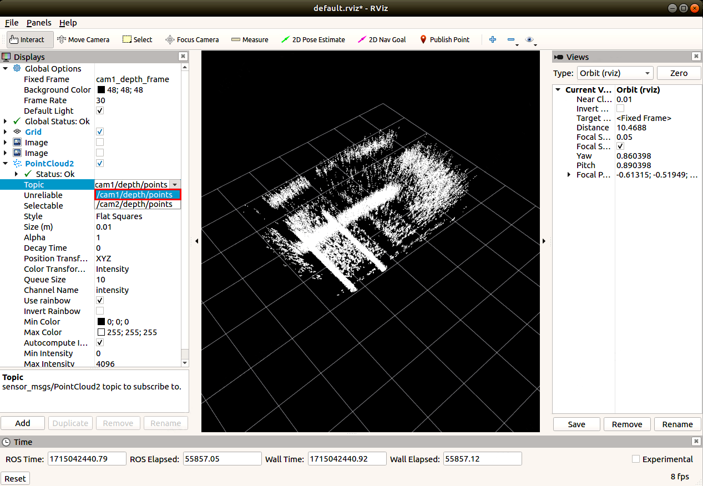

</div>

**6. 显示彩色点云**

Rviz 只能显示一个话题

```console
roslaunch ScepterROS_MultiCameras scepter_pointCloudxyzcolor.launch
```

<div class="center">


</div>

<div class="center">

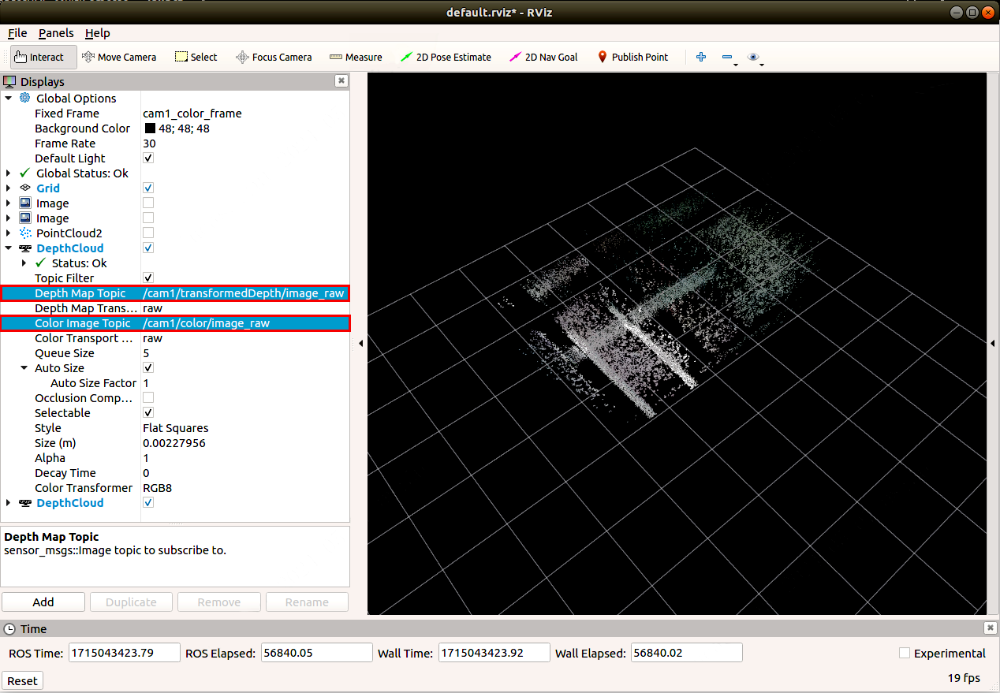

</div>

<!-- tabs:end -->

## 4.1.4. 发布的话题

<!-- tabs:start -->

#### **ROS**

Scepter_manager 发布由 [sensor_msgs](http://wiki.ros.org/sensor_msgs) 包定义的以下话题

- /Scepter/depth/camera_info
- /Scepter/color/image_raw
- /Scepter/depth/image_raw
- /Scepter/ir/image_raw
- /Scepter/transformedColor/image_raw
- /Scepter/transformedDepth/image_raw

#### **ROS_MultiCameras**

Scepter_manager 发布由 [sensor_msgs](http://wiki.ros.org/sensor_msgs) 包定义的以下话题

- /**nodename**/depth/camera_info
- /**nodename**/color/image_raw
- /**nodename**/depth/image_raw
- /**nodename**/ir/image_raw
- /**nodename**/transformedDepth/image_raw
- /**nodename**/transformedColor/image_raw


<!-- tabs:end -->

## 4.1.5. 编程指南

如果开发者需要设置相机参数或算法开关，请参考以下流程。
以调用**scSetSpatialFilterEnabled**为例：

1. 从 **/src/ScepterROS/dependencies/include/Scepter_api.h** 查找 api

<div class="center">

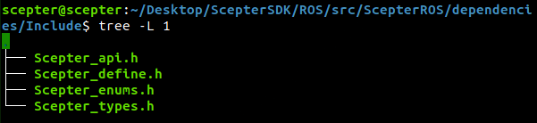

</div>

2. 将代码添加到 **/src/ScepterROS/src/scepter_manager.cpp**

<div class="center">

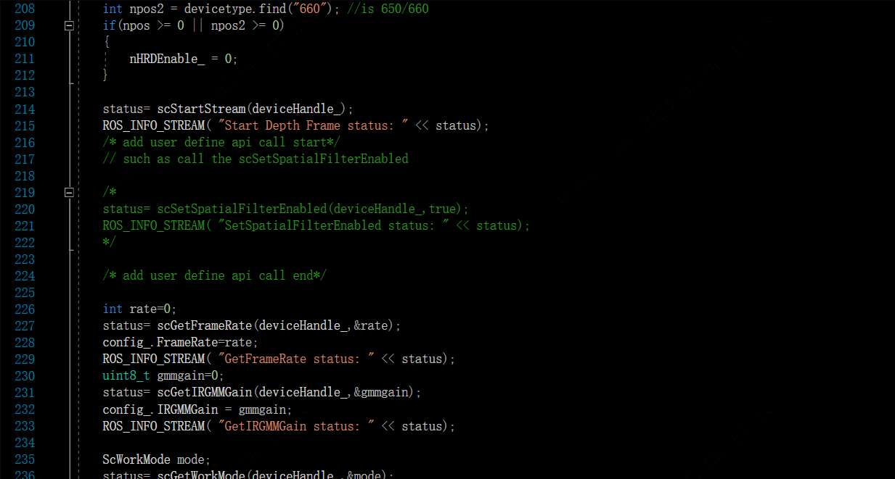

</div>

<style>
.center
{
  width: auto;
  display: table;
  margin-left: auto;
  margin-right: auto;
}
</style>
