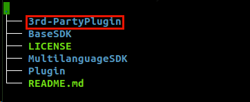
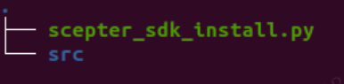
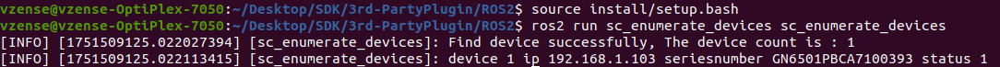
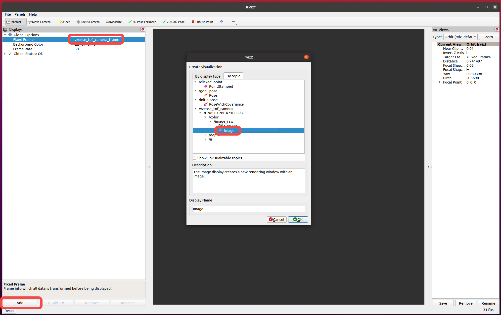
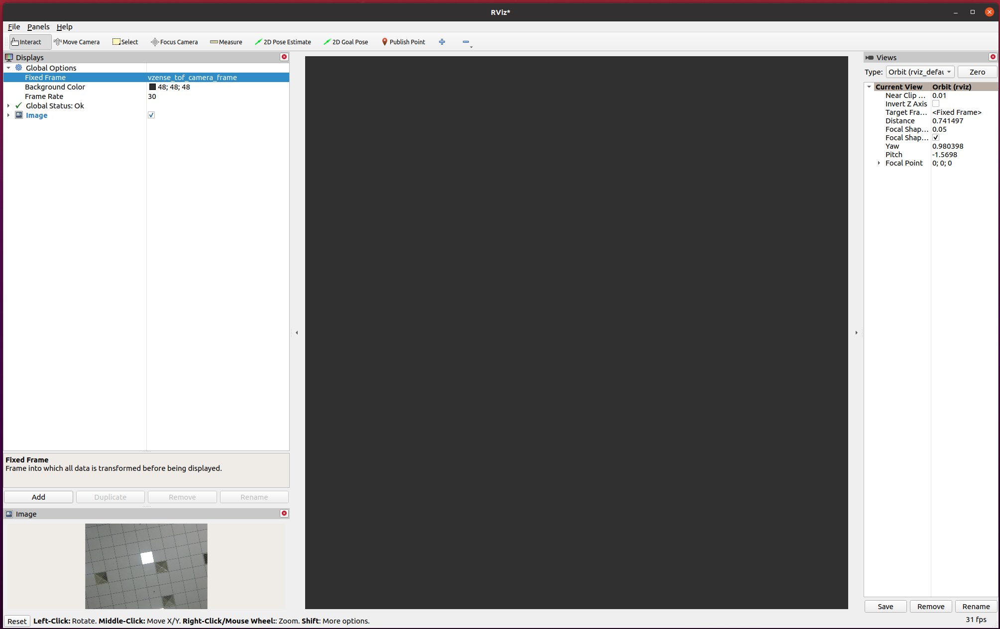
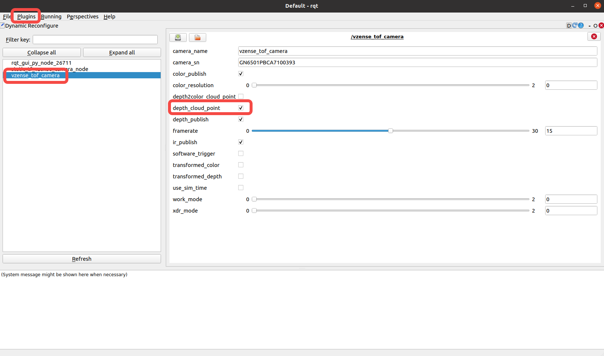
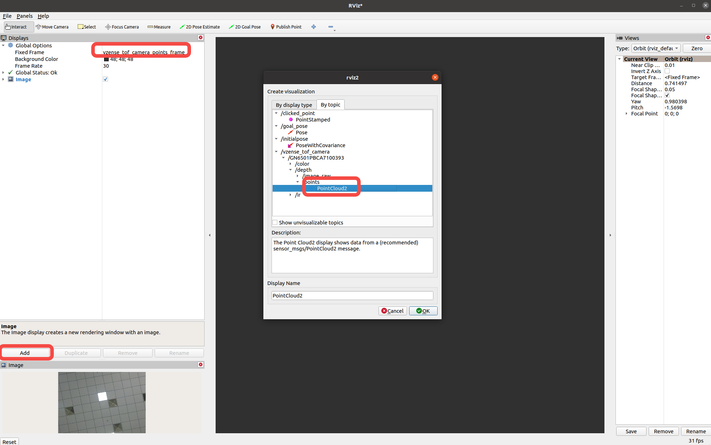
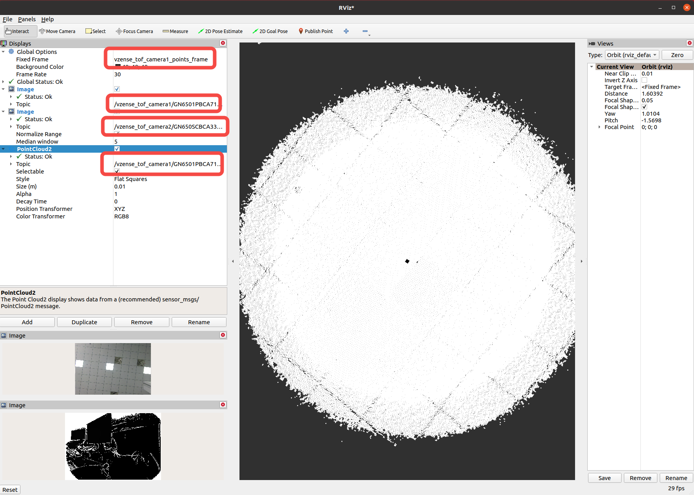
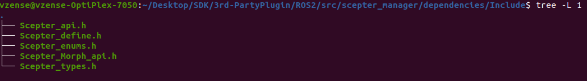
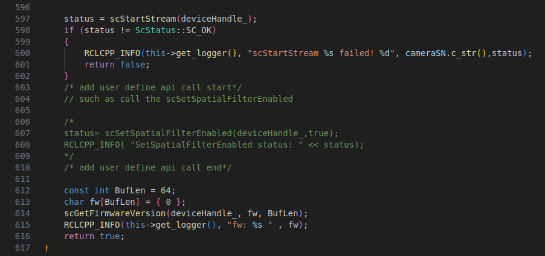

# 4.2. ROS2

该 ROS2 软件包可用于 ScepterSDK 的深度、IR 和 Color 数据的采集和处理。

## 4.2.1. 环境要求

**1. 为您的操作系统安装推荐的 ROS2 发行版(<https://ros.org/reps/rep-2000.html>)**

- ROS2 安装页面：<https://docs.ros.org/>

- 您可以使用第三方插件 FishROS，实现快速安装 ROS：<https://github.com/fishros/install>

**2. 已验证的版本**

| 系统         | 详情             |
| ------------ | ---------------- |
| Ubuntu 24.04 | Jazzy Jalisco    |
| Ubuntu 22.04 | Humble Hawksbill |
| Ubuntu 20.04 | Foxy Fitzroy     |

**3. 安装需要的工具**

- 安装 python 

  ```shell
  > sudo apt install python3
  ```

- 安装 colcon

  ```shell
  > sudo apt install python3-colcon-common-extensions
  ```

- 安装 pcl，仅**Jazzy Jalisco**需要

  ```shell
  > sudo apt install libpcl-dev
  ```


## 4.2.2. 安装 ROS 软件包

**1. 下载 Scepter ROS 包**

```shell
> git clone https://github.com/ScepterSW/ScepterSDK
```

  <div class="center">



  </div>

**2. 安装 Scepter ROS SDK**

```shell
> cd SDK/3rd-PartyPlugin/ROS2
```

<div class="center">



</div>

>./src
>
>├── sc_enumerate_devices -- 用于Vzense相机枚举，获取相机IP、Series Number与Camera Status等信息；
>
>├── scepter_manager -- 用于连接Vzense相机，进行Depth、IR 与 Color 数据的采集和处理；

通过执行命令"**python3 scepter_sdk_install.py**"，可以将Scepter ROS2 Wrapper所需的依赖项拷贝到**dependencies**文件夹中；

以**x86_64-Ubuntu20.04**为例：

```shell
> python3 scepter_sdk_install.py
```

```shell
Dependencies of package <scepter_manager> has installed successfully on Platform x86_64-Ubuntu20.04
Dependencies of package <sc_enumerate_devices> has installed successfully on Platform x86_64-Ubuntu20.04
```

**3.  构建ScepterROS2包**

```shell
> cd SDK/3rd-PartyPlugin/ROS2
```

- 构建sc_enumerate_devices和scepter_manager 

```shell
> colcon build --packages-select sc_enumerate_devices scepter_manager
```

```shell
Starting >>> sc_enumerate_devices
Starting >>> scepter_manager
Finished <<< sc_enumerate_devices [3.47s]
Finished <<< scepter_manager [13.8s]

Summary: 2 packages finished [14.0s]
```

```shell
> source install/setup.bash
```

获取设备信息和状态

```shell
> ros2 run sc_enumerate_devices sc_enumerate_devices 
```

```shell
[INFO] [1751508675.828313553] [sc_enumerate_devices]: Find device successfully, The device count is : 1
[INFO] [1751508675.828385016] [sc_enumerate_devices]: device 1 ip 192.168.1.103 seriesnumber GN6501PBCA7100393 status 1
```
<div class="center">



</div>

编译产物

<div class="center">


</div>

## 4.2.3. 使用方式
<!-- tabs:start -->

### **单设备**

**1. 启动相机节点**

在命令行参数输入相机SN

```shell
> ros2 launch scepter_manager node_execute.launch.py camera_sn:="GN6501PBCA7100393"
```

<div class="center">


</div>

node_execute.launch.py会加载位于./install/scepter_manager/share/scepter_manager/param/下的default.param.yaml作为相机节点的启动参数；

>如需修改相机节点启动参数，有以下两种方式：
>
>方式1：修改yaml文件
>
>在节点启动前按需修改default.param.yaml；
>
>方式2：设置命令行参数
>
>设置帧率20，Color分辨率640*480，其余参数仍是default.param.yaml文件的配置
>
>```shell
>> ros2 launch scepter_manager node_execute.launch.py framerate:=20 color_resolution:=2
>```

**2. 相机动态参数设置**

查看参数列表

```Shell
> ros2 param list /vzense_tof_camera
```

| 参数名称                | 参数含义                        | 参数类型 | 参数取值                                                     | 是否支持动态修改 |
| ----------------------- | :------------------------------ | -------- | ------------------------------------------------------------ | ---------------- |
| camera_name             | 节点名称                        | string   | 任意字母和数字的组合                                         | 否               |
| camera_sn               | 相机Series Number               | string   | 相机Series Number                                            | 否               |
| framerate               | 帧率                            | int      | [1-30]                                                       | 是               |
| work_mode               | 相机工作模式                    | int      | [0-2] <br />0: Active Mode <br />1: Hardwaretrigger Mode <br />2: Softwaretrigger Mode | 是               |
| color_resolution        | 相机RGB分辨率                   | int      | [0-2] <br />0: 1600×1200 <br />1: 800×600 <br />2: 640×480   | 是               |
| xdr_mode                | 相机HDR与WDR模式设置            | int      | [0-2] <br />0: hdr off&wdr off <br />1: hdr on&wdr off <br />2: hdr off&wdr on | 是               |
| depth_publish           | Depth图像Topic发布控制          | bool     | [true,false]<br />true:发布<br />false 不发布                | 是               |
| ir_publish              | IR图像Topic发布控制             | bool     | [true,false]<br />true:发布<br />false 不发布                | 是               |
| color_publish           | RGB图像Topic发布控制            | bool     | [true,false]<br />true:发布<br />false 不发布                | 是               |
| transformed_color       | Color-to-Depth图像Topic发布控制 | bool     | [true,false]<br />true:发布<br />false 不发布                | 是               |
| transformed_depth       | Depth-to-Color图像Topic发布控制 | bool     | [true,false]<br />true:发布<br />false 不发布                | 是               |
| depth_cloud_point       | Depth点云发布控制               | bool     | [true,false]<br />true:发布<br />false 不发布                | 是               |
| depth2color_cloud_point | Depth-to-Color点云Topic发布控制 | bool     | [true,false]<br />true:发布<br />false 不发布                | 是               |
| software_trigger        | 软触发开关                      | bool     | [true,false]<br />true:触发一次<br />false:触发一次          | 是               |

<!-- tabs:start -->

### **方式1**

```shell
> ros2 param set /vzense_tof_camera depth_cloud_point true
```

### **方式2**

```shell
> rqt
```

<div class="center">


</div>

<!-- tabs:end -->

**3. Topic列表**

scepter_manager 发布由 [sensor_msgs](http://wiki.ros.org/sensor_msgs) 包定义的以下话题：

| Topic 名称                                             | Topic 类型                  | Topic 信息                                             |
| ------------------------------------------------------ | --------------------------- | ------------------------------------------------------ |
| /tf_static                                             | tf2_msgs/msg/TFMessage      | 静态TF信息                                             |
| /vzense_tof_camera/<sn>/color/camera_info              | sensor_msgs/msg/CameraInfo  | Color sensor相机信息                                   |
| /vzense_tof_camera/<sn>/color/image_raw                | sensor_msgs/msg/Image       | Color图像                                              |
| /vzense_tof_camera/<sn>/depth/camera_info              | sensor_msgs/msg/CameraInfo  | Depth sensor相机信息                                   |
| /vzense_tof_camera/<sn>/depth/image_raw                | sensor_msgs/msg/Image       | Depth图像                                              |
| /vzense_tof_camera/<sn>/depth/points                   | sensor_msgs/msg/PointCloud2 | Depth点云                                              |
| /vzense_tof_camera/<sn>/depth/points/camera_info       | sensor_msgs/msg/CameraInfo  | Depth sensor相机信息（携带depth点云frameId）           |
| /vzense_tof_camera/<sn>/depth2color/points             | sensor_msgs/msg/PointCloud2 | Depth-to-color点云                                     |
| /vzense_tof_camera/<sn>/depth2color/points/camera_info | sensor_msgs/msg/CameraInfo  | Color sensor相机信息（携带depth-to-color点云frameId）  |
| /vzense_tof_camera/<sn>/ir/camera_info                 | sensor_msgs/msg/CameraInfo  | Depth sensor相机信息（携带IR图像frameId）              |
| /vzense_tof_camera/<sn>/ir/image_raw                   | sensor_msgs/msg/Image       | IR图像                                                 |
| /vzense_tof_camera/<sn>/transformedColor/camera_info   | sensor_msgs/msg/CameraInfo  | Depth sensor相机信息（携带color-to-deptht图像frameId） |
| /vzense_tof_camera/<sn>/transformedColor/image_raw     | sensor_msgs/msg/Image       | Color-to-depth对齐图像                                 |
| /vzense_tof_camera/<sn>/transformedDepth/camera_info   | sensor_msgs/msg/CameraInfo  | Color sensor相机信息（携带depth-to-color点云frameId）  |
| /vzense_tof_camera/<sn>/transformedDepth/image_raw     | sensor_msgs/msg/Image       | Depth-to-color对齐图像                                 |

>部分Topic默认不发布，需动态调整参数后使能

**4. 使用 Rviz2 订阅 Topic**

```shell
> ros2 run rviz2 rviz2
```

- 订阅Color图像

Color图像的Topic名称为：/color/image_raw

<div class="center">



</div>

<div class="center">



</div>

- 订阅Depth点云

Depth点云Topic名称为：/depth/points

```shell
> rqt
```

<div class="center">



</div>

> 默认情况下，相机启动时不会发布该Topic，可以使用rqt进行动态设置。

<div class="center">




</div>

**5. Intra Process Communication 支持**

```Shell
> ros2 launch scepter_manager node_container.launch.py camera_sn:="GN6501PBCA7100393"
```

<div class="center">


</div>

### **多设备**

**1. 启动多个相机节点**

以启动两个相机为例，在命令行参数内分别输入两个相机的SN

命令如下：

```
> ros2 launch scepter_manager node_execute_multi.launch.py camera_sn1:="GN6501PBCA7100393" camera_sn2:="GN650SCBCA3310124"
```

<div class="center">


</div>

node_execute_multi.launch.py会加载位于./install/scepter_manager/share/scepter_manager/param/下的camera1.yaml与camera2.yaml分别作为camera1与camera2的启动参数；

>如需修改相机启动参数，有以下两种方式：
>
>方式1：修改对应相机的yaml文件
>
>即camera1修改camera1.yaml，camera2修改camera2.yaml
>
>方式2：设置对应相机的命令行参数
>
>仅可以设置camera\<ID\>.yaml内的参数，输入参数命名格式**paramname\<ID\>**, 以framerate为例，framerate1:=25 framerate2:=14
>
>未设置的参数，使用camera\<ID\>.yaml内的默认值;
>
>设置camera1帧率25，camera1发布Depth点云，camera2帧率14，camera2的Color分辨率640*480，其余参数仍是camera\<ID\>.yaml文件的配置
>
>```
>> ros2 launch scepter_manager node_execute_multi.launch.py camera_sn1:="GN6501PBCA7100393" camera_sn2:="GN650SCBCA3310124" framerate1:=25 framerate2:=14  depth_cloud_point1:=true color_resolution2:=2
>```

**2. 相机动态参数设置**

使用方式同单设备，仅选择的节点名称不同。

**3. 多相机Topic列表**

scepter_manager 发布由 [sensor_msgs](http://wiki.ros.org/sensor_msgs) 包定义的以下话题：

| Topic 名称                                               | Topic 类型                  | Topic 信息                                                   |
| -------------------------------------------------------- | --------------------------- | ------------------------------------------------------------ |
| /tf_static                                               | tf2_msgs/msg/TFMessage      | 静态TF信息                                                   |
| /vzense_tof_camera1/<sn1>/color/camera_info              | sensor_msgs/msg/CameraInfo  | camera1 Color sensor相机信息                                 |
| /vzense_tof_camera1/<sn1>/color/image_raw                | sensor_msgs/msg/Image       | camera1 Color图像                                            |
| /vzense_tof_camera1/<sn1>/depth/camera_info              | sensor_msgs/msg/CameraInfo  | camera1 Depth sensor相机信息                                 |
| /vzense_tof_camera1/<sn1>/depth/image_raw                | sensor_msgs/msg/Image       | camera1 Depth图像                                            |
| /vzense_tof_camera1/<sn1>/depth/points                   | sensor_msgs/msg/PointCloud2 | camera1 Depth点云                                            |
| /vzense_tof_camera1/<sn1>/depth/points/camera_info       | sensor_msgs/msg/CameraInfo  | camera1 Depth sensor相机信息（携带depth点云frameId）         |
| /vzense_tof_camera1/<sn1>/depth2color/points             | sensor_msgs/msg/PointCloud2 | camera1 Depth-to-color点云                                   |
| /vzense_tof_camera1/<sn1>/depth2color/points/camera_info | sensor_msgs/msg/CameraInfo  | camera1 Color sensor相机信息（携带depth-to-color点云frameId） |
| /vzense_tof_camera1/<sn1>/ir/camera_info                 | sensor_msgs/msg/CameraInfo  | camera1 Depth sensor相机信息（携带IR图像frameId）            |
| /vzense_tof_camera1/<sn1>/ir/image_raw                   | sensor_msgs/msg/Image       | camera1 IR图像                                               |
| /vzense_tof_camera1/<sn1>/transformedColor/camera_info   | sensor_msgs/msg/CameraInfo  | camera1 Depth sensor相机信息（携带color-to-deptht图像frameId） |
| /vzense_tof_camera1/<sn1>/transformedColor/image_raw     | sensor_msgs/msg/Image       | camera1 Color-to-depth对齐图像                               |
| /vzense_tof_camera1/<sn1>/transformedDepth/camera_info   | sensor_msgs/msg/CameraInfo  | camera1 Color sensor相机信息（携带depth-to-color点云frameId） |
| /vzense_tof_camera1/<sn1>/transformedDepth/image_raw     | sensor_msgs/msg/Image       | camera1 Depth-to-color对齐图像                               |
| /vzense_tof_camera2/<sn2>/color/camera_info              | sensor_msgs/msg/CameraInfo  | camera2 Color sensor相机信息                                 |
| /vzense_tof_camera2/<sn2>/color/image_raw                | sensor_msgs/msg/Image       | camera2 Color图像                                            |
| /vzense_tof_camera2/<sn2>/depth/camera_info              | sensor_msgs/msg/CameraInfo  | camera2 Depth sensor相机信息                                 |
| /vzense_tof_camera2/<sn2>/depth/image_raw                | sensor_msgs/msg/Image       | camera2 Depth图像                                            |
| /vzense_tof_camera2/<sn2>/depth/points                   | sensor_msgs/msg/PointCloud2 | camera2 Depth点云                                            |
| /vzense_tof_camera2/<sn2>/depth/points/camera_info       | sensor_msgs/msg/CameraInfo  | camera2 Depth sensor相机信息（携带depth点云frameId）         |
| /vzense_tof_camera2/<sn2>/depth2color/points             | sensor_msgs/msg/PointCloud2 | camera2 Depth-to-color点云                                   |
| /vzense_tof_camera2/<sn2>/depth2color/points/camera_info | sensor_msgs/msg/CameraInfo  | camera2 Color sensor相机信息（携带depth-to-color点云frameId） |
| /vzense_tof_camera2/<sn2>/ir/camera_info                 | sensor_msgs/msg/CameraInfo  | camera2 Depth sensor相机信息（携带IR图像frameId）            |
| /vzense_tof_camera2/<sn2>/ir/image_raw                   | sensor_msgs/msg/Image       | camera2 IR图像                                               |
| /vzense_tof_camera2/<sn2>/transformedColor/camera_info   | sensor_msgs/msg/CameraInfo  | camera2 Depth sensor相机信息（携带color-to-deptht图像frameId） |
| /vzense_tof_camera2/<sn2>/transformedColor/image_raw     | sensor_msgs/msg/Image       | camera2 Color-to-depth对齐图像                               |
| /vzense_tof_camera2/<sn2>/transformedDepth/camera_info   | sensor_msgs/msg/CameraInfo  | camera2 Color sensor相机信息（携带depth-to-color点云frameId） |
| /vzense_tof_camera2/<sn2>/transformedDepth/image_raw     | sensor_msgs/msg/Image       | camera2 Depth-to-color对齐图像                               |
>部分Topic默认不发布，需动态调整参数后使能

**4. Rviz2订阅**

使用方式同单设备，仅示例订阅camera1的Color与Depth点云及camera2的Depth：

<div class="center">



</div>

**5. Intra Process Communication 支持**

```shell
> ros2 launch scepter_manager node_container_multi.launch.py camera_sn1:="GN6501PBCA7100393" camera_sn2:="GN650SCBCA3310124"
```

<div class="center">


</div>

<!-- tabs:end -->
## 4.2.4. 编程指南

如果开发者需要设置其余相机参数或算法开关，请参考以下流程。
以调用**scSetSpatialFilterEnabled**为例：

- 从 **/src/scepter_manger/dependencies/include/Scepter_api.h** 查找 api

<div class="center">



</div>

- 将代码添加到 **/src/scepter_manger/src/scepter_manager.cpp**

<div class="center">



</div>

## 4.2.5. ROS2 Samples

**1. Samples简介**

ROS2_Samples/src目录下，提供6个package，演示订阅图像和点云：

```shell
├── device_sw_trigger_mode -- 订阅SoftwareTigger模式下相机节点的Depth/Ir/Color图像
├── frame_capture_and_save -- 订阅Active模式下相机节点的Depth/Ir/Color图像
├── point_cloud_capture_and_save -- 订阅Active模式下相机节点的Depth点云
├── point_cloud_capture_and_save_depthimg_to_color_sensor -- 订阅Active模式下相机节点的Depth-to-Color点云
├── transform_colorimg_to_depth_sensor_frame -- 订阅Active模式下相机节点的Color-to-Depth图像
└── transform_depthimg_to_color_sensor_frame-- 订阅Active模式下相机节点的Depth-to-Color图像
```

**2. Samples编译**

```shell
> cd SDK/3rd-PartyPlugin/ROS2_Samples
> colcon build
```

```shell
Starting >>> device_sw_trigger_mode
Starting >>> frame_capture_and_save
Starting >>> point_cloud_capture_and_save
Starting >>> point_cloud_capture_and_save_depthimg_to_color_sensor
Starting >>> transform_colorimg_to_depth_sensor_frame
Starting >>> transform_depthimg_to_color_sensor_frame
Finished <<< frame_capture_and_save [17.0s]                                                    
Finished <<< transform_colorimg_to_depth_sensor_frame [17.1s]                     
Finished <<< transform_depthimg_to_color_sensor_frame [17.3s]              
Finished <<< device_sw_trigger_mode [17.7s]          
Finished <<< point_cloud_capture_and_save_depthimg_to_color_sensor [26.3s]
Finished <<< point_cloud_capture_and_save [26.9s]

Summary: 6 packages finished [27.1s]
```
**3. Samples执行**

- 获取需要连接的相机节点的名称

```shell
> ros2 node list
```

```shell
/static_tf_vzense_camera_node  --- 静态TF发布的节点
/vzense_tof_camera             --- Vzense的相机节点
```

- 运行用例，订阅指定相机节点

```shell
> ros2 run device_sw_trigger_mode device_sw_trigger_mode --ros-args -p node_name:="/vzense_tof_camera"

> ros2 run frame_capture_and_save frame_capture_and_save --ros-args -p node_name:="/vzense_tof_camera"

> ros2 run point_cloud_capture_and_save point_cloud_capture_and_save --ros-args -p node_name:="/vzense_tof_camera"

> ros2 run point_cloud_capture_and_save_depthimg_to_color_sensor point_cloud_capture_and_save_depthimg_to_color_sensor  --ros-args -p node_name:="/vzense_tof_camera"

> ros2 run transform_colorimg_to_depth_sensor_frame transform_colorimg_to_depth_sensor_frame  --ros-args -p node_name:="/vzense_tof_camera"

> ros2 run transform_depthimg_to_color_sensor_frame transform_depthimg_to_color_sensor_frame  --ros-args -p node_name:="/vzense_tof_camera"
```

>
> 用例在执行后，订阅数据存储到对应package的目录下。
>
<style>
.center
{
  width: auto;
  display: table;
  margin-left: auto;
  margin-right: auto;
}
</style>