# 2. BaseSDK (C/C++)

## 2.1. 基础介绍

BaseSDK 包含 Windows，Ubuntu16.04，Ubuntu18.04，AArch64 开发包部分，目录结构如下：

<!-- tabs:start -->

#### **Windows**

Windows 目录包含个人计算机平台(x86_64) Windows PC 开发包, 使用标准编译器 VS2017。


- Bin：目录主要包含 SDK 的动态链接库，如 Scepter_api.dll，包括 x64 和 x86 的版本，运行基于该 SDK 开发的应用之前，需要先将相应平台的 dll 文件拷贝到可执行程序所在的目录。

- Include：主要包含 SDK 的通用头文件：Scepter_api.h，Scepter_define.h，Scepter_enums.h，Scepter_types.h。

- Lib：主要包含 SDK 的 lib 文件，如 Scepter_api.lib。

- PrecompiledSamples：FrameViewer 可查看深度摄像头的深度图像和 IR 图像，针对不同设备，可自行编译 Samples 目录中的 FrameViewer 进行相应展示。

- Samples：主要包含使用 ScepterSDK 开发的例程。

- README：SDK 的内容简介。

- ReleaseNotes：SDK 的版本发布说明。

#### **Ubuntu**

Ubuntu16.04 目录包含个人计算机平台(x86_64) Ubuntu16.04 开发包, 使用标准编译器 x86_64-linux-gnu(v5.4.0)。

Ubuntu18.04 目录包含个人计算机平台(x86_64) Ubuntu18.04 开发包, 使用标准编译器 x86_64-linux-gnu(v7.5.0)。

Ubuntu18.04 SDK 包与 Ubuntu20.04、Ubuntu22.04 兼容。


- Include：主要包含 SDK 的通用头文件：Scepter_api.h，Scepter_define.h，Scepter_enums.h，Scepter_types.h。

- Lib：主要包含 SDK 的 lib 文件，如 Scepter_api.so。

- PrecompiledSamples：FrameViewer 可查看深度摄像头的深度图像和 IR 图像，针对不同设备，可自行编译 Samples 目录中的 FrameViewer 进行相应展示。

- Samples：主要包含使用 ScepterSDK 开发的例程。

- README：SDK 的内容简介。

- ReleaseNotes：SDK 的版本发布说明。

#### **AArch64**

AArch64 目录包含 64 位 Arm-Linux 开发包，使用标准编译器 aarch64-linux-gnu(v7.5.0)。


- Include：主要包含 SDK 的通用头文件：Scepter_api.h，Scepter_define.h，Scepter_enums.h，Scepter_types.h。

- Lib：主要包含 SDK 的 lib 文件，如 Scepter_api.so。

- PrecompiledSamples：FrameViewer 可查看深度摄像头的深度图像和 IR 图像，针对不同设备，可自行编译 Samples 目录中的 FrameViewer 进行相应展示。

- Samples：主要包含使用 ScepterSDK 开发的例程。

- README：SDK 的内容简介。

- ReleaseNotes：SDK 的版本发布说明。

<!-- tabs:end -->

## 2.2. 项目配置

<!-- tabs:start -->

#### **Windows**

Windows 下使用 Visual Studio 2017 开发，可以选择以下两种方式新建工程：

方式一设置 VC++ 目录和链接器的属性值；

方式二设置 C/C++ 和链接器的属性值。

<!-- tabs:start -->

#### **方式一**

新建应用项目工程，设置工程属性，将 Include 目录添加到包含目录中，将 Lib 目录添加到库目录中。

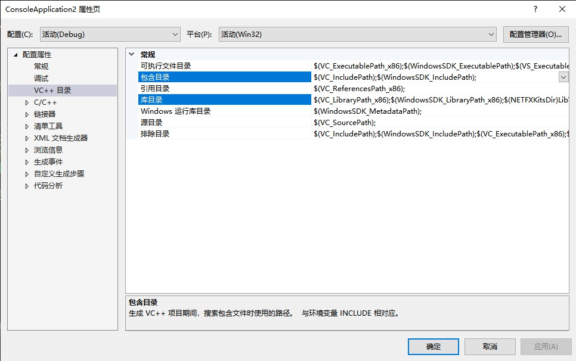

#### **方式二**

新建应用项目工程，设置工程属性，将 Include 目录添加到附加包含目录中。

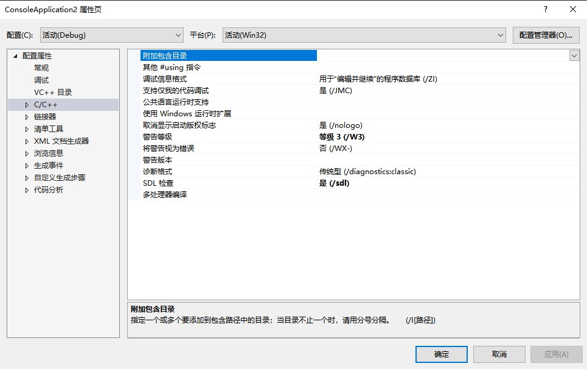

将 Lib 目录添加到附加库目录中。


<!-- tabs:end -->

将 Scepter_api.lib 添加到附加依赖项中。

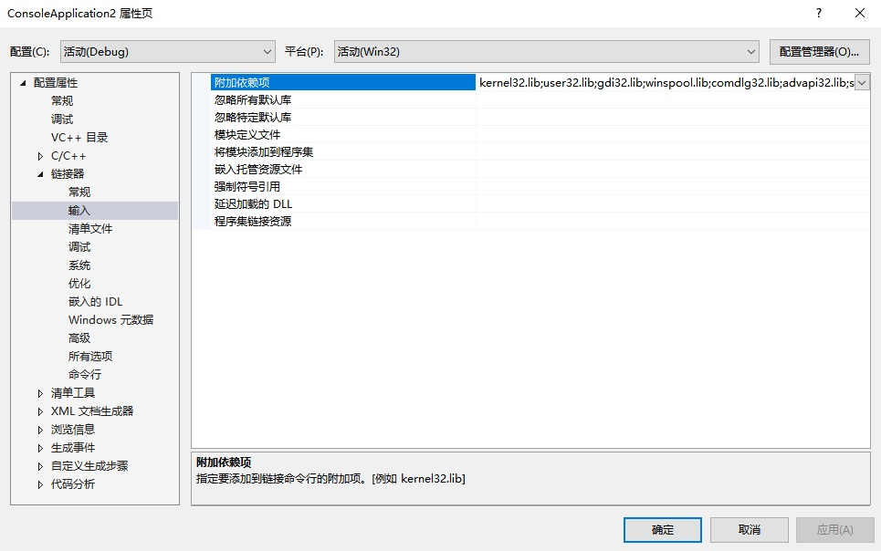

依据开发环境(x64/x86)将 SDK 的 Bin 文件夹中 x64/x86 下的所有文件拷贝到项目工程指定的输出目录中。

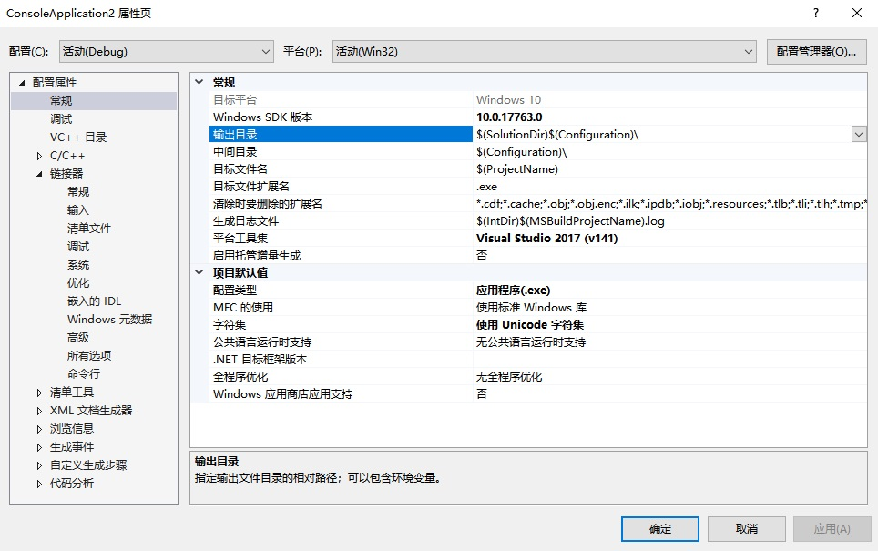

可参考 Samples 中的项目配置。

#### **Ubuntu**

使用 ScepterSDK 开发新的项目，需要在 CMakeList 中将 SDK 中的 Include 目录加入到包含路径:

```consle
include_directories("../../../Include")
```

将 Lib 目录加入到链接搜索路径，并链接 libScepter_api.so。

```consle
LINK_DIRECTORIES("${CMAKE_CURRENT_SOURCE_DIR}/../../../Lib/")
```

具体内容可参考 Samples 中的例程配置。


#### **AArch64**

使用 ScepterSDK 开发新的项目，需要在 CMakeList 中将 SDK 中的 Include 目录加入到包含路径:

```consle
include_directories("../../../Include")
```

将 Lib 目录加入到链接搜索路径，并链接 libScepter_api.so。

```consle
LINK_DIRECTORIES("${CMAKE_CURRENT_SOURCE_DIR}/../../../Lib/")
```

具体内容可参考 Samples 中的例程配置。


<!-- tabs:end -->

## 2.3. 基础例程

基础例程介绍 SDK 的单个特性 API 接口的使用。为了使用户可以快速的熟悉使用，例程根据产品进行分类。

例程包含打开图像数据流、图像获取、软/硬触发、点云转换与保存等 API 接口的使用。

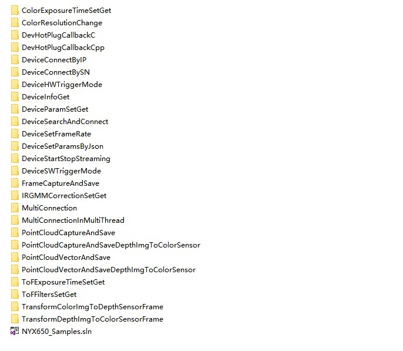

接下来，我们将详细介绍每个例程的功能。

```cpp
ColorExposureTimeSetGet                         //设置获取设备彩色传感器曝光时间
ColorResolutionChange                           //更改设备彩色传感器分辨率
DevHotPlugCallbackC                             //C 设置设备热插拔回调
DevHotPlugCallbackCpp                           //C++设置设备热插拔回调
DeviceConnectByIP                               //设置设备通过 IP 地址链接
DeviceConnectBySN                               //设置设备通过设备 SN 连接
DeviceHWTriggerMode                             //设置设备为硬触发模式
DeviceInfoGet                                   //获取设备 SN、IP 地址、固件版本信息
DeviceParamSetGet                               //获取设备内外参、畸变参数，设置、获取设备 GmmaGian 值
DeviceSearchAndConnect                          //搜索并连接设备
DeviceSetFrameRate                              //设置设备帧率
DeviceSetParamsByJson                           //通过 Json 设置设备参数
DeviceStartStopStreaming                        //开始与停止设备数据流
DeviceSWTriggerMode                             //设置设备为软触发模式
FrameCaptureAndSave                             //捕获与保存设备图像
IRGMMCorrectionSetGet                           //设置获取设备 ToF IR校正参数
MultiConnection                                 //多设备连接
MultiConnectionInMultiThread                    //在多线程中多设备连接
PointCloudCaptureAndSave                        //捕获与保存点云
PointCloudCaptureAndSaveDepthImgToColorSensor   //捕获点云并且将其保存到彩色图像传感器
PointCloudVectorAndSave                         //捕获与保存 ROI 区域中的点云
PointCloudVectorAndSaveDepthImgToColorSensor    //捕获 ROI 区域中的点云并且将其保存到彩色图像传感器
ToFExposureTimeSetGet                           //设置获取设备 ToF 曝光时间
ToFFiltersSetGet                                //设置获取设备 ToF 滤波开关
TransformColorImgToDepthSensorFrame             //将彩色图像对齐到设备的深度图像空间
TransformDepthImgToColorSensorFrame             //将深度图像对齐到设备的彩色图像空间
```

下面，我们以单个产品的单独例程为例，演示其编译运行的过程：

<!-- tabs:start -->

#### **Windows**

1. 根据实际产品选择对应的 sample，以 NYX650 产品编译 DeviceConnectBySN 为例:

   ① 鼠标右键选择需要启动的项目，选择右键选项栏中的“设为启动项目”选项。

   ② 点击菜单栏的“调试”按钮，选择下拉栏中的“开始调试”或使用快捷键“F5”编译运行项目。

   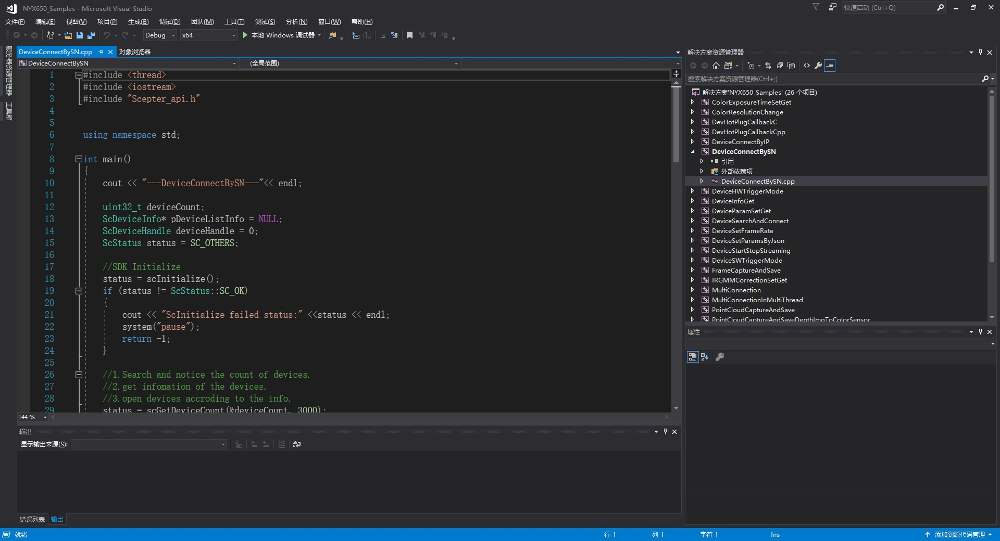

2. 编译完成，调试运行。结果如下图：

   

#### **Ubuntu**

1. 根据实际产品选择对应的 sample，以 NYX650 产品编译 DeviceConnectBySN 为例

   ```consle
   cd ScepterSDK/Ubuntu18.04/Samples/Base/NYX650
   mkdir build
   cd build/
   cmake ../
   make
   ```

   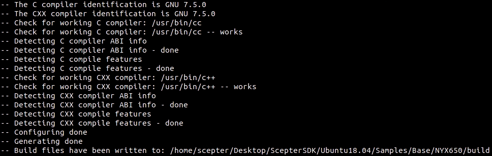
   

2. 编译完成，输出路径为 PrecompiledSamples，进入目录后运行。

   ```consle
   cd ScepterSDK/Ubuntu/PrecompiledSamples/NYX650_Samples/
   ./DeviceConnectBySN
   ```

   

#### **AArch64**

1. 根据实际产品选择对应的 sample，以 NYX650 产品编译 DeviceConnectBySN 为例

   ```consle
   cd ScepterSDK/AArch64/Samples/Base/NYX650/
   mkdir build
   cd build/
   cmake ../
   make
   ```

   
   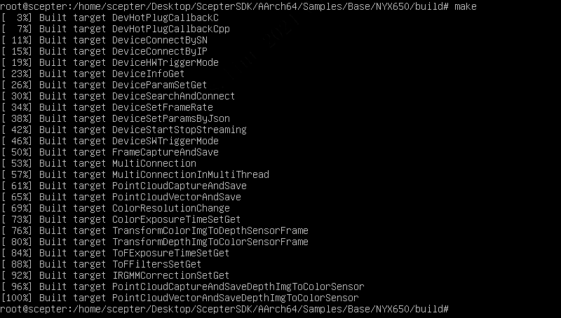

2. 编译完成，输出路径为 PrecompiledSamples，进入目录后运行。

   ```consle
   cd ScepterSDK/AArch64/PrecompiledSamples/NYX650_Samples/
   ./DeviceConnectBySN
   ```

   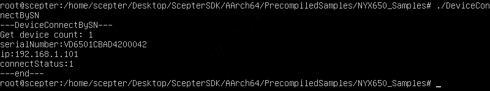

<!-- tabs:end -->

## 2.4. OpenCV 例程

OpenCV 例程用于展示如何搭配第三方库使用 ScepterSDK。例程使用 OpenCV 的图像映射功能展示彩色深度图像、IR 与 Color 图像。

<!-- tabs:start -->

#### **Windows**

1. 到 OpenCV 官网，下载并安装 [OpenCV 3.0.0](https://sourceforge.net/projects/opencvlibrary/files/opencv-win/3.0.0-rc1/opencv-3.0.0-rc1.exe/download)。

   选用此版本的原因是在 ScepterSDK 中，OpenCVSample 采用了 OpenCV 3.0.0 版本进行开发。您可以根据实际的编程需求，选择使用不同版本的 OpenCV。

   

   选择指定的位置开始解压。

   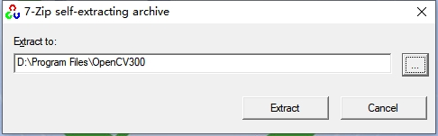

2. 设置环境变量 OPENCV_DIR。

   设置此环境变量的原因是在 ScepterSDK 中，OpenCVSample 采用了 OPENCV_DIR 这一环境变量。

   其值为安装的 OpenCV 的 build 目录的绝对路径，例如 D:\Programs\OpenCV300\opencv\build。

   

3. 根据实际产品选择对应的 sample。

   下面以 NYX650 为例，使用 Visual Studio 2017 打开 ScepterSDK\Windows\Samples\OpenCV\NYX650 目录下的 FrameViewer.vcxproj，直接编译。

   

4. 编译生成的可执行文件 FrameViewer.exe 在 ScepterSDK\Windows\Bin\x86\或 ScepterSDK\Windows\Bin\x64\目录下。

5. 运行 FrameViewer.exe，执行效果如下图。

   

#### **Ubuntu**

1. 为方便您直接使用，Samples/OpenCV/Thirdparty 目录下已经包含预编译好的 OpenCV 3.4.1 版本，无需您额外下载和编译。

   

   选用此版本的原因是在 ScepterSDK 中，OpenCVSample 采用了 OpenCV 3.4.1 版本进行开发。您可以根据实际的编程需求，选择使用不同版本的 OpenCV。

2. 根据实际产品选择对应的 sample，以 NYX650 为例编译 OpenCV 显示例程

   ```consle
   cd ScepterSDK/Ubuntu/Samples/OpenCV/NYX650
   mkdir build
   cd build/
   cmake ../
   make
   ```

   

3. 运行编译成功后的 Demo

   ```consle
   cd ScepterSDK/Ubuntu/PrecompiledSamples/
   ./NYX650_OpenCVSample
   ```

   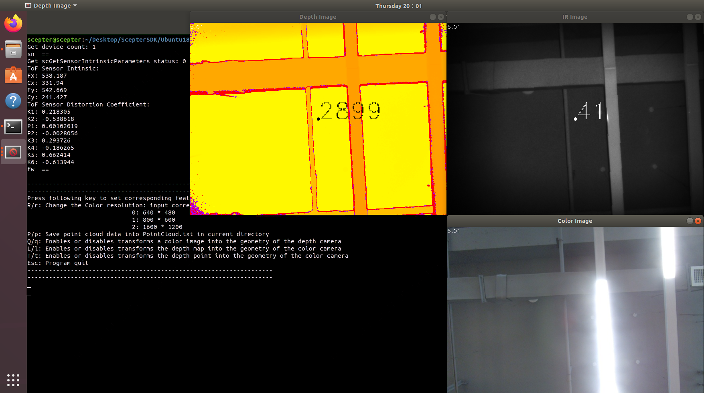

#### **AArch64**

1. 为方便您直接使用，Samples/OpenCV/Thirdparty 目录下已经包含预编译好的 OpenCV 3.4.1 版本，无需您额外下载和编译。

   

   选用此版本的原因是在 ScepterSDK 中，OpenCVSample 采用了 OpenCV 3.4.1 版本进行开发。您可以根据实际的编程需求，选择使用不同版本的 OpenCV。

   > AArch64 端常用 headless 模式，该模式下运行 OpenCV 会出错。OpenCV 在 headless 模式下运行可能遇到的问题包括：依赖的图形库不可用、图形环境配置错误、或者 OpenCV 的某些功能依赖于图形处理能力。

2. 根据实际产品选择对应的 sample，以 NYX650 为例编译 OpenCV 显示例程

   ```consle
   cd ScepterSDK/AArch64/Samples/OpenCV/NYX650
   mkdir build
   cd build/
   cmake ../
   make
   ```

   

3. 运行编译成功后的 Demo

   ```consle
   cd ScepterSDK/AArch64/PrecompiledSamples/
   ./NYX650_OpenCVSample
   ```

   

<!-- tabs:end -->

## 2.5. API 参考

> 不同型号产品对应的枚举值个数可能不同，请以实际枚举值为准。

<!-- tabs:start -->

#### **Enum 数据类型**

### 2.5.1.1. ScFrameType

**功能：**

图像类型。

**枚举值：**

```cpp
typedef enum
{
    SC_DEPTH_FRAME                               = 0,   //表示深度图像类型，每像素16位，以毫米为单位
    SC_IR_FRAME                                  = 1,   //表示灰度图像类型，每像素8位
    SC_COLOR_FRAME                               = 3,   //表示彩色图像类型，每像素24位，RGB/BGR格式
    SC_TRANSFORM_COLOR_IMG_TO_DEPTH_SENSOR_FRAME = 4,   //表示映射到深度传感器空间的彩色图像类型，其中分辨率与深度图像的分辨率相同

                                                        //可以使用scSetTransformColorImgToDepthSensorEnabled()启用此帧类型
    SC_TRANSFORM_DEPTH_IMG_TO_COLOR_SENSOR_FRAME = 5,   //表示映射到彩色传感器空间的深度图像类型，其中分辨率与彩色图像的分辨率相同。
                                                        //可以使用scSetTransformDepthImgToColorSensorEnabled()启用此帧类型
} ScFrameType;
```

### 2.5.1.2. ScPixelFormat

**功能：**

图像数据的像素类型。

**枚举值：**

```cpp
typedef enum
{
    SC_PIXEL_FORMAT_DEPTH_MM16   = 0,   //表示每个像素数据为 16 位的深度值，单位为毫米
    SC_PIXEL_FORMAT_GRAY_8       = 2,   //表示每个像素数据为 8 位的灰度值

    // Color
    SC_PIXEL_FORMAT_RGB_888_JPEG = 3,   //表示通过JPEG解压缩，彩色图像像素格式，每个像素数据为 24 位的 RGB 值
    SC_PIXEL_FORMAT_BGR_888_JPEG = 4,   //表示通过JPEG解压缩，彩色图像像素格式，每个像素数据为 24 位的 BGR 值
    SC_PIXEL_FORMAT_RGB_888      = 5,   //表示无压缩，彩色图像像素格式，每个像素数据为 24 位的 RGB 值
    SC_PIXEL_FORMAT_BGR_888      = 6,   //表示无压缩，彩色图像像素格式，每个像素数据为 24 位的 BGR 值
    SC_PIXEL_FORMAT_RGB_565      = 7,   //表示无压缩，彩色图像像素格式，每个像素数据为 16 位的 RGB 值
    SC_PIXEL_FORMAT_BGR_565      = 8    //表示无压缩，彩色图像像素格式，每个像素数据为 16 位的 BGR 值
} ScPixelFormat;
```

### 2.5.1.3. ScSensorType

**功能：**

传感器类型。

**枚举值：**

```cpp
typedef enum
{
    SC_TOF_SENSOR   = 0x01,   //表示深度数据传感器
    SC_COLOR_SENSOR = 0x02    //表示彩色图像传感器
} ScSensorType;
```

### 2.5.1.4. ScStatus

**功能：**

接口函数的返回值。

**枚举值：**

```cpp
typedef enum
{
    SC_OK                           = 0,      //表示调用成功
    SC_NO_DEVICE_CONNECTED          = -1,     //表示当前无设备连接，或设备未正确连接。检查硬件连接或尝试拔下并重新插入电缆。
    SC_INVALID_DEVICE_INDEX         = -2,     //表示传入的设备序号无效
    SC_DEVICE_POINTER_IS_NULL       = -3,     //表示传入的设备指针为空
    SC_INVALID_FRAME_TYPE           = -4,     //表示传入的图像类型无效
    SC_FRAME_POINTER_IS_NULL        = -5,     //表示传入的图像指针为空
    SC_NO_PROPERTY_VALUE_GET        = -6,     //表示无法获取当前属性值
    SC_NO_PROPERTY_VALUE_SET        = -7,     //表示无法设置当前属性值
    SC_PROPERTY_POINTER_IS_NULL     = -8,     //表示传入的指向存储属性值的缓存指针为空
    SC_PROPERTY_SIZE_NOT_ENOUGH     = -9,     //表示传入的指向存储属性值的缓存空间不足
    SC_INVALID_DEPTH_RANGE          = -10,    //表示传入的 depth range 无效
    SC_GET_FRAME_READY_TIME_OUT     = -11,    //表示获取图像时超时
    SC_INPUT_POINTER_IS_NULL        = -12,    //表示传入的指针为空
    SC_CAMERA_NOT_OPENED            = -13,    //表示相机未打开
    SC_INVALID_CAMERA_TYPE          = -14,    //表示传入的相机类型无效
    SC_INVALID_PARAMS               = -15,    //表示传入的参数无效
    SC_CURRENT_VERSION_NOT_SUPPORT  = -16,    //表示当前版本不支持
    SC_UPGRADE_IMG_ERROR            = -17,    //表示升级相机固件失败
    SC_UPGRADE_IMG_PATH_TOO_LONG    = -18,    //表示传入的相机固件路径长度太长（大于260）
    SC_UPGRADE_CALLBACK_NOT_SET     = -19,    //表示未设置相机升级时的回调函数
    SC_PRODUCT_NOT_SUPPORT          = -20,    //表示当前设备不支持此操作
    SC_NO_CONFIG_FOLDER             = -21,    //表示未找到产品配置文件
    SC_WEB_SERVER_START_ERROR       = -22,    //表示Web服务器启动/重新启动错误（IP或端口）
    SC_GET_OVER_STAY_FRAME          = -23,    //表示从帧准备就绪到获取帧的时间超出1秒
    SC_CREATE_LOG_DIR_ERROR         = -24,    //表示创建日志目录错误
    SC_CREATE_LOG_FILE_ERROR        = -25,    //表示创建日志文件错误
    SC_NO_ADAPTER_CONNECTED         = -100,   //表示电源适配器未连接
    SC_REINITIALIZED                = -101,   //表示重复初始化
    SC_NO_INITIALIZED               = -102,   //表示未做初始化
    SC_CAMERA_OPENED                = -103,   //表示相机已经打开
    SC_CMD_ERROR                    = -104,   //表示命令下发失败
    SC_CMD_SYNC_TIME_OUT            = -105,   //表示命令发送成功，但是同步匹配失败
    SC_IP_NOT_MATCH                 = -106,   //表示相机 IP 与主机 IP 不在同一网段
    SC_NOT_STOP_STREAM              = -107,   //表示未调用SCStopStream关闭数据流
    SC_NOT_START_STREAM             = -108,   //表示未调用scStartStream获取数据流
    SC_NOT_FIND_DRIVERS_FOLDER      = -109,   //表示驱动程序目录不存在
    SC_CAMERA_OPENING               = -110,   //表示相机已通过另一个SC_OpenDeviceByXXX API打开
    SC_CAMERA_OPENED_BY_ANOTHER_APP = -111,   //表示相机已被其他应用程序打开
    SC_OTHERS                       = -255,   //表示其他错误
} ScStatus;
```

### 2.5.1.5. ScConnectStatus

**功能：**

设备连接状态。

**枚举值：**

```cpp
typedef enum
{
    SC_LIMBO       = 0,   //表示未知设备状态，无法尝试打开
    SC_CONNECTABLE = 1,   //表示设备可连接状态，支持打开
    SC_OPENED      = 2    //表示设备已连接，无法再次打开
} ScConnectStatus;
```

### 2.5.1.6. ScWorkMode

**功能：**

设备工作状态。

**枚举值：**

```cpp
typedef enum
{
    SC_ACTIVE_MODE           = 0x00,   //表示设备处于主动工作状态。此时使用 API 打开相机后，设备会主动上传图像数据
    SC_HARDWARE_TRIGGER_MODE = 0x01,   //表示设备处于被动工作状态。此时使用 API 打开相机后，设备在硬件触发的时候，才会上传图像数据
    SC_SOFTWARE_TRIGGER_MODE = 0x02,   //表示设备处于被动工作状态。此时使用 API 打开相机后，设备在软件触发的时候，才会上传图像数据
} ScWorkMode;
```

### 2.5.1.7. ScExposureControlMode

**功能：**

传感器的曝光模式。

**枚举值：**

```cpp
typedef enum
{
    SC_EXPOSURE_CONTROL_MODE_AUTO   = 0,  //表示传感器使用自动曝光模式
    SC_EXPOSURE_CONTROL_MODE_MANUAL = 1,  //表示传感器使用手动曝光模式
} ScExposureControlMode;
```

#### **Struct 数据类型**

### 2.5.2.1. ScVector3f

**功能：**

3 维点坐标，单位为毫米。

**成员：**

```cpp
typedef struct
{
    float x;   //表示 X 轴方向的坐标值
    float y;   //表示 Y 轴方向的坐标值
    float z;   //表示 Z 轴方向的坐标值
} ScVector3f;
```

### 2.5.2.2. ScVector2u16

**功能：**

2 维点坐标。

**成员：**

```cpp
typedef struct
{
    uint16_t x;   //表示 X 轴方向的坐标值
    uint16_t y;   //表示 Y 轴方向的坐标值
} ScVector2u16;
```

### 2.5.2.3. ScDepthVector3

**功能：**

深度图像的像素点表示。

**成员：**

```cpp
typedef struct
{
    int32_t      depthX;   //表示图像坐标系下，X 轴方向的坐标值
    int32_t      depthY;   //表示图像坐标系下，Y 轴方向的坐标值
    ScDepthPixel depthZ;   //表示像素坐标（depthX，depthY）处的深度值，单位为毫米
} ScDepthVector3;
```

### 2.5.2.4. ScResolution

**功能：**

图像分辨率。

**成员：**

```cpp
typedef struct
{
    int32_t width;   //表示图像的宽度
    int32_t height;  //表示图像的高度
} ScResolution;
```

### 2.5.2.5. ScResolutionList

**功能：**

支持的图像分辨率。

**成员：**

```cpp
typedef struct
{
    int32_t      count;          //表示支持的图像分辨率的数量
    ScResolution resolution[6];  //表示支持的图像分辨率的信息
} ScResolutionList;
```

### 2.5.2.6. ScSensorIntrinsicParameters

**功能：**

传感器的镜头内参和畸变参数。内参通常用于点云的计算，畸变参数用于图像反畸变算法使用。

SDK 中已经实现深度图像到点云的转换及图像反畸变的功能，请参考例程使用相关接口。

**成员：**

```cpp
typedef struct
{
    double fx;   //x方向的焦距，单位为像素
    double fy;   //y方向的焦距，单位为像素
    double cx;   //主点的x坐标，图像的中心，单位为像素
    double cy;   //主点的y坐标，图像的中心，单位为像素
    double k1;   //径向畸变, 1st
    double k2;   //径向畸变, 2nd
    double p1;   //轴向畸变
    double p2;   //轴向畸变
    double k3;   //径向畸变, 3rd
    double k4;   //径向畸变, 4st
    double k5;   //径向畸变, 5nd
    double k6;   //径向畸变, 6rd
} ScSensorIntrinsicParameters;
```

### 2.5.2.7. ScSensorExtrinsicParameters

**功能：**

相机外参 R 与 T，用于 depth 与 rgb 图像的对齐，参考公式如下:


**成员：**

```cpp
typedef struct
{
    double rotation[9];      //3×3 的旋转矩阵
    double translation[3];   //3×1 平移矩阵
} ScSensorExtrinsicParameters;
```

### 2.5.2.8. ScFrame

**功能：**

图像信息。

**成员：**

```cpp
typedef struct
{
    uint32_t      frameIndex;        //表示图像帧索引号
    ScFrameType   frameType;         //表示图像数据类型
    ScPixelFormat pixelFormat;       //表示像素类型
    uint8_t*      pFrameData;        //表示指向图像数据缓存的指针
    uint32_t      dataLen;           //表示图像数据的长度，单位为字节
    float         exposureTime;      //表示曝光时间，单位为毫秒
    uint8_t       depthRange;        //表示当前帧的深度范围，仅对深度图像有效
    uint16_t      width;             //表示图像宽度
    uint16_t      height;            //表示图像高度
    uint64_t      deviceTimestamp;   //表示帧在设备上生成时的时间戳，不包括帧处理和传输时间
} ScFrame;
```

### 2.5.2.9. ScFrameReady

**功能：**

图像数据是否就绪（1 代表就绪，0 代表未就绪）。

**枚举值：**

```cpp
typedef struct
{
    uint32_t depth            : 1;    //表示深度图像数据是否就绪
    uint32_t ir               : 1;    //表示灰度图像数据是否就绪
    uint32_t color            : 1;    //表示彩色图像数据是否就绪
    uint32_t transformedColor : 1;    //表示对齐到深度传感器空间的彩色图像是否就绪
    uint32_t transformedDepth : 1;    //表示对齐到彩色传感器空间的深度图像是否就绪
    uint32_t reserved         : 27;   //预留位
} ScFrameReady;
```

### 2.5.2.10. ScDeviceInfo

**功能：**

设备信息。

**成员：**

```cpp
typedef struct
{
    char            productName[64];    //表示设备的产品名称
    char            uri[256];           //表示设备的标识符
    char            alias[64];          //表示设备的别名
    char            serialNumber[64];   //表示设备的序列号
    char            ip[17];             //表示设备的 IP 地址
    ScConnectStatus status;             //表示设备连接状态
} ScDeviceInfo;
```

### 2.5.2.11. ScTimeFilterParams

**功能：**

时间滤波参数。

**成员：**

```cpp
typedef struct
{
    int32_t threshold;   //表示滤波阈值，[1，6]，值越大，滤波效果越明显，点云抖动越小
    bool enable;         //表示滤波是否打开，true 代表打开，false 代表关闭
} ScTimeFilterParams;
```

### 2.5.2.12. ScConfidenceFilterParams

**功能：**

置信度滤波参数。

**成员：**

```cpp
typedef struct
{
    int32_t threshold;   //表示滤波阈值，[1，100]，数值越大，过滤效果越明显，过滤掉的点数越多
    bool enable;         //表示滤波是否打开，true 代表打开，false 代表关闭
} ScConfidenceFilterParams;
```

### 2.5.2.13. ScFlyingPixelFilterParams

**功能：**

去飞点滤波参数。

**成员：**

```cpp
typedef struct
{
    int32_t threshold;   //表示滤波阈值，[0，16]，数值越大，过滤效果越明显，过滤掉的点数越多
    bool enable;         //表示滤波是否打开，true 代表打开，false 代表关闭
} ScFlyingPixelFilterParams;
```

### 2.5.2.14. ScIRGMMCorrectionParams

**功能：**

IR gain 值校正参数。

**成员：**

```cpp
typedef struct
{
    int32_t threshold;   //表示滤波阈值，[1，100]，数值越大，校正效果越明显
    bool enable;         //表示滤波是否打开，true 代表打开，false 代表关闭
} ScIRGMMCorrectionParams;
```

### 2.5.2.15. ScInputSignalParamsForHWTrigger

**功能：**

硬件触发的输入信号参数。

**成员：**

```cpp
typedef struct
{
    uint16_t width;                  //表示输入信号宽度，阈值[1，65535]
    uint16_t interval;               //表示输入信号的间隔，阈值[34000，65535]
    uint8_t  polarity;               //表示电平有效性，[0，1]，0表示低电平有效，1表示高电平有效
} ScInputSignalParamsForHWTrigger;
```

### 2.5.2.16. ScOutputSignalParams

**功能：**

输出信号参数。

**成员：**

```cpp
typedef struct
{
    uint16_t width;       //表示输入信号宽度，阈值[1，65535]
    uint16_t delay;       //表示输出信号的延迟时间，阈值[0，65535]
    uint8_t  polarity;    //表示电平有效性，[0，1]，0表示低电平有效，1表示高电平有效
} ScOutputSignalParams;
```
### 2.5.2.17. ScTimeSyncConfig

**功能：**

对时参数。

**成员：**

```cpp
typedef struct
{
    uint8_t flag;     //!< 0:表示关闭对时，1:表示开启NTP对时，2:表示开启PTP对时，只有NTP对时需要IP
    uint8_t ip[16];   //!< 只有NTP对时需要ip
} ScTimeSyncConfig;
```

#### **API 介绍**

### 2.5.3.1. scInitialize

**函数原型：**

```cpp
ScStatus scInitialize()
```

**函数功能：**

完成 SDK 初始化，需要在调用其他 API 之前先调用

**函数参数：**

无

**返回值：**

[**ScStatus**](#_2514-scstatus)：SC_OK 调用成功，其他值调用失败

### 2.5.3.2. scShutdown

**函数原型：**

```cpp
ScStatus scShutdown()
```

**函数功能：**

完成 SDK 注销，释放 SDK 使用过程中创建的所有资源。该接口调用之后，不应调用除 scInitialize 之外的其他接口

**函数参数：**

无

**返回值：**

[**ScStatus**](#_2514-scstatus)：SC_OK 调用成功，其他值调用失败

### 2.5.3.3. scGetSDKVersion

**函数原型：**

```cpp
ScStatus scGetSDKVersion(char* pSDKVersion, int32_t length)
```

**函数功能：**

获取 SDK 的版本号：x.x.x

**函数参数：**

无

**返回值：**

SDK 版本号

### 2.5.3.4. scGetDeviceCount

**函数原型：**

```cpp
ScStatus scGetDeviceCount(uint32_t* pDeviceCount, uint32_t scanTime)
```

**函数功能：**

获取已连接的设备数目

**函数参数：**

<span style="color: #4ec9b0; font-weight: bold">uint32_t</span>\* pDeviceCount：指向 32 位整数变量的指针，在该变量中返回设备数量

<span style="color: #4ec9b0; font-weight: bold">uint32_t</span> scanTime：单位为毫秒，数值范围为（0，65535）。
当设备计数不为 0 时，API 立即返回。
当设备计数为 0 时，除非设备计数不为 0，否则 API 最多等待等待时间（ms）。

**返回值：**

[**ScStatus**](#_2514-scstatus)：SC_OK 调用成功，其他值调用失败

### 2.5.3.5. scGetDeviceInfoList

**函数原型：**

```cpp
ScStatus scGetDeviceInfoList(uint32_t deviceCount, ScDeviceInfo* pDevicesInfoList)
```

**函数功能：**

获取 deviceCount 个数的设备信息列表

**函数参数：**

<span style="color: #4ec9b0; font-weight: bold">uint32_t</span> deviceCount：需要获取信息列表的设备个数

[**ScDeviceInfo**](#_25210-scdeviceinfo)* pDevicesInfo：返回设备信息列表，其应该指向大小为 sizeof(ScDeviceInfo)*deviceCount 大小的缓存

**返回值：**

[**ScStatus**](#_2514-scstatus)：SC_OK 调用成功，其他值调用失败

### 2.5.3.6. scOpenDeviceBySN

**函数原型：**

```cpp
ScStatus scOpenDeviceBySN(const char* pSN, ScDeviceHandle* pDevice)
```

**函数功能：**

使用设备 SN 打开设备

**函数参数：**

<span style="color: #4ec9b0; font-weight: bold">const</span> char\* pSN：设备 SN

<span style="color: #4ec9b0; font-weight: bold">ScDeviceHandle</span>\* pDevice： 打开设备成功后，返回的设备句柄

**返回值：**

[**ScStatus**](#_2514-scstatus)：SC_OK 调用成功，其他值调用失败

### 2.5.3.7. scOpenDeviceByIP

**函数原型：**

```cpp
ScStatus scOpenDeviceByIP(const char* pIP, ScDeviceHandle* pDevice)
```

**函数功能：**

使用设备 IP 地址打开设备

**函数参数：**

<span style="color: #4ec9b0; font-weight: bold">const</span> char\* pIP：设备的 IP 地址

<span style="color: #4ec9b0; font-weight: bold">ScDeviceHandle</span>\* pDevice： 打开设备成功后，返回的设备句柄

**返回值：**

[**ScStatus**](#_2514-scstatus)：SC_OK 调用成功，其他值调用失败

### 2.5.3.8. scCloseDevice

**函数原型：**

```cpp
ScStatus scCloseDevice(ScDeviceHandle* pDevice)
```

**函数功能：**

关闭设备

**函数参数：**

<span style="color: #4ec9b0; font-weight: bold">ScDeviceHandle</span>\* pDevice： 要关闭设备的句柄

**返回值：**

[**ScStatus**](#_2514-scstatus)：SC_OK 调用成功，其他值调用失败

### 2.5.3.9. scStartStream

**函数原型：**

```cpp
ScStatus scStartStream(ScDeviceHandle device)
```

**函数功能：**

打开数据流

**函数参数：**

<span style="color: #4ec9b0; font-weight: bold">ScDeviceHandle</span> device： 要关闭数据流的设备的句柄

**返回值：**

[**ScStatus**](#_2514-scstatus)：SC_OK 调用成功，其他值调用失败

### 2.5.3.10. scStopStream

**函数原型：**

```cpp
ScStatus scStopStream(ScDeviceHandle device)
```

**函数功能：**

关闭数据流

**函数参数：**

<span style="color: #4ec9b0; font-weight: bold">ScDeviceHandle</span> device： 要关闭数据流的设备的句柄

**返回值：**

[**ScStatus**](#_2514-scstatus)：SC_OK 调用成功，其他值调用失败

### 2.5.3.11. scGetFrameReady

**函数原型：**

```cpp
ScStatus scGetFrameReady(ScDeviceHandle device, uint16_t waitTime, ScFrameReady* pFrameReady)
```

**函数功能：**

获取图像就绪状态。调用函数 scGetFrame 前必须调用此函数，否则无法获取图像。

**函数参数：**

<span style="color: #4ec9b0; font-weight: bold">ScDeviceHandle</span> device： 设备句柄

<span style="color: #4ec9b0; font-weight: bold">uint16_t</span> waitTime：允许等待图像就绪的超时时间(ms)，取值范围为(0，65535)。此值与图像的帧率有关，建议值设置为 2\*1000/fps。例如当前的帧率为 20，则建议设置 waitTime 为 2 \* 1000 / 20 = 100。如果设置 waitTime 为 40，则调用函数时可能返回 ScRetGetFrameReadyTimeOut。

[**ScFrameReady**](#_2529-scframeready)\* pFrameReady：返回图像的就绪状态

**返回值：**

[**ScStatus**](#_2514-scstatus)：SC_OK 调用成功，其他值调用失败

### 2.5.3.12. scGetFrame

**函数原型：**

```cpp
ScStatus scGetFrame(ScDeviceHandle device, ScFrameType frameType, ScFrame* pScFrame)
```

**函数功能：**

获取指定图像类型的图像数据。调用此函数前必须调用 scGetFrameReady。

**函数参数：**

<span style="color: #4ec9b0; font-weight: bold">ScDeviceHandle</span> device： 设备句柄

[**ScFrameType**](#_2511-scframetype) frameType：待获取图像的类型

[**ScFrame**](#_2528-scframe)\* pScFrame：返回的图像数据

**返回值：**

[**ScStatus**](#_2514-scstatus)：SC_OK 调用成功，其他值调用失败

### 2.5.3.13. scSetWorkMode

**函数原型：**

```cpp
ScStatus scSetWorkMode(ScDeviceHandle device, ScWorkMode mode)
```

**函数功能：**

设置相机的工作模式

**函数参数：**

<span style="color: #4ec9b0; font-weight: bold">ScDeviceHandle</span> device： 设备句柄

[**ScWorkMode**](#_2516-scworkmode) mode：要设置的工作模式，对于 ActiveMode ，将时间过滤器的默认值设置为 True ，对于 SlaveMode ，将时间过滤器的默认值设置为 False

**返回值：**

[**ScStatus**](#_2514-scstatus)：SC_OK 调用成功，其他值调用失败

### 2.5.3.14. scGetWorkMode

**函数原型：**

```cpp
ScStatus scGetWorkMode(ScDeviceHandle device, ScWorkMode* pMode)
```

**函数功能：**

获取相机的工作模式

**函数参数：**

<span style="color: #4ec9b0; font-weight: bold">ScDeviceHandle</span> device： 设备句柄

[**ScWorkMode**](#_2516-scworkmode)\* pMode：获取到的设备的工作模式

**返回值：**

[**ScStatus**](#_2514-scstatus)：SC_OK 调用成功，其他值调用失败

### 2.5.3.15. scSoftwareTriggerOnce

**函数原型：**

```cpp
ScStatus scSoftwareTriggerOnce(ScDeviceHandle device)
```

**函数功能：**

执行一次软件触发，仅当相机处于 SC_SOFTWARE_TRIGGER_MODE 时有效

**函数参数：**

<span style="color: #4ec9b0; font-weight: bold">ScDeviceHandle</span> device： 设备句柄

**返回值：**

[**ScStatus**](#_2514-scstatus)：SC_OK 调用成功，其他值调用失败

### 2.5.3.16. scGetSensorIntrinsicParameters

**函数原型：**

```cpp
ScStatus scGetSensorIntrinsicParameters(ScDeviceHandle device, ScSensorType sensorType, ScSensorIntrinsicParameters* pSensorIntrinsicParameters)
```

**函数功能：**

获取传感器镜头的内参

**函数参数：**

<span style="color: #4ec9b0; font-weight: bold">ScDeviceHandle</span> device： 设备句柄

[**ScSensorType**](#_2513-scsensortype) sensorType：传感器类型

[**ScSensorIntrinsicParameters**](#_2526-scsensorintrinsicparameters)\* pSensorIntrinsicParameters：返回传感器镜头的内参

**返回值：**

[**ScStatus**](#_2514-scstatus)：SC_OK 调用成功，其他值调用失败

### 2.5.3.17. scGetSensorExtrinsicParameters

**函数原型：**

```cpp
ScStatus scGetSensorExtrinsicParameters(ScDeviceHandle device, ScSensorExtrinsicParameters* pSensorExtrinsicParameters)
```

**函数功能：**

获取设备的外参

**函数参数：**

<span style="color: #4ec9b0; font-weight: bold">ScDeviceHandle</span> device： 设备句柄

[**ScSensorExtrinsicParameters**](#_2527-scsensorextrinsicparameters)\* pSensorExtrinsicParameters：返回设备的外参

**返回值：**

[**ScStatus**](#_2514-scstatus)：SC_OK 调用成功，其他值调用失败

### 2.5.3.18. scGetFirmwareVersion

**函数原型：**

```cpp
ScStatus scGetFirmwareVersion(ScDeviceHandle device, char* pFirmwareVersion, int32_t length)
```

**函数功能：**

获取设备的固件版本

**函数参数：**

<span style="color: #4ec9b0; font-weight: bold">ScDeviceHandle</span> device： 设备句柄

<span style="color: #4ec9b0; font-weight: bold">char</span>\* pFirmwareVersion：返回设备的固件版本

<span style="color: #4ec9b0; font-weight: bold">int32_t</span> length：pFirmwareVersion 指向的缓存的字节长度

**返回值：**

[**ScStatus**](#_2514-scstatus)：SC_OK 调用成功，其他值调用失败

### 2.5.3.19. scGetDeviceMACAddress

**函数原型：**

```cpp
ScStatus scGetDeviceMACAddress(ScDeviceHandle device, char* pMACAddress)
```

**函数功能：**

获取设备的 MAC 地址

**函数参数：**

<span style="color: #4ec9b0; font-weight: bold">ScDeviceHandle</span> device： 设备句柄

<span style="color: #4ec9b0; font-weight: bold">char</span>\* pMACAddress：返回设备的 MAC 地址，其默认是一个字节长度为 18，以‘\0’结尾的字符串

**返回值：**

[**ScStatus**](#_2514-scstatus)：SC_OK 调用成功，其他值调用失败

### 2.5.3.20. scSetIRGMMGain

**函数原型：**

```cpp
ScStatus scSetIRGMMGain(ScDeviceHandle device, uint8_t gmmgain)
```

**函数功能：**

设置 IR 图像的数字增益

**函数参数：**

<span style="color: #4ec9b0; font-weight: bold">ScDeviceHandle</span> device： 设备句柄

<span style="color: #4ec9b0; font-weight: bold">uint8_t</span> gmmgain：要设置给设备的 IR 增益值

**返回值：**

[**ScStatus**](#_2514-scstatus)：SC_OK 调用成功，其他值调用失败

### 2.5.3.21. scGetIRGMMGain

**函数原型：**

```cpp
ScStatus scGetIRGMMGain(ScDeviceHandle device, uint8_t* pGmmgain)
```

**函数功能：**

获取 IR 图像的数字增益

**函数参数：**

<span style="color: #4ec9b0; font-weight: bold">ScDeviceHandle</span> device： 设备句柄

<span style="color: #4ec9b0; font-weight: bold">uint8_t</span>\* pGmmgain：返回设备的 IR 增益值

**返回值：**

[**ScStatus**](#_2514-scstatus)：SC_OK 调用成功，其他值调用失败

### 2.5.3.22. scSetIRGMMCorrection

**函数原型：**

```cpp
ScStatus scSetIRGMMCorrection(ScDeviceHandle device, const ScIRGMMCorrectionParams params)
```

**函数功能：**

设置设备上的 IR GMM 校正的值

**函数参数：**

<span style="color: #4ec9b0; font-weight: bold">ScDeviceHandle</span> device： 设备句柄

<span style="color: #4ec9b0; font-weight: bold">const</span> [**ScIRGMMCorrectionParams**](#_25214-scirgmmcorrectionparams) params：IR GMM 校正的值

**返回值：**

[**ScStatus**](#_2514-scstatus)：SC_OK 调用成功，其他值调用失败

### 2.5.3.23. scGetIRGMMCorrection

**函数原型：**

```cpp
ScStatus scGetIRGMMCorrection(ScDeviceHandle device, ScIRGMMCorrectionParams* params)
```

**函数功能：**

获取设备上的 IR GMM 校正的值

**函数参数：**

<span style="color: #4ec9b0; font-weight: bold">ScDeviceHandle</span> device： 设备句柄

[**ScIRGMMCorrectionParams**](#_25214-scirgmmcorrectionparams)\* params：IR GMM 校正的值

**返回值：**

[**ScStatus**](#_2514-scstatus)：SC_OK 调用成功，其他值调用失败

### 2.5.3.24. scSetColorPixelFormat

**函数原型：**

```cpp
ScStatus scSetColorPixelFormat(ScDeviceHandle device,ScPixelFormat pixelFormat)
```

**函数功能：**

设置彩色图像的像素格式，目前仅支持 RGB 和 BGR 格式

**函数参数：**

<span style="color: #4ec9b0; font-weight: bold">ScDeviceHandle</span> device： 设备句柄

[**ScPixelFormat**](#_2512-scpixelformat) pixelFormat：要设置的彩色图像的像素格式

**返回值：**

[**ScStatus**](#_2514-scstatus)：SC_OK 调用成功，其他值调用失败

### 2.5.3.25. scSetColorGain

**函数原型：**

```cpp
ScStatus scSetColorGain(ScDeviceHandle device, float params)
```

**函数功能：**

在手动曝光模式中，设置彩色传感器曝光模式的颜色增益

**函数参数：**

<span style="color: #4ec9b0; font-weight: bold">ScDeviceHandle</span> device： 设备句柄

<span style="color: #4ec9b0; font-weight: bold">float</span> params：NYX650 的颜色增益值在[0，100]范围内。不同的产品具有不同的范围，请参考产品说明书

**返回值：**

[**ScStatus**](#_2514-scstatus)：SC_OK 调用成功，其他值调用失败

### 2.5.3.26. scGetColorGain

**函数原型：**

```cpp
ScStatus scGetColorGain(ScDeviceHandle device, float params)
```

**函数功能：**

获取彩色传感器曝光模式的颜色增益

**函数参数：**

<span style="color: #4ec9b0; font-weight: bold">ScDeviceHandle</span> device： 设备句柄

<span style="color: #4ec9b0; font-weight: bold">float</span> params：颜色增益值

**返回值：**

[**ScStatus**](#_2514-scstatus)：SC_OK 调用成功，其他值调用失败

### 2.5.3.27. scSetColorResolution

**函数原型：**

```cpp
ScStatus scSetColorResolution(ScDeviceHandle device, int32_t w, int32_t h)
```

**函数功能：**

设置彩色图像的分辨率

**函数参数：**

<span style="color: #4ec9b0; font-weight: bold">ScDeviceHandle</span> device： 设备句柄

<span style="color: #4ec9b0; font-weight: bold">int32_t</span> w：图像的宽

<span style="color: #4ec9b0; font-weight: bold">int32_t</span> h：图像的高

**返回值：**

[**ScStatus**](#_2514-scstatus)：SC_OK 调用成功，其他值调用失败

### 2.5.3.28. scGetColorResolution

**函数原型：**

```cpp
ScStatus scGetColorResolution(ScDeviceHandle device, int32_t* pW, int32_t* pH)
```

**函数功能：**

获取彩色图像的分辨率

**函数参数：**

<span style="color: #4ec9b0; font-weight: bold">ScDeviceHandle</span> device： 设备句柄

<span style="color: #4ec9b0; font-weight: bold">int32_t</span>\* pW：返回彩色图像的图像宽

<span style="color: #4ec9b0; font-weight: bold">int32_t</span>\* pH：返回彩色图像的图像高

**返回值：**

[**ScStatus**](#_2514-scstatus)：SC_OK 调用成功，其他值调用失败

### 2.5.3.29. scGetSupportedResolutionList

**函数原型：**

```cpp
ScStatus scGetSupportedResolutionList(ScDeviceHandle device, ScSensorType type, ScResolutionList* pList)
```

**函数功能：**

获取传感器支持的图像分辨率列表

**函数参数：**

<span style="color: #4ec9b0; font-weight: bold">ScDeviceHandle</span> device： 设备句柄

[**ScSensorType**](#_2513-scsensortype) type：传感器类型

[**ScResolutionList**](#_2525-scresolutionlist)\* pList：支持的图像分辨率列表

**返回值：**

[**ScStatus**](#_2514-scstatus)：SC_OK 调用成功，其他值调用失败

### 2.5.3.30. scSetFrameRate

**函数原型：**

```cpp
ScStatus scSetFrameRate(ScDeviceHandle device, int32_t value)
```

**函数功能：**

设置设备的图像帧率，同时对深度和彩色图像生效。此接口是同步接口，耗时较长，大约需要 500ms

**函数参数：**

<span style="color: #4ec9b0; font-weight: bold">ScDeviceHandle</span> device： 设备句柄

<span style="color: #4ec9b0; font-weight: bold">int32_t</span> value：要设置的目标帧率

**返回值：**

[**ScStatus**](#_2514-scstatus)：SC_OK 调用成功，其他值调用失败

### 2.5.3.31. scGetFrameRate

**函数原型：**

```cpp
ScStatus scGetFrameRate(ScDeviceHandle device, int32_t* pValue)
```

**函数功能：**

获取设备的图像帧率

**函数参数：**

<span style="color: #4ec9b0; font-weight: bold">ScDeviceHandle</span> device： 设备句柄

<span style="color: #4ec9b0; font-weight: bold">int32_t</span>\* pValue：返回设备的图像帧率

**返回值：**

[**ScStatus**](#_2514-scstatus)：SC_OK 调用成功，其他值调用失败

### 2.5.3.32. scSetExposureControlMode

**函数原型：**

```cpp
ScStatus scSetExposureControlMode(ScDeviceHandle device, ScSensorType sensorType, ScExposureControlMode controlMode)
```

**函数功能：**

设置传感器的曝光模式

**函数参数：**

<span style="color: #4ec9b0; font-weight: bold">ScDeviceHandle</span> device： 设备句柄

[**ScSensorType**](#_2513-scsensortype) sensorType：要设置曝光模式的传感器类型

[**ScExposureControlMode**](#_2517-scexposurecontrolmode) controlMode：要设置的曝光模式

**返回值：**

[**ScStatus**](#_2514-scstatus)：SC_OK 调用成功，其他值调用失败

### 2.5.3.33. scGetExposureControlMode

**函数原型：**

```cpp
ScStatus scGetExposureControlMode(ScDeviceHandle device, ScSensorType sensorType, ScExposureControlMode* pControlMode)
```

**函数功能：**

获取传感器的曝光模式

**函数参数：**

<span style="color: #4ec9b0; font-weight: bold">ScDeviceHandle</span> device： 设备句柄

[**ScSensorType**](#_2513-scsensortype) sensorType：要获取曝光模式的传感器类型

[**ScExposureControlMode**](#_2517-scexposurecontrolmode) controlMode：返回传感器的曝光模式

**返回值：**

[**ScStatus**](#_2514-scstatus)：SC_OK 调用成功，其他值调用失败

### 2.5.3.34. scSetExposureTime

**函数原型：**

```cpp
ScStatus scSetExposureTime(ScDeviceHandle device, ScSensorType sensorType, int32_t exposureTime)
```

**函数功能：**

设置传感器的曝光时间

深度传感器，只支持在手动曝光模式下，设置曝光时间

彩色传感器，支持在自动曝光模式下，设置最大曝光时间；支持在手动曝光模式下，设置曝光时间

**函数参数：**

<span style="color: #4ec9b0; font-weight: bold">ScDeviceHandle</span> device： 设备句柄

[**ScSensorType**](#_2513-scsensortype) sensorType：要获取曝光时间的传感器类型

<span style="color: #4ec9b0; font-weight: bold">int32_t</span> exposureTime：要设置的曝光时间参数

**返回值：**

[**ScStatus**](#_2514-scstatus)：SC_OK 调用成功，其他值调用失败

### 2.5.3.35. scGetExposureTime

**函数原型：**

```cpp
ScStatus scGetExposureTime(ScDeviceHandle device, ScSensorType sensorType, int32_t* pExposureTime)
```

**函数功能：**

获取传感器的曝光时间

**函数参数：**

<span style="color: #4ec9b0; font-weight: bold">ScDeviceHandle</span> device： 设备句柄

[**ScSensorType**](#_2513-scsensortype) sensorType：要获取曝光时间的传感器类型

<span style="color: #4ec9b0; font-weight: bold">int32_t\*</span> pExposureTime：返回获取的曝光时间参数

**返回值：**

[**ScStatus**](#_2514-scstatus)：SC_OK 调用成功，其他值调用失败

### 2.5.3.36. scSetColorAECMaxExposureTime

**函数原型：**

```cpp
ScStatus scSetColorAECMaxExposureTime(ScDeviceHandle device, int32_t exposureTime);
```

**函数功能：**

设置彩色传感器在自动曝光模式下的最大曝光时间。该接口在自动曝光模式下使用

**函数参数：**

<span style="color: #4ec9b0; font-weight: bold">ScDeviceHandle</span> device： 设备句柄

<span style="color: #4ec9b0; font-weight: bold">int32_t</span> exposureTime：曝光时间参数

**返回值：**

[**ScStatus**](#_2514-scstatus)：SC_OK 调用成功，其他值调用失败

### 2.5.3.37. scGetColorAECMaxExposureTime

**函数原型：**

```cpp
ScStatus scGetColorAECMaxExposureTime(ScDeviceHandle device, int32_t* pExposureTime)
```

**函数功能：**

获取彩色传感器在自动曝光模式下的最大曝光时间。该接口在自动曝光模式下使用

**函数参数：**

<span style="color: #4ec9b0; font-weight: bold">ScDeviceHandle</span> device： 设备句柄

<span style="color: #4ec9b0; font-weight: bold">int32_t\*</span> pExposureTime：返回获取的曝光时间参数

**返回值：**

[**ScStatus**](#_2514-scstatus)：SC_OK 调用成功，其他值调用失败

### 2.5.3.38. scGetMaxExposureTime

**函数原型：**

```cpp
ScStatus scGetMaxExposureTime(ScDeviceHandle device, ScSensorType sensorType, int32_t* pMaxExposureTime);
```

**函数功能：**

获取传感器的最大曝光时间

**函数参数：**

<span style="color: #4ec9b0; font-weight: bold">ScDeviceHandle</span> device： 设备句柄

[**ScSensorType**](#_2513-scsensortype) sensorType：要获取曝光时间的传感器类型

<span style="color: #4ec9b0; font-weight: bold">int32_t</span>\* pMaxExposureTime：返回获取的最大曝光时间，在不同的帧率下，最大曝光时间有所不同。

**返回值：**

[**ScStatus**](#_2514-scstatus)：SC_OK 调用成功，其他值调用失败

### 2.5.3.39. scSetTimeFilterParams

**函数原型：**

```cpp
ScStatus scSetTimeFilterParams(ScDeviceHandle device, ScTimeFilterParams params)
```

**函数功能：**

设置深度图像的时域滤波参数

**函数参数：**

<span style="color: #4ec9b0; font-weight: bold">ScDeviceHandle</span> device： 设备句柄

[**ScTimeFilterParams**](#_25211-sctimefilterparams) params：指向存储返回值的变量的指针

**返回值：**

[**ScStatus**](#_2514-scstatus)：SC_OK 调用成功，其他值调用失败

### 2.5.3.40. scGetTimeFilterParams

**函数原型：**

```cpp
ScStatus scGetTimeFilterParams(ScDeviceHandle device, ScTimeFilterParams* pParams)
```

**函数功能：**

获取深度图像的时域滤波参数

**函数参数：**

<span style="color: #4ec9b0; font-weight: bold">ScDeviceHandle</span> device： 设备句柄

[**ScTimeFilterParams**](#_25211-sctimefilterparams) params：指向存储返回值的变量的指针

**返回值：**

[**ScStatus**](#_2514-scstatus)：SC_OK 调用成功，其他值调用失败

### 2.5.3.41. scSetConfidenceFilterParams

**函数原型：**

```cpp
ScStatus scSetConfidenceFilterParams(ScDeviceHandle device,ScConfidenceFilterParams params)
```

**函数功能：**

设置深度图像的置信度滤波参数

**函数参数：**

<span style="color: #4ec9b0; font-weight: bold">ScDeviceHandle</span> device： 设备句柄

[**ScConfidenceFilterParams**](#_25212-scconfidencefilterparams) params：指向存储返回值的变量的指针

**返回值：**

[**ScStatus**](#_2514-scstatus)：SC_OK 调用成功，其他值调用失败

### 2.5.3.42. scGetConfidenceFilterParams

**函数原型：**

```cpp
ScStatus scGetConfidenceFilterParams(ScDeviceHandle device, ScConfidenceFilterParams *pParams)
```

**函数功能：**

获取深度图像的置信度滤波参数

**函数参数：**

<span style="color: #4ec9b0; font-weight: bold">ScDeviceHandle</span> device： 设备句柄

[**ScConfidenceFilterParams**](#_25212-scconfidencefilterparams) params：指向存储返回值的变量的指针

**返回值：**

[**ScStatus**](#_2514-scstatus)：SC_OK 调用成功，其他值调用失败

### 2.5.3.43. scSetFlyingPixelFilterParams

**函数原型：**

```cpp
ScStatus scSetFlyingPixelFilterParams(ScDeviceHandle device, const ScFlyingPixelFilterParams params)
```

**函数功能：**

设置深度图像的去飞点滤波参数

**函数参数：**

<span style="color: #4ec9b0; font-weight: bold">ScDeviceHandle</span> device： 设备句柄

<span style="color: #4ec9b0; font-weight: bold">const</span> [**ScFlyingPixelFilterParams**](#_25213-scflyingpixelfilterparams) params：滤波参数

**返回值：**

[**ScStatus**](#_2514-scstatus)：SC_OK 调用成功，其他值调用失败

### 2.5.3.44. scGetFlyingPixelFilterParams

**函数原型：**

```cpp
ScStatus scGetFlyingPixelFilterParams(ScDeviceHandle device, ScFlyingPixelFilterParams* params)
```

**函数功能：**

获取深度图像的去飞点滤波参数

**函数参数：**

<span style="color: #4ec9b0; font-weight: bold">ScDeviceHandle</span> device： 设备句柄

[**ScFlyingPixelFilterParams**](#_25213-scflyingpixelfilterparams)\* params：滤波参数

**返回值：**

[**ScStatus**](#_2514-scstatus)：SC_OK 调用成功，其他值调用失败

### 2.5.3.45. scSetFillHoleFilterEnabled

**函数原型：**

```cpp
ScStatus scSetFillHoleFilterEnabled(ScDeviceHandle device, bool bEnabled);
```

**函数功能：**

设置深度图像的补洞滤波开启关闭

**函数参数：**

<span style="color: #4ec9b0; font-weight: bold">ScDeviceHandle</span> device： 设备句柄

<span style="color: #4ec9b0; font-weight: bold">bool</span> bEnabled：true 开启，false 关闭

**返回值：**

[**ScStatus**](#_2514-scstatus)：SC_OK 调用成功，其他值调用失败

### 2.5.3.46. scGetFillHoleFilterEnabled

**函数原型：**

```cpp
ScStatus scGetFillHoleFilterEnabled(ScDeviceHandle device, bool* pEnabled);
```

**函数功能：**

获取深度图像的补洞滤波开启关闭

**函数参数：**

<span style="color: #4ec9b0; font-weight: bold">ScDeviceHandle</span> device： 设备句柄

<span style="color: #4ec9b0; font-weight: bold">bool</span>\* pEnabled：true 开启，false 关闭

**返回值：**

[**ScStatus**](#_2514-scstatus)：SC_OK 调用成功，其他值调用失败

### 2.5.3.47. scSetSpatialFilterEnabled

**函数原型：**

```cpp
ScStatus scSetSpatialFilterEnabled(ScDeviceHandle device, bool bEnabled)
```

**函数功能：**

设置深度图像的空间滤波开启关闭

**函数参数：**

<span style="color: #4ec9b0; font-weight: bold">ScDeviceHandle</span> device： 设备句柄

<span style="color: #4ec9b0; font-weight: bold">bool</span> bEnabled：true 开启，false 关闭

**返回值：**

[**ScStatus**](#_2514-scstatus)：SC_OK 调用成功，其他值调用失败

### 2.5.3.48. scGetSpatialFilterEnabled

**函数原型：**

```cpp
ScStatus scGetSpatialFilterEnabled(ScDeviceHandle device, bool* pEnabled)
```

**函数功能：**

获取深度图像的空间滤波开启关闭

**函数参数：**

<span style="color: #4ec9b0; font-weight: bold">ScDeviceHandle</span> device： 设备句柄

<span style="color: #4ec9b0; font-weight: bold">bool</span>\* pEnabled：true 开启，false 关闭

**返回值：**

[**ScStatus**](#_2514-scstatus)：SC_OK 调用成功，其他值调用失败

### 2.5.3.49. scSetTransformColorImgToDepthSensorEnabled

**函数原型：**

```cpp
ScStatus scSetTransformColorImgToDepthSensorEnabled(ScDeviceHandle device, bool bEnabled)
```

**函数功能：**

设置彩色图像对齐到深度相机空间的开关，只有带彩色传感器的设备才支持此操作。如果打开开关，则调用 scGetFrameReady 时，ScFrameReady.transformedColor 的值为 1，然后调用 scGetFrame 可以得到 ScTransformColorImgToDepthSensorFrame 类型的彩色图像，其大小与深度图像大小相同。

**函数参数：**

<span style="color: #4ec9b0; font-weight: bold">ScDeviceHandle</span> device：设备句柄

<span style="color: #4ec9b0; font-weight: bold">bool</span> bEnabled：true 打开对齐，false 关闭对齐

**返回值：**

[**ScStatus**](#_2514-scstatus)：SC_OK 调用成功，其他值调用失败

### 2.5.3.50. scGetTransformColorImgToDepthSensorEnabled

**函数原型：**

```cpp
ScStatus scGetTransformColorImgToDepthSensorEnabled(ScDeviceHandle device, bool *bEnabled)
```

**函数功能：**

获取彩色图像对齐到深度相机空间的开关状态

**函数参数：**

<span style="color: #4ec9b0; font-weight: bold">ScDeviceHandle</span> device： 设备句柄

<span style="color: #4ec9b0; font-weight: bold">bool</span> \*bEnabled：返回开关状态

**返回值：**

[**ScStatus**](#_2514-scstatus)：SC_OK 调用成功，其他值调用失败

### 2.5.3.51. scSetTransformDepthImgToColorSensorEnabled

**函数原型：**

```cpp
ScStatus scSetTransformDepthImgToColorSensorEnabled(ScDeviceHandle device, bool bEnabled)
```

**函数功能：**

设置深度图像对齐到彩色相机空间的开关，只有带彩色传感器的设备才支持此操作。如果打开开关，则调用 scGetFrameReady 时，ScFrameReady.transformedDepth 的值为 1，然后调用 scGetFrame 可以得到 ScTransformDepthImgToColorSensorFrame 类型的深度图像，其大小与彩色图像大小相同。

**函数参数：**

<span style="color: #4ec9b0; font-weight: bold">ScDeviceHandle</span> device： 设备句柄

<span style="color: #4ec9b0; font-weight: bold">bool</span> bEnabled：true 打开对齐，false 关闭对齐

**返回值：**

[**ScStatus**](#_2514-scstatus)：SC_OK 调用成功，其他值调用失败

### 2.5.3.52. scGetTransformDepthImgToColorSensorEnabled

**函数原型：**

```cpp
ScStatus scGetTransformDepthImgToColorSensorEnabled(ScDeviceHandle device, bool *bEnabled)
```

**函数功能：**

获取深度图像对齐到彩色相机空间的开关状态

**函数参数：**

<span style="color: #4ec9b0; font-weight: bold">ScDeviceHandle</span> device： 设备句柄

<span style="color: #4ec9b0; font-weight: bold">bool</span> \*bEnabled：返回开关状态

**返回值：**

[**ScStatus**](#_2514-scstatus)：SC_OK 调用成功，其他值调用失败

### 2.5.3.53. scTransformDepthPointToColorPoint

**函数原型：**

```cpp
ScStatus scTransformDepthPointToColorPoint(const ScDeviceHandle device, const ScDepthVector3 depthPoint, const ScVector2u16 colorSize, ScVector2u16* pPointInColor)
```

**函数功能：**

对齐深度图像上的点到彩色图像空间，可以在彩色图像上获得与传入的深度图像坐标点相对应的点的坐标

**函数参数：**

<span style="color: #4ec9b0; font-weight: bold">ScDeviceHandle</span> device： 设备句柄

<span style="color: #4ec9b0; font-weight: bold">const</span> [**ScDepthVector3**](#_2523-scdepthvector3) depthPoint：深度图像的坐标点

<span style="color: #4ec9b0; font-weight: bold">const</span> [**ScVector2u16**](#_2522-scvector2u16) colorSize：彩色图像尺寸

[**ScVector2u16**](#_2522-scvector2u16)\* pPointInColor：获得的与深度图像的坐标点对应的彩色图像坐标点

**返回值：**

[**ScStatus**](#_2514-scstatus)：SC_OK 调用成功，其他值调用失败

### 2.5.3.54. scConvertDepthToPointCloud

**函数原型：**

```cpp
ScStatus scConvertDepthToPointCloud(ScDeviceHandle device, ScDepthVector3* pDepthVector, ScVector3f* pWorldVector, int32_t pointCount, ScSensorIntrinsicParameters* pSensorParam)
```

**函数功能：**

把传入的深度图像坐标点集合转换为世界坐标系点集合。世界坐标原点在深度传感器镜头中心，Z 轴垂直与设备前盖板，其正方向从设备指向远方；X 轴从深度镜头指向激光器，其正方向从设备指向远方；Y 轴垂直与设备指向地面，其正方向从设备指向远方。

**函数参数：**

<span style="color: #4ec9b0; font-weight: bold">ScDeviceHandle</span> device： 设备句柄

[**ScDepthVector3**](#_2523-scdepthvector3)\* pDepthVector：深度图像的坐标点的集合

[**ScVector3f**](#_2521-scvector3f)\* pWorldVector：转换后点云的坐标点的集合

<span style="color: #4ec9b0; font-weight: bold">int32_t</span> pointCount：坐标点的数目

[**ScSensorIntrinsicParameters**](#_2526-scsensorintrinsicparameters)\* pSensorParam：传感器内参

**返回值：**

[**ScStatus**](#_2514-scstatus)：SC_OK 调用成功，其他值调用失败

### 2.5.3.55. scConvertDepthFrameToPointCloudVector

**函数原型：**

```cpp
ScStatus scConvertDepthFrameToPointCloudVector(ScDeviceHandle device, const ScFrame* pDepthFrame, ScVector3f* pWorldVector)
```

**函数功能：**

把传入的深度图像转换为世界坐标系点集合，转换后的世界坐标系点集合的大小为 ScFrame.width \* ScFrame.height，支持 ScDepthFrame 和 ScTransformDepthImgToColorSensorFrame 图像

**函数参数：**

<span style="color: #4ec9b0; font-weight: bold">ScDeviceHandle</span> device： 设备句柄

<span style="color: #4ec9b0; font-weight: bold">const</span> [**ScFrame**](#_2528-scframe)\* pDepthFrame：深度图像

[**ScVector3f**](#_2521-scvector3f)\* pWorldVector：转换后点云的坐标点的集合

**返回值：**

[**ScStatus**](#_2514-scstatus)：SC_OK 调用成功，其他值调用失败

### 2.5.3.56. scSetHotPlugStatusCallback

**函数原型：**

```cpp
ScStatus scSetHotPlugStatusCallback(PtrHotPlugStatusCallback pCallback, const void* pUserData)
```

**函数功能：**

设置设备热拔插状态回调函数

**函数参数：**

PtrHotPlugStatusCallback pCallback： 回调函数

<span style="color: #4ec9b0; font-weight: bold">const</span> <span style="color: #4ec9b0; font-weight: bold">void</span>\* pUserData：用户数据，可以为空

**返回值：**

[**ScStatus**](#_2514-scstatus)：SC_OK 调用成功，其他值调用失败

### 2.5.3.57. scRebootDevie

**函数原型：**

```cpp
ScStatus scRebootDevie(ScDeviceHandle device);
```

**函数功能：**

重启设备

**函数参数：**

<span style="color: #4ec9b0; font-weight: bold">ScDeviceHandle</span> device： 设备句柄

**返回值：**

[**ScStatus**](#_2514-scstatus)：SC_OK 调用成功，其他值调用失败

### 2.5.3.58. scSetHDRModeEnabled

**函数原型：**

```cpp
ScStatus scSetHDRModeEnabled(ScDeviceHandle device, bool bEnabled)
```

**函数功能：**

开启或关闭 HDR 功能，设备需在手动曝光模式，因此，如果您想切换到自动曝光，请先将 HDR 模式设置为禁用

**函数参数：**

<span style="color: #4ec9b0; font-weight: bold">ScDeviceHandle</span> device： 设备句柄

<span style="color: #4ec9b0; font-weight: bold">bool</span> bEnabled：true 开启，false 关闭

**返回值：**

[**ScStatus**](#_2514-scstatus)：SC_OK 调用成功，其他值调用失败

### 2.5.3.59. scGetHDRModeEnabled

**函数原型：**

```cpp
ScStatus scGetHDRModeEnabled(ScDeviceHandle device, bool* bEnabled)
```

**函数功能：**

获取 HDR 功能开启状态

**函数参数：**

<span style="color: #4ec9b0; font-weight: bold">ScDeviceHandle</span> device： 设备句柄

<span style="color: #4ec9b0; font-weight: bold">bool</span>\* bEnabled：true 开启，false 关闭

**返回值：**

[**ScStatus**](#_2514-scstatus)：SC_OK 调用成功，其他值调用失败

### 2.5.3.60. scSetInputSignalParamsForHWTrigger

**函数原型：**

```cpp
ScStatus scSetInputSignalParamsForHWTrigger(ScDeviceHandle device, ScInputSignalParamsForHWTrigger params);
```

**函数功能：**

设置硬触发的输入信号参数

**函数参数：**

<span style="color: #4ec9b0; font-weight: bold">ScDeviceHandle</span> device： 设备句柄

[**ScInputSignalParamsForHWTrigger**](#_25215-scinputsignalparamsforhwtrigger) params：硬触发的输入信号参数

**返回值：**

[**ScStatus**](#_2514-scstatus)：SC_OK 调用成功，其他值调用失败

### 2.5.3.61. scGetInputSignalParamsForHWTrigger

**函数原型：**

```cpp
ScStatus scGetInputSignalParamsForHWTrigger(ScDeviceHandle device, ScInputSignalParamsForHWTrigger* pParams);
```

**函数功能：**

获取硬触发的输入信号参数

**函数参数：**

<span style="color: #4ec9b0; font-weight: bold">ScDeviceHandle</span> device： 设备句柄

[**ScInputSignalParamsForHWTrigger**](#_25215-scinputsignalparamsforhwtrigger)\* pParams：硬触发的输入信号参数

**返回值：**

[**ScStatus**](#_2514-scstatus)：SC_OK 调用成功，其他值调用失败

### 2.5.3.62. scSetParamsByJson

**函数原型：**

```cpp
ScStatus scSetParamsByJson(ScDeviceHandle device, char* pfilePath)
```

**函数功能：**

从配置文件设置相机的参数

**函数参数：**

<span style="color: #4ec9b0; font-weight: bold">ScDeviceHandle</span> device： 设备句柄

<span style="color: #4ec9b0; font-weight: bold">char</span>\* pfilePath：配置文件路径

**返回值：**

[**ScStatus**](#_2514-scstatus)：SC_OK 调用成功，其他值调用失败


### 2.5.3.63. scGetDepthRangeValue

**函数原型：**

``` cpp
cStatus scGetDepthRangeValue(ScDeviceHandle device, int16_t* minValue, int16_t* maxValue)
```

**函数功能：**

获取设备当前工作模式下的深度范围

**函数参数：**

<span style="color: #4ec9b0; font-weight: bold">ScDeviceHandle</span> device： 设备句柄

<span style="color: #4ec9b0; font-weight: bold">int16_t</span>\* minValue： 深度最小值

<span style="color: #4ec9b0; font-weight: bold">int16_t</span>\* maxValue： 深度最大值

**返回值：**

[**ScStatus**](#_2514-scstatus)：SC_OK 调用成功，其他值调用失败

### 2.5.3.64. scSetTimeSyncConfig

**函数原型：**

``` cpp
ScStatus scSetTimeSyncConfig(ScDeviceHandle device, ScTimeSyncConfig params)
```

**函数功能：**

设置时间同步的参数

**函数参数：**

<span style="color: #4ec9b0; font-weight: bold">ScDeviceHandle</span> device： 设备句柄

[**ScTimeSyncConfig**](#_25217-sctimesyncconfig) params: 时间同步参数

**返回值：**

[**ScStatus**](#_2514-scstatus)：SC_OK 调用成功，其他值调用失败

### 2.5.3.65. scGetTimeSyncConfig

**函数原型：**

``` cpp
ScStatus scGetTimeSyncConfig(ScDeviceHandle device, ScTimeSyncConfig* pParams);
```

**函数功能：**

获取时间同步的参数

**函数参数：**

<span style="color: #4ec9b0; font-weight: bold">ScDeviceHandle</span> device： 设备句柄

[**ScTimeSyncConfig**](#_25217-sctimesyncconfig)\* pParams: 时间同步参数 

**返回值：**

[**ScStatus**](#_2514-scstatus)：SC_OK 调用成功，其他值调用失败

### 2.5.3.66. scGetDistanceLevelCountOfHDRMode

**函数原型：**

``` cpp
ScStatus scGetDistanceLevelCountOfHDRMode(ScDeviceHandle device, int32_t* pCount);
```

**函数功能：**

在HDR模式下获取距离级别的计数

**函数参数：**

<span style="color: #4ec9b0; font-weight: bold">ScDeviceHandle</span> device： 设备句柄

<span style="color: #4ec9b0; font-weight: bold">int32_t</span>\* pCount: 距离级别计数

**返回值：**

[**ScStatus**](#_2514-scstatus)：SC_OK 调用成功，其他值调用失败

### 2.5.3.67. scSetExposureTimeOfHDR

**函数原型：**

``` cpp
ScStatus scSetExposureTimeOfHDR(ScDeviceHandle device, uint8_t level, int32_t exposureTime)
```

**函数功能：**

在HDR模式下，设置深度传感器的曝光时间

**函数参数：**

<span style="color: #4ec9b0; font-weight: bold">ScDeviceHandle</span> device： 设备句柄

<span style="color: #4ec9b0; font-weight: bold">uint8_t</span> level: HDR模式远近程度

<span style="color: #4ec9b0; font-weight: bold">int32_t</span> exposureTime: 曝光时间

**返回值：**

[**ScStatus**](#_2514-scstatus)：SC_OK 调用成功，其他值调用失败

### 2.5.3.68. scGetExposureTimeOfHDR

**函数原型：**

``` cpp
ScStatus scGetExposureTimeOfHDR(ScDeviceHandle device, uint8_t level, int32_t* pExposureTime)
```

**函数功能：**

在HDR模式下，获取深度传感器的曝光时间

**函数参数：**

<span style="color: #4ec9b0; font-weight: bold">ScDeviceHandle</span> device： 设备句柄

<span style="color: #4ec9b0; font-weight: bold">uint8_t</span> level:  HDR模式远近程度

<span style="color: #4ec9b0; font-weight: bold">int32_t</span>\* pExposureTime: 曝光时间

**返回值：**

[**ScStatus**](#_2514-scstatus)：SC_OK 调用成功，其他值调用失败

### 2.5.3.69. scGetMaxExposureTimeOfHDR

**函数原型：**

``` cpp
ScStatus scGetMaxExposureTimeOfHDR(ScDeviceHandle device, uint8_t level, int32_t* pMaxExposureTime)
```

**函数功能：**

在HDR模式下，获取深度传感器的最大曝光时间

**函数参数：**

<span style="color: #4ec9b0; font-weight: bold">ScDeviceHandle</span> device： 设备句柄

<span style="color: #4ec9b0; font-weight: bold">uint8_t</span> level:   HDR模式远近程度

<span style="color: #4ec9b0; font-weight: bold">int32_t</span>\* exposureTime: 曝光时间

**返回值：**

[**ScStatus**](#_2514-scstatus)：SC_OK 调用成功，其他值调用失败
<!-- tabs:end -->
