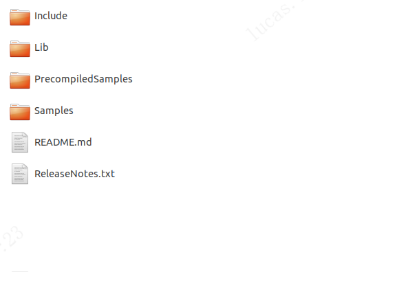
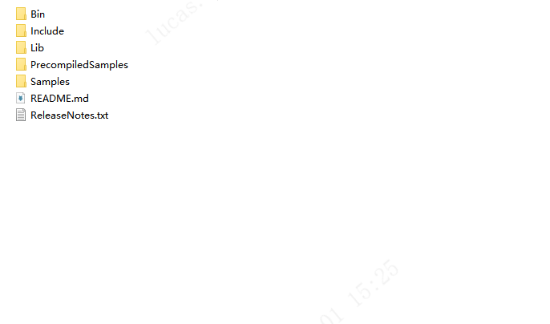

# 2.1. 基础介绍

BaseSDK 包含 Arm-Linux(AArch64)，Ubuntu16.04，Ubuntu18.04，Windows 开发包部分，目录结构如下：

<!-- tabs:start -->

#### **Arm-Linux(AArch64)**

目录包含 64 位 Arm-Linux 开发包，使用标准编译器 aarch64-linux-gnu(v7.5.0)。

- Include：主要包含 SDK 的通用头文件：Scepter_api.h，Scepter_define.h，Scepter_enums.h，Scepter_types.h。

- Lib：主要包含 SDK 的 lib 文件，如 Scepter_api.so。

- PrecompiledSamples：FrameViewer 可查看深度摄像头的深度图像和 IR 图像，针对不同设备，可自行编译 Samples 目录中的 FrameViewer 进行相应展示。

- Samples：主要包含使用 ScepterSDK 开发的例程。

- README：SDK 的内容简介。

- ReleaseNotes：SDK 的版本发布说明。

#### **Ubuntu16.04**

目录包含个人计算机平台(x86_64) Ubuntu16.04 开发包, 使用标准编译器 x86_64-linux-gnu(v5.4.0)。

- Include：主要包含 SDK 的通用头文件：Scepter_api.h，Scepter_define.h，Scepter_enums.h，Scepter_types.h。

- Lib：主要包含 SDK 的 lib 文件，如 Scepter_api.so。

- PrecompiledSamples：FrameViewer 可查看深度摄像头的深度图像和 IR 图像，针对不同设备，可自行编译 Samples 目录中的 FrameViewer 进行相应展示。

- Samples：主要包含使用 ScepterSDK 开发的例程。

- README：SDK 的内容简介。

- ReleaseNotes：SDK 的版本发布说明。

#### **Ubuntu18.04**

目录包含个人计算机平台(x86_64) Ubuntu18.04 开发包, 使用标准编译器 x86_64-linux-gnu(v7.5.0)。

Ubuntu18.04 SDK 包与 Ubuntu20.04、Ubuntu22.04 兼容。

- Include：主要包含 SDK 的通用头文件：Scepter_api.h，Scepter_define.h，Scepter_enums.h，Scepter_types.h。

- Lib：主要包含 SDK 的 lib 文件，如 Scepter_api.so。

- PrecompiledSamples：FrameViewer 可查看深度摄像头的深度图像和 IR 图像，针对不同设备，可自行编译 Samples 目录中的 FrameViewer 进行相应展示。

- Samples：主要包含使用 ScepterSDK 开发的例程。

- README：SDK 的内容简介。

- ReleaseNotes：SDK 的版本发布说明。

#### **Windows**

目录包含个人计算机平台(x86_64) Windows PC 开发包, 使用标准编译器 VS2017。

- Bin：目录主要包含 SDK 的动态链接库，如 Scepter_api.dll，包括 x64 和 x86 的版本，运行基于该 SDK 开发的应用之前，需要先将相应平台的 dll 文件拷贝到可执行程序所在的目录。

- Include：主要包含 SDK 的通用头文件：Scepter_api.h，Scepter_define.h，Scepter_enums.h，Scepter_types.h。

- Lib：主要包含 SDK 的 lib 文件，如 Scepter_api.lib。

- PrecompiledSamples：FrameViewer 可查看深度摄像头的深度图像和 IR 图像，针对不同设备，可自行编译 Samples 目录中的 FrameViewer 进行相应展示。

- Samples：主要包含使用 ScepterSDK 开发的例程。

- README：SDK 的内容简介。

- ReleaseNotes：SDK 的版本发布说明。

<!-- tabs:end -->
