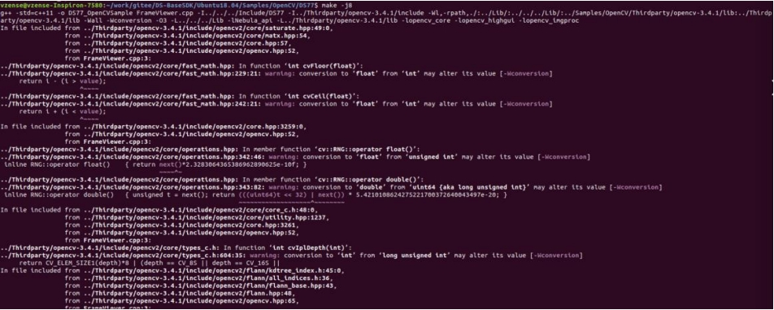
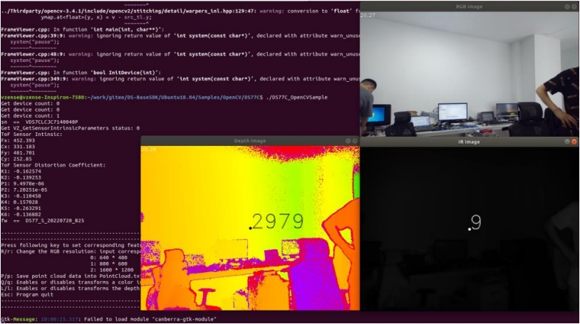

# 2.4. OpenCV 例程

OpenCV 例程用于展示如何搭配第三方库使用 Scepter SDK。例程使用 OpenCV 的图像映射功能展示彩色深度图像、IR 与 Color 图像。

<!-- tabs:start -->

#### **Arm-Linux(AArch64)**

1. 根据实际产品选择对应的 sample，以 NYX650 为例编译 OpenCV 显示例程

   ```consle
   cd ScepterSDK/AArch64/Samples/OpenCV/NYX650
   mkdir build
   cd build/
   cmake ../
   make
   ```

   

2. 运行编译成功后的 Demo

   ```consle
   ./NYX650_OpenCVSample
   ```

   

#### **Ubuntu16.04/18.04**

1. 根据实际产品选择对应的 sample，以 NYX650 为例编译 OpenCV 显示例程

   ```consle
   cd ScepterSDK/Ubuntu/Samples/OpenCV/NYX650
   mkdir build
   cd build/
   cmake ../
   make
   ```

   

2. 运行编译成功后的 Demo

   ```consle
   ./NYX650_OpenCVSample
   ```

   

#### **Windows**

1. 到 OpenCV 官网，下载并安装 [OpenCV 3.0.0](https://opencv.org/release/opencv-3-0-0/)。

   

2. 设置环境变量 OPENCV_DIR， 其值为安装的 OpenCV 的 build 目录的绝对路径。
   例如 D:\Programs\OpenCV300\opencv\build。

   

3. 根据实际产品选择对应的 sample。下面以 VENO86 为例，使用 Visual Studio 2017 打开 ScepterSDK\Windows\Samples\OpenCV\VENO86 目录下的 FrameViewer.vcxproj，直接编译。

   

4. 编译生成的可执行文件 FrameViewer.exe 在 ScepterSDK\Windows\Bin\x86\或 ScepterSDK\Windows\Bin\x64\目录下。

5. 运行 FrameViewer.exe，执行效果如下图。

   

<!-- tabs:end -->
