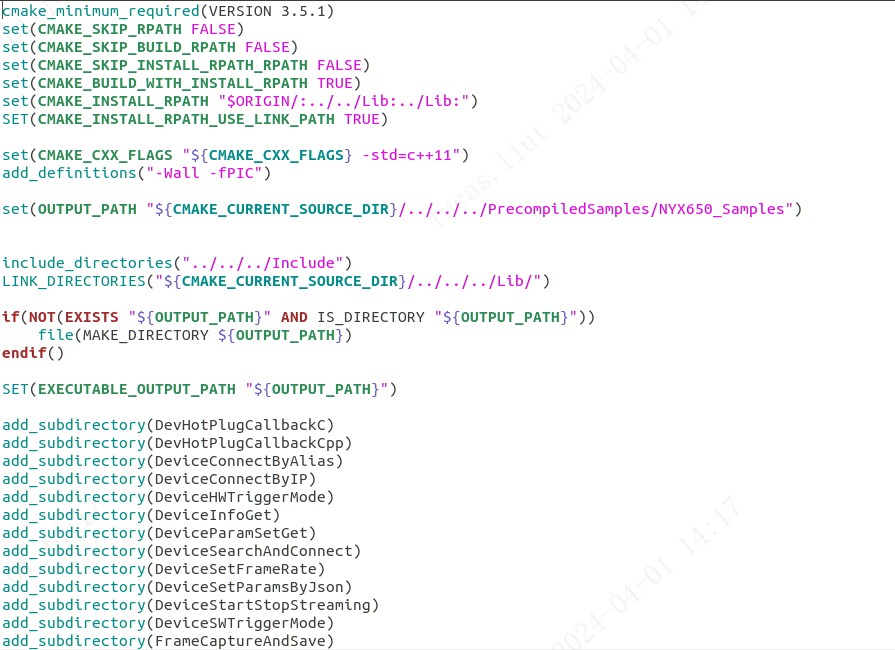
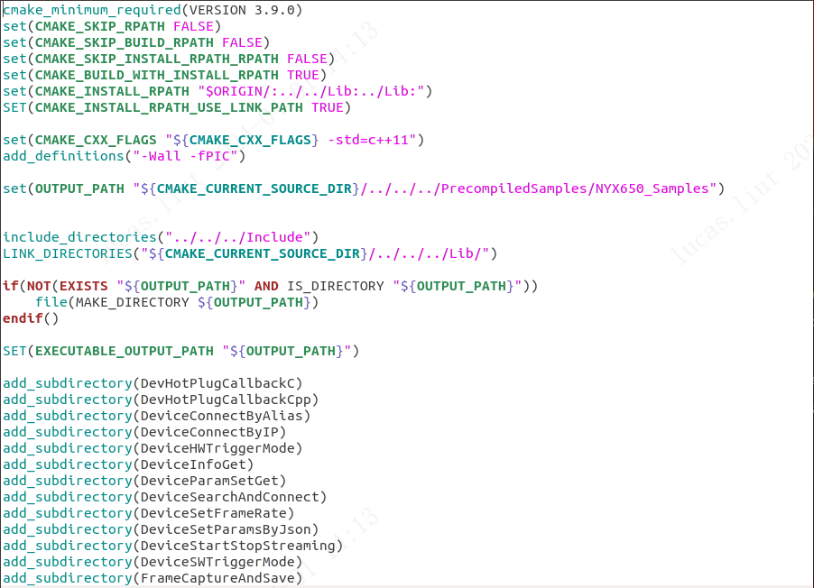
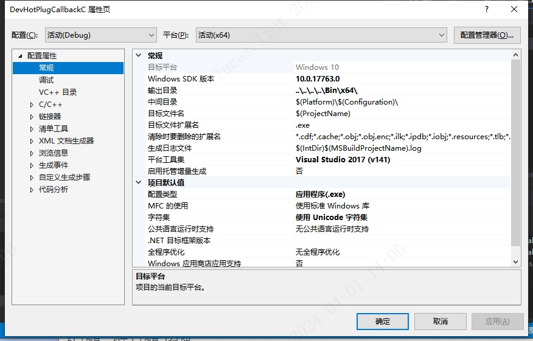
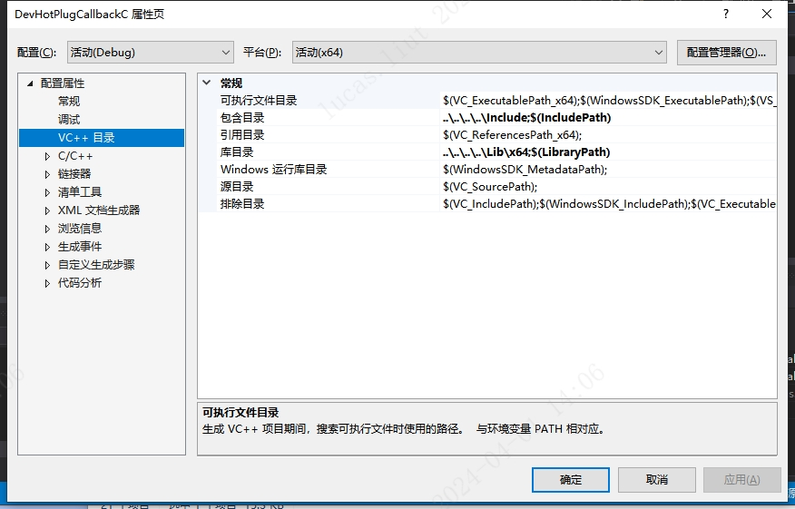
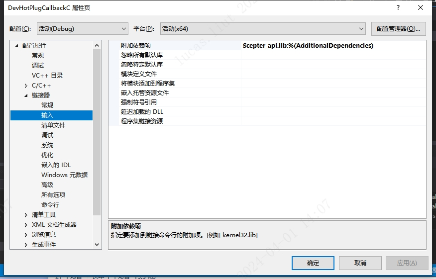

# 2.2. 项目配置

<!-- tabs:start -->

#### **Arm-Linux(AArch64)**

使用 Scepter SDK 开发新的项目，需要在 CMakeList 中将 SDK 中的 Include 目录加入到包含路径:

```consle
include_directories("../../../Include")
```

将 Lib 目录加入到链接搜索路径，并链接 libScepter_api.so。

```consle
LINK_DIRECTORIES("${CMAKE_CURRENT_SOURCE_DIR}/../../../Lib/")
```

具体内容可参考 Samples 中的例程配置。



#### **Ubuntu16.04/18.04**

使用 Scepter SDK 开发新的项目，需要在 CMakeList 中将 SDK 中的 Include 目录加入到包含路径:

```consle
include_directories("../../../Include")
```

将 Lib 目录加入到链接搜索路径，并链接 libScepter_api.so。

```consle
LINK_DIRECTORIES("${CMAKE_CURRENT_SOURCE_DIR}/../../../Lib/")
```

具体内容可参考 Samples 中的例程配置。



#### **Windows**

Windows 下使用 Visual Studio 2017 开发。

新建应用项目工程，设置工程属性，将 Include 目录添加到包含目录中，将 Lib 目录添加到库目录中。





另外，需要将 Scepter_api.lib 添加到附加依赖项中。



可参考 Samples 中的项目配置。

<!-- tabs:end -->
