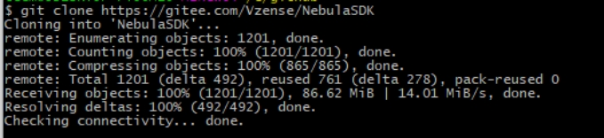
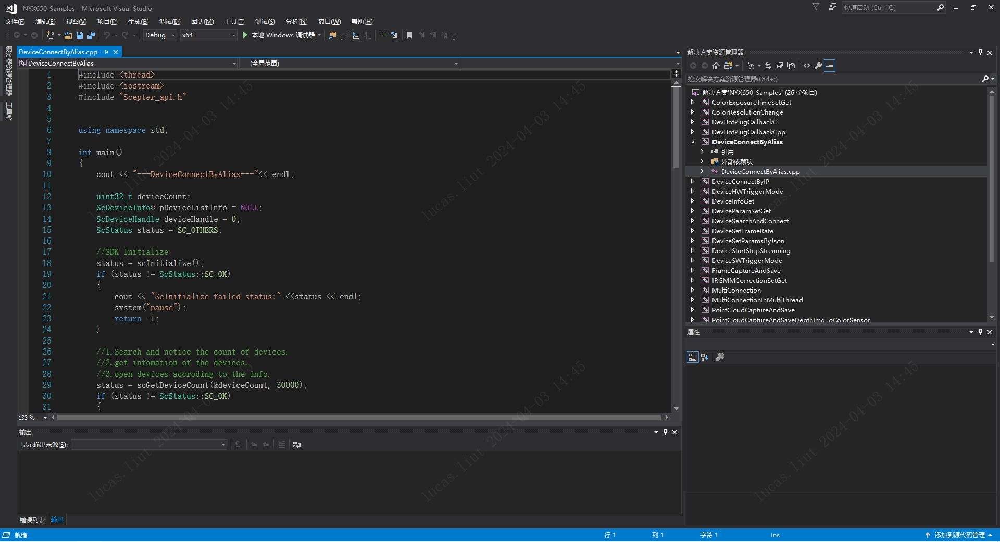
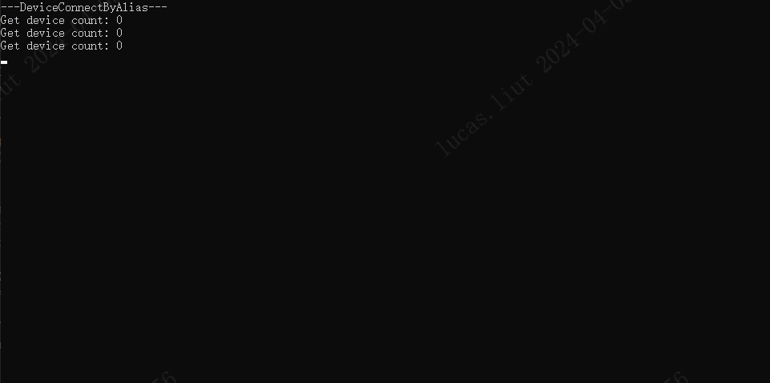
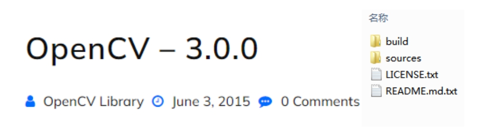
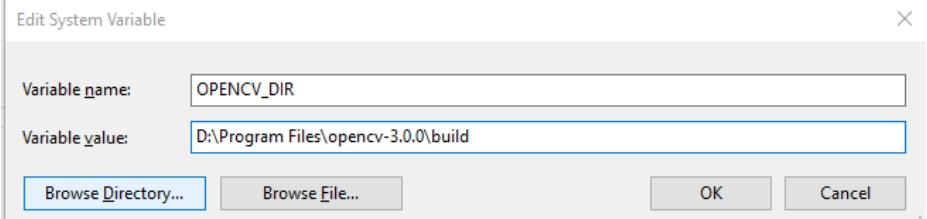

# 2.1. Windows

## 2.1.1. 下载 ScepterSDK

您可以通过以下链接或 git clone 的方式来下载 ScepterSDK 开发包。

下载地址：<https://github.com/ScepterSW/ScepterSDK>
镜像加速地址：<https://gitee.com/ScepterSW/ScepterSDK>

```consle
 git clone https://github.com/ScepterSW/ScepterSDK
```

## 2.1.1. SDK 目录介绍

ScepterSDK 开发包提供的 Sample 用于演示 SDK 的 API 接口使用，位于 SDK 目录的 Samples 文件夹下。包含如下内容：

- Bin：目录主要包含 SDK 的动态链接库，如 Scepter_api.dll，包括 x64 和 x86 的版本，运行基于该 SDK 开发的应用之前，需要先将相应平台的 dll 文件拷贝到可执行程序所在的目录。

- Include：主要包含 SDK 的通用头文件：Scepter_api.h，Scepter_define.h，Scepter_enums.h，Scepter_types.h。

- Lib：主要包含 SDK 的 lib 文件，如 Scepter_api.lib。

- PrecompiledSamples：FrameViewer 可查看深度摄像头的深度图像和 IR 图像，针对不同设备，可自行编译 Samples 目录中的 FrameViewer 进行相应展示。

- Samples：主要包含使用 ScepterSDK 开发的例程。

- README：SDK 的内容简介。

- ReleaseNotes：SDK 的版本发布说明。

## 2.1.2. 项目配置

Windows 下使用 Visual Studio 2017 开发。新建应用项目工程，设置工程属性，将 Include 目录添加到包含目录中，将 Lib 目录添加到库目录中。另外，需要将 Scepter_api.lib 添加到附加依赖项中。可参考 Samples 中的项目配置。

## 2.1.3. 基础例程

基础例程介绍 SDK 的单个特性 API 接口的使用。为了使用户可以快速的熟悉使用，例程根据产品进行分类，如 NYX650 & NYX660，VENO86 & VENO87 等。例程包含打开图像数据流、图像获取、软/硬触发、点云转换与保存等 API 接口的使用。

1. 从 Gitee/GitHub 下载 Scepter SDK

   ```consle
    git clone https://gitee.com/gmiorg/ScepterSDK
   ```

   <!--  -->

2. 根据实际产品选择对应的 sample，以 VENO86 产品编译 DeviceConnectByAlias 为例

   

3. 编译完成，调试运行。结果如下图：

   

## 2.1.4. OpenCV 例程

1. 到 OpenCV 官网，下载并安装 [OpenCV 3.0.0](https://opencv.org/release/opencv-3-0-0/)。

   

2. 设置环境变量 OPENCV_DIR， 其值为安装的 OpenCV 的 build 目录的绝对路径。
   例如 D:\Programs\OpenCV300\opencv\build。

   

3. 根据实际产品选择对应的 sample。下面以 VENO86 为例，使用 Visual Studio 2017 打开 ScepterSDK\Windows\Samples\OpenCV\VENO86 目录下的 FrameViewer.vcxproj，直接编译。

   

4. 编译生成的可执行文件 FrameViewer.exe 在 ScepterSDK\Windows\Bin\x86\或 ScepterSDK\Windows\Bin\x64\目录下。

5. 运行 FrameViewer.exe，执行效果如下图。

   
