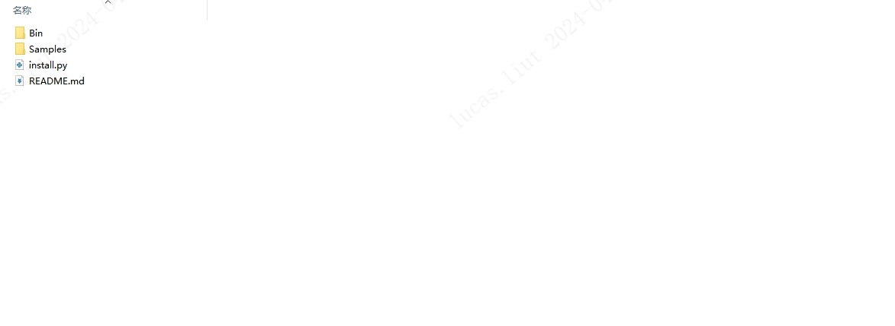

# 3.2.1. 基础介绍(C#)

C# SDK 开发包提供的 Sample 用于演示 SDK 的 API 接口使用，目录结构如下：

目录包含个人计算机平台(x86_64) Windows PC 开发包, 使用标准编译器 VS2017。

- Bin：目录主要包含 SDK 的动态链接库，如 Scepter_CSharp.dll，包括 x64 和 x86 的版本，运行基于该 SDK 开发的应用之前，需要先将相应平台的 dll 文件拷贝到可执行程序所在的目录。

- Samples：主要包含使用 ScepterSDK 开发的例程。

- install.py：用于从指定的路径中提取并移动 Scepter_CSharp.dll 文件的脚本文件。

- README.md：SDK 的项目配置的简要说明。
