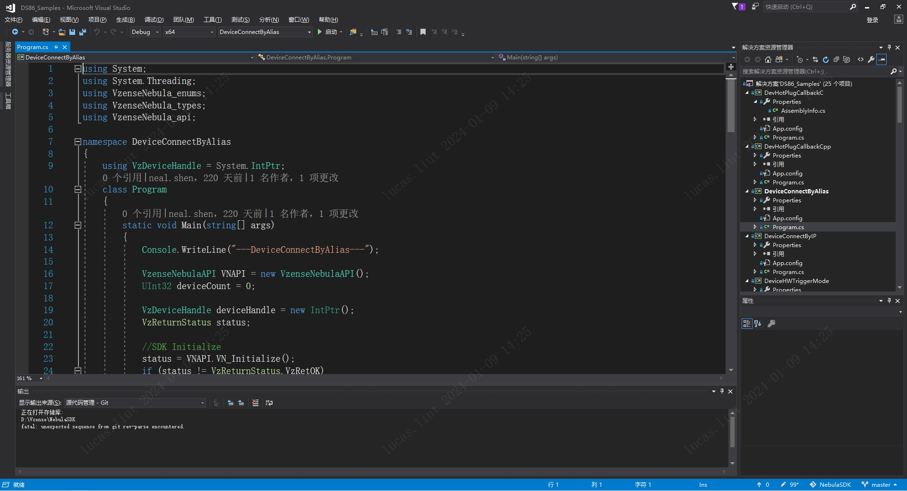
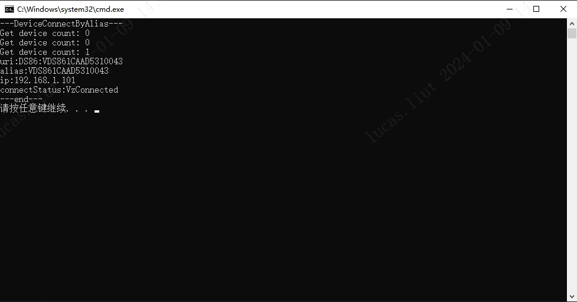

# 3.2.3. 基础例程

基础例程介绍 SDK 的单个特性 API 接口的使用。为了使用户可以快速的熟悉使用，例程根据产品进行分类。

例程包含打开图像数据流、图像获取、软/硬触发、点云转换与保存等 API 接口的使用。

接下来，我们将详细介绍每个例程的功能。

```cpp
ColorExposureTimeSetGet                         //设置获取设备彩色传感器曝光时间
ColorResolutionChange                           //更改设备彩色传感器分辨率
DevHotPlugCallbackC                             //C 设置设备热插拔回调
DevHotPlugCallbackCpp                           //C++设置设备热插拔回调
DeviceConnectByAlias                            //设置设备通过设备 SN 连接
DeviceConnectByIP                               //设置设备通过 IP 地址链接
DeviceHWTriggerMode                             //设置设备为硬触发模式
DeviceInfoGet                                   //获取设备 SN、IP 地址、固件版本信息
DeviceParamSetGet                               //获取设备内外参、畸变参数，设置、获取设备 GmmaGian 值
DeviceSearchAndConnect                          //搜索并连接设备
DeviceSetFrameRate                              //设置设备帧率
DeviceSetParamsByJson                           //通过 Json 设置设备参数
DeviceStartStopStreaming                        //开始与停止设备数据流
DeviceSWTriggerMode                             //设置设备为软触发模式
FrameCaptureAndSave                             //捕获与保存设备图像
MultiConnection                                 //多设备连接
MultiConnectionInMultiThread                    //在多线程中多设备连接
PointCloudCaptureAndSave                        //捕获与保存点云
PointCloudCaptureAndSaveDepthImgToColorSensor   //捕获点云并且将其保存到彩色图像传感器
PointCloudVectorAndSave                         //捕获与保存 ROI 区域中的点云
PointCloudVectorAndSaveDepthImgToColorSensor    //捕获 ROI 区域中的点云并且将其保存到彩色图像传感器
ToFExposureTimeSetGet                           //设置获取设备 ToF 曝光时间
ToFFiltersSetGet                                //设置获取设备 ToF 滤波开关
IRGMMCorrectionSetGet                           //设置获取设备 ToF IR校正参数
TransformColorImgToDepthSensorFrame             //将彩色图像对齐到设备的深度图像空间
TransformDepthImgToColorSensorFrame             //将深度图像对齐到设备的彩色图像空间
```

下面，我们以单个产品的单独例程为例，演示其编译运行的过程：

1. 根据实际产品选择对应的 sample，以 NYX650 产品编译 DeviceConnectByAlias 为例:

   ① 鼠标右键选择需要启动的项目，选择右键选项栏中的“设为启动项目”选项。

   ② 点击菜单栏的“调试”按钮，选择下拉栏中的“开始调试”或使用快捷键“F5”编译运行项目。

   

2. 编译完成，调试运行。结果如下图：

   
