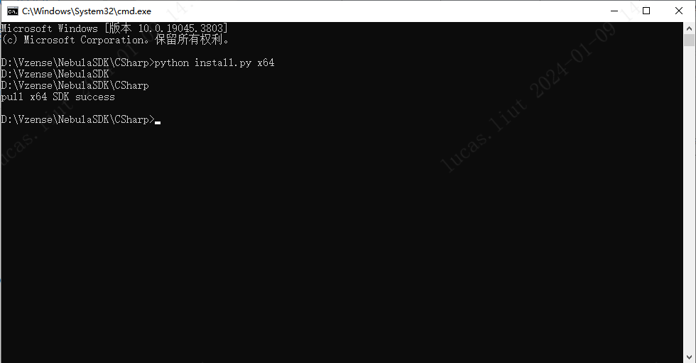

# 3.2.2. 项目配置

Windows 下使用 Visual Studio 2017 开发，需要.NET Framework 为 4.6.x 版本。

可按照以下步骤构建 CSharp 依赖的库环境。

项目支持**x64**和**x86**，需要将相应的文件复制到'Bin/x64'或'Bin/x86'。 以**x64**为例：

- 方法一:

  手动将**ScepterSDK/Windows/Bin/x64**中的所有文件复制到**ScepterSDK/C#/Bin/x64**

- 方法二:

  运行**ScepterSDK/C#/install.py**

  ```console
  python install.py x64
  ```

  
