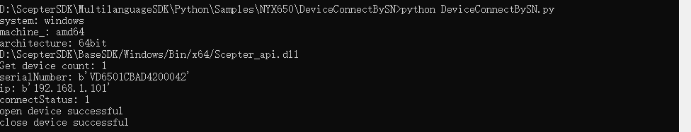

# 3.1. Python

## 3.1.1. 基础介绍

Python SDK 目录结构如下：


- API：主要包含 SDK 的通用头文件：Scepter_api.py，Scepter_define.py，Scepter_enums.py，Scepter_types.py。

- Samples：主要包含使用 ScepterSDK 开发的例程。

- README.md：SDK 的内容简介。

## 3.1.2. 项目配置

在运行 ScepterSDK 之前，请确保您的 Python 版本为 3.8 或更高版本，并已安装 ctypes、numpy 模块。在大多数 Python 发行版中，ctypes 都是作为内置模块存在的，因此我们无需额外安装。

> Python已验证版本：3.8/3.9/3.10/3.11/3.12

```shell
> pip install numpy
```

使用 ScepterSDK 开发新的项目，需要使用英文路径。针对不同的操作系统，需要同时复制 SDK 中的 Python 文件夹和对应系统的文件夹。API 文件夹中的 Scepter_api.py 会自动读取相机的 libScepter_api.so 或 Scepter_api.dll 库文件。

```python
if system_ == 'linux':
   if machine_ == 'x86_64':
      os_info = os.uname()
      print('os_info:',type(os_info))
      system_info = os_info.version
      print('version:',system_info)
      if system_info.find('18.04') != -1 or system_info.find('20.04') != -1:
         libpath = (os.path.abspath(os.path.dirname(os.getcwd()) + os.path.sep + "../../../../BaseSDK/"))+"/Ubuntu18.04/Lib/libScepter_api.so"
         print(libpath)
         self.sc_cam_lib = cdll.LoadLibrary(libpath)
      else:
         libpath = (os.path.abspath(os.path.dirname(os.getcwd()) + os.path.sep + "../../../../BaseSDK/"))+"/Ubuntu16.04/Lib/libScepter_api.so"
         print(libpath)
         self.sc_cam_lib = cdll.LoadLibrary(libpath)
      elif machine_ == 'aarch64':
         libpath = (os.path.abspath(os.path.dirname(os.getcwd()) + os.path.sep + "../../../../BaseSDK/"))+"/AArch64/Lib/libScepter_api.so"
         print(libpath)
         self.sc_cam_lib = cdll.LoadLibrary(libpath)
   else:
      print('do not supported OS', system_, machine_)
      exit()
elif platform.system() == 'Windows':
   if machine_ == 'amd64':
      if architecture_ == '64bit':
         libpath = (os.path.abspath(os.path.dirname(os.getcwd()) + os.path.sep + "../../../../BaseSDK/"))+"/Windows/Bin/x64/Scepter_api.dll"
         print(libpath)
         elf.sc_cam_lib = cdll.LoadLibrary(libpath)
   else:
      libpath = (os.path.abspath(os.path.dirname(os.getcwd()) + os.path.sep + "../../../../BaseSDK/"))+"/Windows/Bin/x86/Scepter_api.dll"
      print(libpath)
      self.sc_cam_lib = cdll.LoadLibrary(libpath)
   else:
      print('do not supported OS', system_, machine_)
      exit()
else:
   print('do not supported OS', system_, machine_)
   exit()

```

## 3.1.3. 基础例程

基础例程介绍 SDK 的单个特性 API 接口的使用。为了使用户可以快速的熟悉使用，例程根据产品进行分类。

例程包含打开图像数据流、图像获取、软/硬触发、点云转换与保存等 API 接口的使用。


接下来，我们将详细介绍每个例程的功能。

```python
ColorExposureTimeSetGet                         #设置获取设备彩色传感器曝光时间
ColorResolutionChange                           #更改设备彩色传感器分辨率
DevHotPlugCallback                              #设置设备热插拔回调
DeviceConnectByIP                               #设置设备通过 IP 地址链接
DeviceConnectBySN                               #设置设备通过设备 SN 连接
DeviceHWTriggerMode                             #设置设备为硬触发模式
DeviceImportParamInitFile                       #初始化参数文件导入到相机中
DeviceInfoGet                                   #获取设备 SN、IP 地址、固件版本信息
DeviceIPAndSubnetMaskSet						#设置设备静态IP、子网掩码（非DHCP）
DeviceParamSetGet                               #获取设备内外参、畸变参数，设置、获取设备 GmmaGian 值
DeviceSearchAndConnect                          #搜索并连接设备
DeviceSetFrameRate                              #设置设备帧率
DeviceSetNTP									#设置NTP对时
DeviceSetParamsByJson                           #通过 Json 设置设备参数
DeviceSetPTP								    #设置PTP对时
DeviceSetSoftwareTriggerParameter               #设置软触发融合图像帧数
DeviceStartStopStreaming                        #开始与停止设备数据流
DeviceSWTriggerMode                             #设置设备为软触发模式
DeviceUpgradeFirmWare                           #升级设备固件
FrameCaptureAndSave                             #捕获与保存设备图像
IRGMMCorrectionSetGet                           #设置获取设备 ToF IR校正参数
MultiConnection                                 #多设备连接
PointCloudCaptureAndSave                        #捕获与保存点云
PointCloudCaptureAndSaveDepthImgToColorSensor   #捕获点云并且将其保存到彩色图像传感器
PointCloudVectorAndSave                         #捕获与保存 ROI 区域中的点云
PointCloudVectorAndSaveDepthImgToColorSensor    #捕获 ROI 区域中的点云并且将其保存到彩色图像传感器
SingleFrameDelayTest							#触发模式下获取单帧图像耗时测试
ToFExposureTimeOfHDRSetGet                      #使能HDR设置获取设备 ToF 曝光时间
ToFExposureTimeOfWDRSetGet                      #使能WDR设置获取设备 ToF 曝光时间
ToFExposureTimeSetGet                           #设置获取设备 ToF 曝光时间
ToFFiltersSetGet                                #设置获取设备 ToF 滤波开关
TransformColorImgToDepthSensorFrame             #将彩色图像对齐到设备的深度图像空间
TransformDepthImgToColorSensorFrame             #将深度图像对齐到设备的彩色图像空间
FrameViewer                                     #设备的OpenCV例程 
```

下面，我们以单个产品的单独例程为例，演示其编译运行的过程：

1. 根据实际产品选择对应的 sample，以 NYX650 产品编译 DeviceConnectBySN 为例

   

2. 编译完成，调试运行。

   ```shell
   > cd ScepterSDK\Python\Samples\NYX650\DeviceConnectBySN
   > python DeviceConnectBySN.py
   ```

   结果如下图：

   

## 3.1.4. OpenCV 例程

OpenCV 例程用于展示如何搭配第三方库使用 ScepterSDK。例程使用 OpenCV 的图像映射功能展示彩色深度图像、IR 与 Color 图像。

1. 安装 opencv-python 模块。

   ```shell
   > pip install opencv-python
   ```

2. 根据实际产品选择对应的 sample，以 NYX650 为例

   

3. 运行 OpenCV 显示例程

   ```shell
   > cd ScepterSDK\Python\Samples\NYX650\FrameViewer
   > python FrameViewer.py
   ```

   

## 3.1.5. API 参考

> 不同型号产品对应的枚举值个数可能不同，请以实际枚举值为准。

<!-- tabs:start -->

#### **Enum 数据类型**

### 3.1.5.1.1. ScFrameType

**功能：**

图像类型。

**枚举值：**

```python
class ScFrameType(Enum):
    SC_DEPTH_FRAME       = 0                                #表示深度图像类型，每像素16位，以毫米为单位
    SC_IR_FRAME          = 1                                #表示灰度图像类型，每像素8位
    SC_COLOR_FRAME       = 3                                #表示彩色图像类型，每像素24位，RGB/BGR格式
    SC_TRANSFORM_COLOR_IMG_TO_DEPTH_SENSOR_FRAME = 4        #表示映射到深度传感器空间的彩色图像类型，其中分辨率与深度图像的分辨率相同
                                                            #可以使用scSetTransformColorImgToDepthSensorEnabled()启用此帧类型
    SC_TRANSFORM_DEPTH_IMG_TO_COLOR_SENSOR_FRAME = 5        #表示映射到彩色传感器空间的深度图像类型，其中分辨率与彩色图像的分辨率相同。
                                                            #可以使用scSetTransformDepthImgToColorSensorEnabled()启用此帧类型
```

### 3.1.5.1.2. ScSensorType

**功能：**

传感器类型。

**枚举值：**

```python
class ScSensorType(Enum):
    SC_TOF_SENSOR = 0x01,      #表示深度数据传感器
    SC_COLOR_SENSOR = 0x02    #表示彩色图像传感器
```

### 3.1.5.1.3. ScPixelFormat

**功能：**

图像数据的像素类型。

**枚举值：**

```python
class ScPixelFormat(Enum):
    SC_PIXEL_FORMAT_DEPTH_MM16      = 0   #表示每个像素数据为 16 位的深度值，单位为毫米
    SC_PIXEL_FORMAT_GRAY_8          = 2   #表示每个像素数据为 8 位的灰度值
    SC_PIXEL_FORMAT_RGB_888_JPEG    = 3   #表示通过JPEG解压缩，彩色图像像素格式，每个像素数据为 24 位的 RGB 值
    SC_PIXEL_FORMAT_BGR_888_JPEG    = 4   #表示通过JPEG解压缩，彩色图像像素格式，每个像素数据为 24 位的 BGR 值
    SC_PIXEL_FORMAT_RGB_888         = 5   #表示无压缩，彩色图像像素格式，每个像素数据为 24 位的 RGB 值
    SC_PIXEL_FORMAT_BGR_888         = 6   #表示无压缩，彩色图像像素格式，每个像素数据为 24 位的 BGR 值
    SC_PIXEL_FORMAT_RGB_565         = 7   #表示无压缩，彩色图像像素格式，每个像素数据为 16 位的 RGB 值
    SC_PIXEL_FORMAT_BGR_565         = 8   #表示无压缩，彩色图像像素格式，每个像素数据为 16 位的 BGR 值
```

### 3.1.5.1.4. ScReturnStatus

**功能：**

接口函数的返回值。

**枚举值：**

```python
class ScReturnStatus(Enum):
    SC_OK                           =  0     #表示调用成功
    SC_NO_DEVICE_CONNECTED          = -1     #表示当前无设备连接，或设备未正确连接。检查硬件连接或尝试拔下并重新插入电缆。
    SC_INVALID_DEVICE_INDEX         = -2     #表示传入的设备序号无效
    SC_DEVICE_POINTER_IS_NULL       = -3     #表示传入的设备指针为空
    SC_INVALID_FRAME_TYPE           = -4     #表示传入的图像类型无效
    SC_FRAME_POINTER_IS_NULL        = -5     #表示传入的图像指针为空
    SC_NO_PROPERTY_VALUE_GET        = -6     #表示无法获取当前属性值
    SC_NO_PROPERTY_VALUE_SET        = -7     #表示无法设置当前属性值
    SC_PROPERTY_POINTER_IS_NULL     = -8     #表示传入的指向存储属性值的缓存指针为空
    SC_PROPERTY_SIZE_NOT_ENOUGH     = -9     #表示传入的指向存储属性值的缓存空间不足
    SC_INVALID_DEPTH_RANGE          = -10    #表示传入的 depth range 无效
    SC_GET_FRAME_READY_TIME_OUT     = -11    #表示获取图像时超时
    SC_INPUT_POINTER_IS_NULL        = -12    #表示传入的指针为空
    SC_CAMERA_NOT_OPENED            = -13    #表示相机未打开
    SC_INVALID_CAMERA_TYPE          = -14    #表示传入的相机类型无效
    SC_INVALID_PARAMS               = -15    #表示传入的参数无效
    SC_CURRENT_VERSION_NOT_SUPPORT  = -16    #表示当前版本不支持
    SC_UPGRADE_IMG_ERROR            = -17    #表示升级相机固件失败
    SC_UPGRADE_IMG_PATH_TOO_LONG    = -18    #表示传入的相机固件路径长度太长（大于260）
    SC_UPGRADE_CALLBACK_NOT_SET     = -19    #表示未设置相机升级时的回调函数
    SC_PRODUCT_NOT_SUPPORT          = -20    #表示当前设备不支持此操作
    SC_NO_CONFIG_FOLDER             = -21    #表示未找到产品配置文件
    SC_WEB_SERVER_START_ERROR       = -22    #表示Web服务器启动/重新启动错误（IP或端口）
    SC_GET_OVER_STAY_FRAME          = -23    #表示从帧准备就绪到获取帧的时间超出1秒
    SC_CREATE_LOG_DIR_ERROR         = -24    #表示创建日志目录错误
    SC_CREATE_LOG_FILE_ERROR        = -25    #表示创建日志文件错误
    SC_NO_ADAPTER_CONNECTED         = -100   #表示电源适配器未连接
    SC_REINITIALIZED                = -101   #表示重复初始化
    SC_NO_INITIALIZED               = -102   #表示未做初始化
    SC_CAMERA_OPENED                = -103   #表示相机已经打开
    SC_CMD_ERROR                    = -104   #表示命令下发失败
    SC_CMD_SYNC_TIME_OUT            = -105   #表示命令发送成功，但是同步匹配失败
    SC_IP_NOT_MATCH                 = -106   #表示相机 IP 与主机 IP 不在同一网段
    SC_NOT_STOP_STREAM              = -107   #表示未调用SCStopStream关闭数据流
    SC_NOT_START_STREAM             = -108   #表示未调用scStartStream获取数据流
    SC_NOT_FIND_DRIVERS_FOLDER      = -109   #表示驱动程序目录不存在
    SC_CAMERA_OPENING               = -110   #表示相机已通过另一个SC_OpenDeviceByXXX API打开
    SC_CAMERA_OPENED_BY_ANOTHER_APP = -111   #表示相机已被其他应用程序打开
    ScRetOthers                     = -255   #表示其他错误
```

### 3.1.5.1.5. ScConnectStatus

**功能：**

设备连接状态。

**枚举值：**

```python
class ScConnectStatus(Enum):
    SC_LIMBO       = 0     #表示未知设备状态，无法尝试打开
    SC_CONNECTABLE = 1     #表示设备可连接状态，支持打开
    SC_OPENED      = 2     #表示设备已连接，无法再次打开
```

### 3.1.5.1.6. ScWorkMode

**功能：**

设备工作状态。

**枚举值：**

```python
class ScWorkMode(Enum):
    SC_ACTIVE_MODE           = 0x00    #表示设备处于主动工作状态。此时使用 API 打开相机后，设备会主动上传图像数据
    SC_HARDWARE_TRIGGER_MODE = 0x01    #表示设备处于被动工作状态。此时使用 API 打开相机后，设备在硬件触发的时候，才会上传图像数据
    SC_SOFTWARE_TRIGGER_MODE = 0x02    #表示设备处于被动工作状态。此时使用 API 打开相机后，设备在软件触发的时候，才会上传图像数据
```

### 3.1.5.1.7. ScExposureControlMode

**功能：**

传感器的曝光模式。

**枚举值：**

```python
class ScExposureControlMode(Enum):
    SC_EXPOSURE_CONTROL_MODE_AUTO   = 0    #表示传感器使用自动曝光模式
    SC_EXPOSURE_CONTROL_MODE_MANUAL = 1    #表示传感器使用手动曝光模式
```

#### **Struct 数据类型**

### 3.1.5.2.1. ScRGB888Pixel

**功能：**

彩色图像像素类型 RGB888。

**成员：**

```python
class ScRGB888Pixel(Structure):
    _pack_ = 1
    _fields_ = [("r", c_uint8),     #表示红色通道
                ("g", c_uint8),     #表示绿色通道
                ("b", c_uint8)]     #表示蓝色通道
```

### 3.1.5.2.2. ScBGR888Pixel

彩色图像像素类型 BGR888。

**成员：**

```python
class ScBGR888Pixel(Structure):
    _pack_ = 1
    _fields_ = [("b", c_uint8),     #表示蓝色通道
                ("g", c_uint8),     #表示绿色通道
                ("r", c_uint8)]     #表示红色通道
```

### 3.1.5.2.3. ScVector3f

**功能：**

3 维点坐标，单位为毫米。

**成员：**

```python
class ScVector3f(Structure):
    _pack_ = 1
    _fields_ = [("x", c_float),     #表示 X 轴方向的坐标值
                ("y", c_float),     #表示 Y 轴方向的坐标值
                ("z", c_float)]     #表示 Z 轴方向的坐标值
```

### 3.1.5.2.4. ScVector2u16

**功能：**

2 维点坐标。

**成员：**

```python
class ScVector2u16(Structure):
    _pack_ = 1
    _fields_ = [("x", c_uint16),    #表示 X 轴方向的坐标值
                ("y", c_uint16)]    #表示 Y 轴方向的坐标值
```

### 3.1.5.2.5. ScDepthVector3

**功能：**

深度图像的像素点表示。

**成员：**

```python
class ScDepthVector3(Structure):
    _pack_ = 1
    _fields_ = [("depthX", c_int),     #表示图像坐标系下，X 轴方向的坐标值
                ("depthY", c_int),     #表示图像坐标系下，Y 轴方向的坐标值
                ("depthZ", c_uint16)]  #表示像素坐标（depthX，depthY）处的深度值，单位为毫米
```

### 3.1.5.2.6. ScResolution

**功能：**

图像分辨率。

**成员：**

```python
class ScResolution(Structure):
    _pack_ = 1
    _fields_ = [("width", c_int),      #表示图像的宽度
                ("height", c_int)]     #表示图像的高度
```

### 3.1.5.2.7. ScResolutionList

**功能：**

支持的图像分辨率。

**成员：**

```python
class ScResolutionList(Structure):
    _pack_ = 1
    _fields_ = [("count", c_int),                     #表示支持的图像分辨率的数量
                ("resolution", ScResolution * 6)]     #表示支持的图像分辨率的信息
```

### 3.1.5.2.8. ScSensorIntrinsicParameters

**功能：**

传感器的镜头内参和畸变参数。内参通常用于点云的计算，畸变参数用于图像反畸变算法使用。

SDK 中已经实现深度图像到点云的转换及图像反畸变的功能，请参考例程使用相关接口。

**成员：**

```python
class ScSensorIntrinsicParameters(Structure):
    _pack_ = 1
    _fields_ = [("fx", c_double),      #x方向的焦距，单位为像素
                ("fy", c_double),      #y方向的焦距，单位为像素
                ("cx", c_double),      #主点的x坐标，图像的中心，单位为像素
                ("cy", c_double),      #主点的y坐标，图像的中心，单位为像素
                ("k1", c_double),      #径向畸变, 1st
                ("k2", c_double),      #径向畸变, 2nd
                ("p1", c_double),      #轴向畸变
                ("p2", c_double),      #轴向畸变
                ("k3", c_double),      #径向畸变, 3rd
                ("k4", c_double),      #径向畸变, 4st
                ("k5", c_double),      #径向畸变, 5nd
                ("k6", c_double)]      #径向畸变, 6rd
```

### 3.1.5.2.9. ScSensorExtrinsicParameters

**功能：**

相机外参 R 与 T，用于 depth 与 rgb 图像的对齐，参考公式如下:


**成员：**

```python
class ScSensorExtrinsicParameters(Structure):
    _pack_ = 1
    _fields_ = [("rotation", c_double * 9),        #3×3 的旋转矩阵
                ("translation", c_double * 3)]     #3×1 平移矩阵
```

### 3.1.5.2.10. ScTimeStamp

**功能：**

表示图像时间戳。

**成员：**

```python
class ScTimeStamp(Structure):
    _pack_ = 1
    _fields_ = [("tm_sec", c_uint16),     #秒
                ("tm_min", c_uint16),     #分钟
                ("tm_hour", c_uint16),    #小时
                ("tm_msec", c_uint16)]    #毫秒
```

### 3.1.5.2.11. ScFrame

**功能：**

图像信息。

**成员：**

```python
class ScFrame(Structure):
    _pack_ = 1
    _fields_ = [("frameIndex", c_uint32),             #表示图像帧索引号
                ("frameType", c_int32),               #表示图像数据类型
                ("pixelFormat", c_int32),             #表示像素类型
                ("pFrameData", POINTER(c_uint8)),     #表示指向图像数据缓存的指针
                ("dataLen", c_uint32),                #表示图像数据的长度，单位为字节
                ("exposureTime", c_float),            #表示曝光时间，单位为毫秒
                ("depthRange", c_uint8),              #表示当前帧的深度范围，仅对深度图像有效
                ("width", c_uint16),                  #表示图像宽度
                ("height", c_uint16),                 #表示图像高度
                ("hardwaretimestamp", c_uint64)]      #表示帧在设备上生成时的时间戳，不包括帧处理和传输时间
```

### 3.1.5.2.12. ScFrameReady

**功能：**

图像数据是否就绪（1 代表就绪，0 代表未就绪）。

**枚举值：**

```python
class ScFrameReady(Structure):
    _pack_ = 1
    _fields_ = [("depth", c_uint, 1),                 #表示深度图像数据是否就绪
                ("ir", c_uint, 1),                    #表示灰度图像数据是否就绪
                ("color", c_uint, 1),                 #表示彩色图像数据是否就绪
                ("transformedColor", c_uint, 1),      #表示对齐到深度传感器空间的彩色图像是否就绪
                ("transformedDepth", c_uint, 1),      #表示对齐到彩色传感器空间的深度图像是否就绪
                ("reserved", c_uint, 27)]             #预留位
```

### 3.1.5.2.13. ScDeviceInfo

**功能：**

设备信息。

**成员：**

```python
class ScDeviceInfo(Structure):
    _pack_ = 1
    _fields_ = [("productName", c_char * 64),      #表示设备的产品名称
                ("serialNumber", c_char * 64),     #表示设备的序列号
                ("ip", c_char * 17),               #表示设备的 IP 地址
                ("status", c_int32)]               #表示设备连接状态
```

### 3.1.5.2.14. ScConfidenceFilterParams

**功能：**

置信度滤波参数。

**成员：**

```python
class ScConfidenceFilterParams(Structure):
    _pack_ = 1
    _fields_ = [("threshold", c_int32),      #表示滤波阈值，[1，100]，数值越大，过滤效果越明显，过滤掉的点数越多
                ("enable", c_bool)]          #表示滤波是否打开，true 代表打开，false 代表关闭
```

### 3.1.5.2.15. ScFlyingPixelFilterParams

**功能：**

去飞点滤波参数。

**成员：**

```python
class ScFlyingPixelFilterParams(Structure):
    _pack_ = 1
    _fields_ = [("threshold", c_int32),      #表示滤波阈值，[0，16]，数值越大，过滤效果越明显，过滤掉的点数越多
                ("enable", c_bool)]          #表示滤波是否打开，true 代表打开，false 代表关闭
```

### 3.1.5.2.16. ScTimeFilterParams

**功能：**

时间滤波参数。

**成员：**

```python
class ScTimeFilterParams(Structure):
    _pack_ = 1
    _fields_ = [("threshold", c_int32),      #表示滤波阈值，[1，6]，值越大，滤波效果越明显，点云抖动越小
                ("enable", c_bool)]          #表示滤波是否打开，true 代表打开，false 代表关闭
```

### 3.1.5.2.17. ScIRGMMCorrectionParams

**功能：**

IR gain 值校正参数。

**成员：**

```python
class ScIRGMMCorrectionParams(Structure):
    _pack_ = 1
    _fields_ = [("threshold", c_int32),      #表示滤波阈值，[0，100]，数值越大，校正效果越明显
                ("enable", c_bool)]          #表示滤波是否打开，true 代表打开，false 代表关闭
```

### 3.1.5.2.18. ScInputSignalParamsForHWTrigger

**功能：**

IR gain 值校正参数。

**成员：**

```python
class ScInputSignalParamsForHWTrigger(Structure):
    _pack_ = 1
    _fields_ = [("width", c_uint16),        #表示输入信号宽度，阈值[1，65535]
                ("interval", c_uint16),     #表示输入信号的间隔，阈值[34000，65535]
                ("polarity", c_uint8)]		#表示电平有效性，[0，1]，0表示低电平有效，1表示高电平有效
```

### 3.1.5.2.19. ScTimeSyncConfig

**功能：**

IR gain 值校正参数。

**成员：**

```python
class ScTimeSyncConfig(Structure):
    _pack_ = 1
    _fields_ = [("flag", c_uint8),			#0:表示关闭对时，1:表示开启NTP对时，2:表示开启PTP对时，只有NTP对时需要IP
                ("ip", c_uint8 * 16)]       #只有NTP对时需要ip
```

#### 

#### **API 介绍**

class ScepterTofCam中，对BaseSDK的接口进行Python的封装转换。

### 3.1.5.3.1. scInitialize

**函数原型：**

```python
def scInitialize(self):
    return self.sc_cam_lib.scInitialize()
```

**函数功能：**

初始化SDK

**函数参数：**

无

**返回值：**

[**ScReturnStatus**](#_31514-screturnstatus)：SC_OK 调用成功，其他值调用失败


> 已在 def __init__(self):中调用，故Samples中没有调用
### 3.1.5.3.2. scShutdown

**函数原型：**

```python
def scShutdown(self):
    return self.sc_cam_lib.scShutdown()
```

**函数功能：**

释放SDK

**函数参数：**

无

**返回值：**

[**ScReturnStatus**](#_31514-screturnstatus)：SC_OK 调用成功，其他值调用失败

> 已在 def __del__(self)中调用，故Samples中没有调用

### 3.1.5.3.3. scGetSDKVersion

**函数原型：**

```python
def scGetSDKVersion(self):
    tmp = c_char * 64
    version = tmp()
    return self.sc_cam_lib.scGetSDKVersion(version, 63),version.value
```

**函数功能：**

获取 SDK 的版本号：x.x.x

**函数参数：**

无

**返回值：**

[**ScReturnStatus**](#_31514-screturnstatus)：SC_OK 调用成功，其他值调用失败

version.value：SDK 版本号

### 3.1.5.3.4. scGetDeviceCount

**函数原型：**

```python
def scGetDeviceCount(self, scanTime = c_uint32(33)):
    count = c_int()
    self.sc_cam_lib.scGetDeviceCount(byref(count), scanTime)
    return count.value
```

**函数功能：**

获取已连接的设备数目

**函数参数：**

scanTime：单位为毫秒，数值范围为（0，65535）。
当设备计数不为 0 时，API 立即返回。
当设备计数为 0 时，除非设备计数不为 0，否则 API 最多等待等待时间（ms）。

**返回值：**

count.value：设备数量

### 3.1.5.3.5. scGetDeviceInfoList

**函数原型：**

```python
def scGetDeviceInfoList(self, cam_count = 1):
    tmp  = ScDeviceInfo* cam_count
    device_infolist = tmp()
    return self.sc_cam_lib.scGetDeviceInfoList(cam_count, device_infolist),device_infolist
```

**函数功能：**

获取 deviceCount 个数的设备信息列表

**函数参数：**

cam_count：需要获取信息列表的设备个数

**返回值：**

[**ScReturnStatus**](#_31514-screturnstatus)：SC_OK 调用成功，其他值调用失败

[**device_infolist**](#_315213-scdeviceinfo)：返回设备信息列表，其应该指向大小为 sizeof(ScDeviceInfo)\*deviceCount 大小的缓存

### 3.1.5.3.6. scOpenDeviceBySN

**函数原型：**

```python
def scOpenDeviceBySN(self,  SN=c_char_p()):
    if SN:
        return self.sc_cam_lib.scOpenDeviceBySN(SN, byref(self.device_handle))
    else:
        return ScReturnStatus.SC_INPUT_POINTER_IS_NULL
```

**函数功能：**

使用设备标识符打开设备

**函数参数：**

SN：设备标识符

**返回值：**

[**ScReturnStatus**](#_31514-screturnstatus)：SC_OK 调用成功，其他值调用失败

### 3.1.5.3.7. scOpenDeviceByIP

**函数原型：**

```python
def scOpenDeviceByIP(self,  ip=c_char_p()):
    if ip:
        return self.sc_cam_lib.scOpenDeviceByIP(ip, byref(self.device_handle))
    else:
        return ScReturnStatus.SC_INPUT_POINTER_IS_NULL, 0
```

**函数功能：**

使用设备 IP 地址打开设备

**函数参数：**

ip：设备的 IP 地址

**返回值：**

[**ScReturnStatus**](#_31514-screturnstatus)：SC_OK 调用成功，其他值调用失败

### 3.1.5.3.8. scCloseDevice

**函数原型：**

```python
def scCloseDevice(self):
    return self.sc_cam_lib.scCloseDevice(byref(self.device_handle))
```

**函数功能：**

关闭设备

**函数参数：**

无

**返回值：**

[**ScReturnStatus**](#_31514-screturnstatus)：SC_OK 调用成功，其他值调用失败

### 3.1.5.3.9. scStartStream

**函数原型：**

```python
def scStartStream(self):
    return self.sc_cam_lib.scStartStream(self.device_handle)
```

**函数功能：**

打开数据流

**函数参数：**

无

**返回值：**

[**ScReturnStatus**](#_31514-screturnstatus)：SC_OK 调用成功，其他值调用失败

### 3.1.5.3.10. scStopStream

**函数原型：**

```python
def scStopStream(self):
    return self.sc_cam_lib.scStopStream(self.device_handle)
```

**函数功能：**

关闭数据流

**函数参数：**

无

**返回值：**

[**ScReturnStatus**](#_31514-screturnstatus)：SC_OK 调用成功，其他值调用失败

### 3.1.5.3.11. scGetFrameReady

**函数原型：**

```python
def scGetFrameReady(self,waitTime = c_uint16(33)):
    frameready = ScFrameReady()
    if not self.device_handle:
        return -3, frameready
    return self.sc_cam_lib.scGetFrameReady(self.device_handle, waitTime, byref(frameready)), frameready
```

**函数功能：**

获取图像就绪状态。调用函数 scGetFrame 前必须调用此函数，否则无法获取图像。

**函数参数：**

waitTime：允许等待图像就绪的超时时间(ms)，取值范围为(0，65535)。此值与图像的帧率有关，建议值设置为 2\*1000/fps。例如当前的帧率为 20，则建议设置 waitTime 为 2 \* 1000 / 20 = 100。如果设置 waitTime 为 40，则调用函数时可能返回 ScRetGetFrameReadyTimeOut。

**返回值：**

[**ScReturnStatus**](#_31514-screturnstatus)：SC_OK 调用成功，其他值调用失败

[**frameready**](#_315212-scframeready)：返回图像的就绪状态

### 3.1.5.3.12. scGetFrame

**函数原型：**

```python
def scGetFrame(self,  frametype = ScFrameType.SC_DEPTH_FRAME):
    Scframe = ScFrame()
    return self.sc_cam_lib.scGetFrame(self.device_handle, frametype.value, byref(Scframe)), Scframe
```

**函数功能：**

获取指定图像类型的图像数据。调用此函数前必须调用 scGetFrameReady。

**函数参数：**

[frametype](#_31511-scframetype)：待获取图像的类型 

**返回值：**

[**ScReturnStatus**](#_31514-screturnstatus)：SC_OK 调用成功，其他值调用失败

[**Scframe**](#_315211-scframe)：返回的图像数据

### 3.1.5.3.13.scGetDepthRangeValue

**函数原型：**

```python
def scGetDepthRangeValue(self):
    minValue = c_int16(0)
    maxValue = c_int16(0)
    return self.sc_cam_lib.scGetDepthRangeValue(self.device_handle, byref(minValue), byref(maxValue)), minValue.value, maxValue.value
 
```

**函数功能：**

获取设备当前工作模式下的深度范围

**函数参数：**

无

**返回值：**

[**ScReturnStatus**](#_31514-screturnstatus)：SC_OK 调用成功，其他值调用失败

minValue：深度最小值

minValue：深度最大值

### 3.1.5.3.14. scGetSensorIntrinsicParameters

**函数原型：**

```python
def scGetSensorIntrinsicParameters(self, sensorType = ScSensorType.SC_TOF_SENSOR):
    CameraParameters = ScSensorIntrinsicParameters()
    return self.sc_cam_lib.scGetSensorIntrinsicParameters(self.device_handle, sensorType.value, byref(CameraParameters)), CameraParameters
```

**函数功能：**

获取传感器镜头的内参

**函数参数：**

[sensorType](#_31512-scsensortype)：传感器类型 

**返回值：**

[**ScReturnStatus**](#_31514-screturnstatus)：SC_OK 调用成功，其他值调用失败

[**CameraParameters**](#_31528-scsensorintrinsicparameters)：返回传感器镜头的内参

### 3.1.5.3.15. scGetSensorExtrinsicParameters

**函数原型：**

```python
def scGetSensorExtrinsicParameters(self):
    CameraExtrinsicParameters = ScSensorExtrinsicParameters()
    return self.sc_cam_lib.scGetSensorExtrinsicParameters(self.device_handle, byref(CameraExtrinsicParameters)), CameraExtrinsicParameters
```

**函数功能：**

获取设备的外参

**函数参数：**

无

**返回值：**

[**ScReturnStatus**](#_31514-screturnstatus)：SC_OK 调用成功，其他值调用失败

[**CameraExtrinsicParameters**](#_31529-scsensorextrinsicparameters)：返回设备的外参

### 3.1.5.3.16. scGetFirmwareVersion

**函数原型：**

```python
def scGetFirmwareVersion(self):
    tmp = c_char * 64
    fw = tmp()
    return self.sc_cam_lib.scGetFirmwareVersion(self.device_handle, fw, 63),fw.value
```

**函数功能：**

获取设备的固件版本

**函数参数：**

无

**返回值：**

[**ScReturnStatus**](#_31514-screturnstatus)：SC_OK 调用成功，其他值调用失败

fw.value：返回设备的固件版本

### 3.1.5.3.17. scGetDeviceMACAddress

**函数原型：**

```python
def scGetDeviceMACAddress(self):
    tmp = c_char * 18
    mac = tmp()
    return self.sc_cam_lib.scGetDeviceMACAddress(self.device_handle, mac), mac.value
```

**函数功能：**

获取设备的 MAC 地址

**函数参数：**

无

**返回值：**

[**ScReturnStatus**](#_31514-screturnstatus)：SC_OK 调用成功，其他值调用失败

mac.value：返回设备的 MAC 地址，其默认是一个字节长度为 18，以‘\0’结尾的字符串

### 3.1.5.3.18. scSetDeviceDHCPEnabled

**函数原型：**

```python
def scSetDeviceDHCPEnabled(self, enable = c_bool(True)):
    return self.sc_cam_lib.scSetDeviceDHCPEnabled(self.device_handle, enable)
```

**函数功能：**

设置DHCP使能状态

**函数参数：**

enable：true 开启，false 关闭

**返回值：**

[**ScReturnStatus**](#_31514-screturnstatus)：SC_OK 调用成功，其他值调用失败 

### 3.1.5.3.19. scGetDeviceDHCPEnabled

**函数原型：**

```python
def scGetDeviceDHCPEnabled(self):
    enable = c_bool(True)
    return self.sc_cam_lib.scGetDeviceDHCPEnabled(self.device_handle, byref(enable)), enable.value
```

**函数功能：**

获取DHCP使能状态

**函数参数：**

无

**返回值：**

[**ScReturnStatus**](#_31514-screturnstatus)：SC_OK 调用成功，其他值调用失败 

enable.value：true 开启，false 关闭

### 3.1.5.3.20. scSetDeviceIPAddr

**函数原型：**

```python
def scSetDeviceIPAddr(self, IPAddr=c_char_p(), length=c_int32(16)):
    return self.sc_cam_lib.scSetDeviceIPAddr(self.device_handle, IPAddr, length)
```

**函数功能：**

设置非DHCP下的IP地址。

**函数参数：**

IPAddr：ip地址

length：ip长度

**返回值：**

[**ScReturnStatus**](#_31514-screturnstatus)：SC_OK 调用成功，其他值调用失败 

### 3.1.5.3.21. scGetDeviceIPAddr

**函数原型：**

```python
def scGetDeviceIPAddr(self):
    tmp = c_char * 16
    IPAddr = tmp()
    return self.sc_cam_lib.scGetDeviceIPAddr(self.device_handle, IPAddr), IPAddr.value
```

**函数功能：**

获取非DHCP下的IP地址。

**函数参数：**

无

**返回值：**

[**ScReturnStatus**](#_31514-screturnstatus)：SC_OK 调用成功，其他值调用失败 

IPAddr.value：IP地址

### 3.1.5.3.22. scSetDeviceSubnetMask

**函数原型：**

```python
def scSetDeviceSubnetMask(self, subnetMask=c_char_p(), length=c_int32(16)):
    return self.sc_cam_lib.scSetDeviceSubnetMask(self.device_handle, subnetMask, length)
```

**函数功能：**

设置非DHCP下的子网掩码。

**函数参数：**

subnetMask：子网掩码地址

length：子网掩码长度

**返回值：**

[**ScReturnStatus**](#_31514-screturnstatus)：SC_OK 调用成功，其他值调用失败 

### 3.1.5.3.23. scGetDeviceSubnetMask

**函数原型：**

```python
def scGetDeviceSubnetMask(self):
    tmp = c_char * 16
    subnetMask = tmp()
    return self.sc_cam_lib.scGetDeviceSubnetMask(self.device_handle, subnetMask), subnetMask.value
```

**函数功能：**

获取非DHCP下的子网掩码。

**函数参数：**

无

**返回值：**

[**ScReturnStatus**](#_31514-screturnstatus)：SC_OK 调用成功，其他值调用失败 

subnetMask.value：子网掩码

### 3.1.5.3.24. scSetRealTimeSyncConfig

**函数原型：**

```python
def scSetRealTimeSyncConfig(self, params = ScTimeSyncConfig()):
    return self.sc_cam_lib.scSetRealTimeSyncConfig(self.device_handle, params)
```

**函数功能：**

设置时间同步的参数

**函数参数：**

[params](#_315219-sctimesyncconfig)：时间同步参数

**返回值：**

[**ScReturnStatus**](#_31514-screturnstatus)：SC_OK 调用成功，其他值调用失败 

### 3.1.5.3.25. scGetRealTimeSyncConfig

**函数原型：**

```python
def scGetRealTimeSyncConfig(self):
    pParams = ScTimeSyncConfig()
    return self.sc_cam_lib.scGetRealTimeSyncConfig(self.device_handle, byref(pParams)),pParams
```

**函数功能：**

获取时间同步的参数

**函数参数：**

无

**返回值：**

[**ScReturnStatus**](#_31514-screturnstatus)：SC_OK 调用成功，其他值调用失败 

[**pParams**](#_315219-sctimesyncconfig)：时间同步参数

### 3.1.5.3.26. scSetFrameRate

**函数原型：**

```python
def scSetFrameRate(self, value = c_uint8(30)):
    return self.sc_cam_lib.scSetFrameRate(self.device_handle, value)
```

**函数功能：**

设置设备的图像帧率，同时对深度和彩色图像生效。此接口是同步接口，耗时较长，大约需要 500ms

**函数参数：**

value：要设置的目标帧率

**返回值：**

[**ScReturnStatus**](#_31514-screturnstatus)：SC_OK 调用成功，其他值调用失败

### 3.1.5.3.27. scGetFrameRate

**函数原型：**

```python
def scGetFrameRate(self):
    rate = c_uint8(1)
    return self.sc_cam_lib.scGetFrameRate(self.device_handle, byref(value)), rate.value
```

**函数功能：**

获取设备的图像帧率

**函数参数：**

无

**返回值：**

[**ScReturnStatus**](#_31514-screturnstatus)：SC_OK 调用成功，其他值调用失败

rate.value：返回设备的图像帧率

[**ScReturnStatus**](#_31514-screturnstatus)：SC_OK 调用成功，其他值调用失败

**value.value**：返回设备的图像帧率

### 3.1.5.3.28. scSetWorkMode

**函数原型：**

```python
def scSetWorkMode(self,  mode = ScWorkMode.SC_ACTIVE_MODE):
    return self.sc_cam_lib.scSetWorkMode(self.device_handle, mode.value)
```

**函数功能：**

设置相机的工作模式

**函数参数：**

[mode](#_31516-scworkmode)：工作模式

**返回值：**

[**ScReturnStatus**](#_31514-screturnstatus)：SC_OK 调用成功，其他值调用失败

### 3.1.5.3.29. scGetWorkMode

**函数原型：**

```python
def scGetWorkMode(self):
    mode = c_uint8(0)
    return self.sc_cam_lib.scGetWorkMode(self.device_handle, byref(mode)), mode.value
```

**函数功能：**

获取相机的工作模式

**函数参数：**

无

**返回值：**

[**ScReturnStatus**](#_31514-screturnstatus)：SC_OK 调用成功，其他值调用失败

[mode.value](#_31516-scworkmode)：获取到的设备的工作模式

### 3.1.5.3.30. scSetSoftwareTriggerParameter

**函数原型：**

```python
def scSetSoftwareTriggerParameter(self, param = c_uint8(0)):
    return self.sc_cam_lib.scSetSoftwareTriggerParameter(self.device_handle, param)
```

**函数功能：**

设置软件触发模式下的，做融合处理的图像帧数

**函数参数：**

param：图像帧数

**返回值：**

[**ScReturnStatus**](#_31514-screturnstatus)：SC_OK 调用成功，其他值调用失败

### 3.1.5.3.31. scGetSoftwareTriggerParameter

**函数原型：**

```python
def scGetSoftwareTriggerParameter(self):
    param = c_uint8(0)
    return self.sc_cam_lib.scGetSoftwareTriggerParameter(self.device_handle, byref(param)), param.value
```

**函数功能：**

获取软件触发模式下的，做融合处理的图像帧数

**函数参数：**

无

**返回值：**

[**ScReturnStatus**](#_31514-screturnstatus)：SC_OK 调用成功，其他值调用失败

param：图像帧数

### 3.1.5.3.32. scSoftwareTriggerOnce

**函数原型：**

```python
def scSoftwareTriggerOnce(self):
    return self.sc_cam_lib.scSoftwareTriggerOnce(self.device_handle)
```

**函数功能：**

执行一次软件触发，仅当相机处于 SC_SOFTWARE_TRIGGER_MODE 时有效

**函数参数：**

无

**返回值：**

[**ScReturnStatus**](#_31514-screturnstatus)：SC_OK 调用成功，其他值调用失败

### 3.1.5.3.33. scSetInputSignalParamsForHWTrigger

**函数原型：**

```python
def scSetInputSignalParamsForHWTrigger(self, params = ScInputSignalParamsForHWTrigger()):
    return self.sc_cam_lib.scSetInputSignalParamsForHWTrigger(self.device_handle, params)
```

**函数功能：**

设置硬触发的输入信号参数

**函数参数：**

[params](#_315218-scinputsignalparamsforhwtrigger)：硬触发的输入信号参数

**返回值：**

[**ScReturnStatus**](#_31514-screturnstatus)：SC_OK 调用成功，其他值调用失败

### 3.1.5.3.34. scGetInputSignalParamsForHWTrigger

**函数原型：**

```python
def scSetInputSignalParamsForHWTrigger(self, params = ScInputSignalParamsForHWTrigger()):
    return self.sc_cam_lib.scSetInputSignalParamsForHWTrigger(self.device_handle, params)
```

**函数功能：**

获取硬触发的输入信号参数

**函数参数：**

无

**返回值：**

[**ScReturnStatus**](#_31514-screturnstatus)：SC_OK 调用成功，其他值调用失败

[params](#_315218-scinputsignalparamsforhwtrigger)：硬触发的输入信号参数

### 3.1.5.3.35. scSetIRGMMGain

**函数原型：**

```python
def scSetIRGMMGain(self, gmmgain = c_uint8(20)):
    return self.sc_cam_lib.scSetIRGMMGain(self.device_handle, gmmgain)
```

**函数功能：**

设置 IR 图像的数字增益

**函数参数：**

gmmgain：要设置给设备的 IR 增益值

**返回值：**

[**ScReturnStatus**](#_31514-screturnstatus)：SC_OK 调用成功，其他值调用失败

### 3.1.5.3.36. scGetIRGMMGain

**函数原型：**

```python
def scGetIRGMMGain(self):
    gmmgain = c_uint8(1)
    return self.sc_cam_lib.scGetIRGMMGain(self.device_handle, byref(gmmgain)), gmmgain.value
```

**函数功能：**

获取 IR 图像的数字增益

**函数参数：**

无

**返回值：**

[**ScReturnStatus**](#_31514-screturnstatus)：SC_OK 调用成功，其他值调用失败

**gmmgain.value**：返回设备的 IR 增益值

### 3.1.5.3.37. scSetIRGMMCorrection

**函数原型：**

```python
def scSetIRGMMCorrection(self, params = ScIRGMMCorrectionParams()):
    return self.sc_cam_lib.scSetIRGMMCorrection(self.device_handle, params)
```

**函数功能：**

设置设备上的 IR Gamma 校正的值

**函数参数：**

[params](#_315217-scirgmmcorrectionparams)：IR Gamma 校正的值

**返回值：**

[**ScReturnStatus**](#_31514-screturnstatus)：SC_OK 调用成功，其他值调用失败

### 3.1.5.3.38. scGetIRGMMCorrection

**函数原型：**

```python
def scGetIRGMMCorrection(self):
   params = ScIRGMMCorrectionParams()
   return self.sc_cam_lib.scGetIRGMMCorrection(self.device_handle, byref(params)), params
```

**函数功能：**

获取设备上的 IR Gamma 校正的值

**函数参数：**

无

**返回值：**

[**ScReturnStatus**](#_31514-screturnstatus)：SC_OK 调用成功，其他值调用失败

[params](#_31514-screturnstatus)：IR Gamma 校正的值

### 3.1.5.3.39. scSetColorPixelFormat

**函数原型：**

```python
def scSetColorPixelFormat(self,pixelFormat=ScPixelFormat.SC_PIXEL_FORMAT_BGR_888_JPEG):
    return self.sc_cam_lib.scSetColorPixelFormat(self.device_handle, pixelFormat)
```

**函数功能：**

设置彩色图像的像素格式，目前仅支持 RGB 和 BGR 格式

**函数参数：**

[pixelFormat](#_31513-scpixelformat)：要设置的彩色图像的像素格式

**返回值：**

[**ScReturnStatus**](#_31514-screturnstatus)：SC_OK 调用成功，其他值调用失败

### 3.1.5.3.40. scSetColorGain

**函数原型：**

```python
def scSetColorGain(self, params = c_float(1.0)):
   return self.sc_cam_lib.scSetColorGain(self.device_handle,  params)
```

**函数功能：**

在手动曝光模式中，设置彩色传感器曝光模式的颜色增益

**函数参数：**

params：彩色传感器的颜色增益值。不同的产品具有不同的范围，请参考产品说明书

**返回值：**

[**ScReturnStatus**](#_31514-screturnstatus)：SC_OK 调用成功，其他值调用失败

### 3.1.5.3.41. scGetColorGain

**函数原型：**

```python
def scGetColorGain(self):
    tmp = c_float*1
    params = tmp()
    return self.sc_cam_lib.scGetColorGain(self.device_handle,  params), params
```

**函数功能：**

获取彩色传感器曝光模式的颜色增益

**函数参数：**

无

**返回值：**

[**ScReturnStatus**](#_31514-screturnstatus)：SC_OK 调用成功，其他值调用失败

params：彩色传感器的颜色增益值。不同的产品具有不同的范围，请参考产品说明书

### 3.1.5.3.42. scGetSupportedResolutionList

**函数原型：**

```python
def scGetSupportedResolutionList(self, type = ScSensorType.SC_TOF_SENSOR, cam_count=1):
    tmp = ScResolutionList * cam_count
    pList = tmp()
    return self.sc_cam_lib.scGetSupportedResolutionList(self.device_handle, type.value, byref(pList)), pList
```

**函数功能：**

获取传感器支持的图像分辨率列表

**函数参数：**

无

**返回值：**

[**ScReturnStatus**](#_31514-screturnstatus)：SC_OK 调用成功，其他值调用失败

pList：支持的图像分辨率列表

### 3.1.5.3.43. scSetColorResolution

**函数原型：**

```python
def scSetColorResolution(self, w = c_int32(1600), h = c_int32(1200)):
    return self.sc_cam_lib.scSetColorResolution(self.device_handle, w, h)
```

**函数功能：**

设置彩色图像的分辨率

**函数参数：**

w：图像的宽

h：图像的高

**返回值：**

[**ScReturnStatus**](#_31514-screturnstatus)：SC_OK 调用成功，其他值调用失败

### 3.1.5.3.44. scGetColorResolution

**函数原型：**

```python
def scGetColorResolution(self):
    w = c_int32(1600)
    h = c_int32(1200)
    return self.sc_cam_lib.scGetColorResolution(self.device_handle, byref(w), byref(h)), w, h
```

**函数功能：**

获取彩色图像的分辨率

**函数参数：**

无

**返回值：**

[**ScReturnStatus**](#_31514-screturnstatus)：SC_OK 调用成功，其他值调用失败

w：返回彩色图像的图像宽

h：返回彩色图像的图像高

### 3.1.5.3.45. scSetExposureControlMode

**函数原型：**

```python
def scSetExposureControlMode(self, sensorType = ScSensorType.SC_TOF_SENSOR, mode = ScExposureControlMode.SC_EXPOSURE_CONTROL_MODE_MANUAL):
    return self.sc_cam_lib.scSetExposureControlMode(self.device_handle, sensorType.value, mode.value)
```

**函数功能：**

设置传感器的曝光模式

**函数参数：**

[sensorType](#_31512-scsensortype)：要设置曝光模式的传感器类型

[mode](#_31517-scexposurecontrolmode)：要设置的曝光模式

**返回值：**

[**ScReturnStatus**](#_31514-screturnstatus)：SC_OK 调用成功，其他值调用失败

### 3.1.5.3.46. scGetExposureControlMode

**函数原型：**

```python
def scGetExposureControlMode(self, sensorType = ScSensorType.SC_TOF_SENSOR):
    mode = c_uint8(1)
    return self.sc_cam_lib.scGetExposureControlMode(self.device_handle, sensorType.value, byref(mode)), mode.value
```

**函数功能：**

获取传感器的曝光模式

**函数参数：**

[sensorType](#_31512-scsensortype)：要设置曝光模式的传感器类型

**返回值：**

[**ScReturnStatus**](#_31514-screturnstatus)：SC_OK 调用成功，其他值调用失败

[mode](#_31517-scexposurecontrolmode)：要设置的曝光模式

### 3.1.5.3.47. scSetExposureTime

**函数原型：**

```python
def scSetExposureTime(self, sensorType = ScSensorType.SC_TOF_SENSOR, params = c_int32(0)):
    return self.sc_cam_lib.scSetExposureTime(self.device_handle, sensorType.value, params)
```

**函数功能：**

设置传感器的曝光时间

深度传感器，只支持在手动曝光模式下，设置曝光时间

彩色传感器，支持在自动曝光模式下，设置最大曝光时间；支持在手动曝光模式下，设置曝光时间

**函数参数：**

[sensorType](#_31512-scsensortype)：要获取曝光时间的传感器类型

params：要设置的曝光时间参数

**返回值：**

[**ScReturnStatus**](#_31514-screturnstatus)：SC_OK 调用成功，其他值调用失败

### 3.1.5.3.48. scGetExposureTime

**函数原型：**

```python
def scGetExposureTime(self, sensorType = ScSensorType.SC_TOF_SENSOR):
    params = c_int32(0)
    return self.sc_cam_lib.scGetExposureTime(self.device_handle, sensorType.value, byref(params)), params.value
```

**函数功能：**

获取传感器的曝光时间

**函数参数：**

[sensorType](#_31512-scsensortype)：要获取曝光时间的传感器类型

**返回值：**

[**ScReturnStatus**](#_31514-screturnstatus)：SC_OK 调用成功，其他值调用失败

params：返回获取的曝光时间参数

### 3.1.5.3.49. scSetColorAECMaxExposureTime

**函数原型：**

```python
def scSetColorAECMaxExposureTime(self, params = c_int32(0)):
    return self.sc_cam_lib.scSetColorAECMaxExposureTime(self.device_handle, params)
```

**函数功能：**

设置彩色传感器在自动曝光模式下的最大曝光时间。该接口在自动曝光模式下使用

**函数参数：**

params：曝光时间参数

**返回值：**

[**ScReturnStatus**](#_31514-screturnstatus)：SC_OK 调用成功，其他值调用失败

### 3.1.5.3.50. scGetColorAECMaxExposureTime

**函数原型：**

```python
def scGetColorAECMaxExposureTime(self):
   params = c_int32(0)
   return self.sc_cam_lib.scGetColorAECMaxExposureTime(self.device_handle, byref(params)), params.value
```

**函数功能：**

获取彩色传感器在自动曝光模式下的最大曝光时间。该接口在自动曝光模式下使用

**函数参数：**

无

**返回值：**

[**ScReturnStatus**](#_31514-screturnstatus)：SC_OK 调用成功，其他值调用失败

params：返回获取的曝光时间参数

### 3.1.5.3.51. scGetMaxExposureTime

**函数原型：**

```python
def scGetMaxExposureTime(self, sensorType = ScSensorType.SC_COLOR_SENSOR):
    tmp = c_int32(1000)
    return self.sc_cam_lib.scGetMaxExposureTime(self.device_handle, sensorType.value, byref(tmp)), tmp.value
```

**函数功能：**

获取传感器的最大曝光时间

**函数参数：**

[sensorType](#_31512-scsensortype)：要获取曝光时间的传感器类型

**返回值：**

[**ScReturnStatus**](#_31514-screturnstatus)：SC_OK 调用成功，其他值调用失败

tmp：返回获取的最大曝光时间，在不同的帧率下，最大曝光时间有所不同

### 3.1.5.3.52. scSetHDRModeEnabled

**函数原型：**

```python
def scSetHDRModeEnabled(self, enable =  c_bool(True)):
    return self.sc_cam_lib.scSetHDRModeEnabled(self.device_handle, enable)
```

**函数功能：**

开启或关闭 HDR 功能，设备需在手动曝光模式，因此，如果您想切换到自动曝光，请先将 HDR 模式设置为禁用

**函数参数：**

enable：true 开启，false 关闭

**返回值：**

[**ScReturnStatus**](#_31514-screturnstatus)：SC_OK 调用成功，其他值调用失败 

### 3.1.5.3.53. scGetHDRModeEnabled

**函数原型：**

```python
def scGetHDRModeEnabled(self):
    enable = c_bool(True)
    return self.sc_cam_lib.scGetHDRModeEnabled(self.device_handle, byref(enable)), enable.value
```

**函数功能：**

获取 HDR 功能开启状态

**函数参数：**

无

**返回值：**

[**ScReturnStatus**](#_31514-screturnstatus)：SC_OK 调用成功，其他值调用失败 

enable.value：true 开启，false 关闭

### 3.1.5.3.54. scGetFrameCountOfHDRMode

**函数原型：**

```python
def scGetFrameCountOfHDRMode(self):
    pCount = c_int32(0)
    return self.sc_cam_lib.scGetFrameCountOfHDRMode(self.device_handle, byref(pCount)), pCount.value
```

**函数功能：**

获取HDR模式下进行融合处理的图像帧数

**函数参数：**

无

**返回值：**

[**ScReturnStatus**](#_31514-screturnstatus)：SC_OK 调用成功，其他值调用失败 

pCount.value：图像帧数

### 3.1.5.3.55. scSetExposureTimeOfHDR

**函数原型：**

```python
def scSetExposureTimeOfHDR(self, frameIndex = c_uint8(0), exposureTime = c_int32(0)):
    return self.sc_cam_lib.scSetExposureTimeOfHDR(self.device_handle, frameIndex, exposureTime)
```

**函数功能：**

在HDR模式下，设置深度传感器的曝光时间

**函数参数：**

frameIndex：帧索引

exposureTime：曝光时间

**返回值：**

[**ScReturnStatus**](#_31514-screturnstatus)：SC_OK 调用成功，其他值调用失败 

### 3.1.5.3.56. scGetExposureTimeOfHDR

**函数原型：**

```python
def scGetExposureTimeOfHDR(self, frameIndex = c_uint8(0)):
    exposureTime = c_int32(0)
    return self.sc_cam_lib.scGetExposureTimeOfHDR(self.device_handle, frameIndex, byref(exposureTime)), exposureTime.value
```

**函数功能：**

在HDR模式下，获取深度传感器的曝光时间

**函数参数：**

frameIndex：帧索引

**返回值：**

[**ScReturnStatus**](#_31514-screturnstatus)：SC_OK 调用成功，其他值调用失败 

exposureTime.value：曝光时间

### 3.1.5.3.57. scGetMaxExposureTimeOfHDR

**函数原型：**

```python
def scGetMaxExposureTimeOfHDR(self, frameIndex = c_uint8(0)):
    exposureTime = c_int32(0)
    return self.sc_cam_lib.scGetMaxExposureTimeOfHDR(self.device_handle, frameIndex, byref(exposureTime)), exposureTime.value
```

**函数功能：**

在HDR模式下，获取深度传感器的最大曝光时间

**函数参数：**

frameIndex：帧索引

**返回值：**

[**ScReturnStatus**](#_31514-screturnstatus)：SC_OK 调用成功，其他值调用失败 

exposureTime.value：曝光时间

### 3.1.5.3.58. scSetWDRModeEnabled

**函数原型：**

```python
def scSetWDRModeEnabled(self, enable =  c_bool(True)):
    return self.sc_cam_lib.scSetWDRModeEnabled(self.device_handle, enable)
```

**函数功能：**

开启或关闭 WDR 功能，设备需在手动曝光模式，因此，如果您想切换到自动曝光，请先将 WDR 模式设置为禁用

**函数参数：**

enable：true 开启，false 关闭

**返回值：**

[**ScReturnStatus**](#_31514-screturnstatus)：SC_OK 调用成功，其他值调用失败 

### 3.1.5.3.59. scGetWDRModeEnabled

**函数原型：**

```python
def scGetWDRModeEnabled(self):
    enable = c_bool(True)
    return self.sc_cam_lib.scGetWDRModeEnabled(self.device_handle, byref(enable)), enable.value
```

**函数功能：**

获取 WDR 功能开启状态

**函数参数：**

无

**返回值：**

[**ScReturnStatus**](#_31514-screturnstatus)：SC_OK 调用成功，其他值调用失败 

enable：true 开启，false 关闭

### 3.1.5.3.60. scGetFrameCountOfWDRMode

**函数原型：**

```python
def scGetFrameCountOfWDRMode(self):
    pCount = c_int32(0)
    return self.sc_cam_lib.scGetFrameCountOfWDRMode(self.device_handle, byref(pCount)), pCount.value
```

**函数功能：**

获取WDR模式下进行融合处理的图像帧数

**函数参数：**

无

**返回值：**

[**ScReturnStatus**](#_31514-screturnstatus)：SC_OK 调用成功，其他值调用失败 

pCount.value：图像帧数

### 3.1.5.3.61. scSetExposureTimeOfWDR

**函数原型：**

```python
def scSetExposureTimeOfWDR(self, frameIndex = c_uint8(0), exposureTime = c_int32(0)):
    return self.sc_cam_lib.scSetExposureTimeOfWDR(self.device_handle, frameIndex, exposureTime)
```

**函数功能：**

在WDR模式下，设置深度传感器的曝光时间

**函数参数：**

frameIndex：帧索引

exposureTime：曝光时间

**返回值：**

[**ScReturnStatus**](#_31514-screturnstatus)：SC_OK 调用成功，其他值调用失败 

### 3.1.5.3.62. scGetExposureTimeOfWDR

**函数原型：**

```python
def scGetExposureTimeOfWDR(self, frameIndex = c_uint8(0)):
    exposureTime = c_int32(0)
    return self.sc_cam_lib.scGetExposureTimeOfWDR(self.device_handle, frameIndex, byref(exposureTime)), exposureTime.value
```

**函数功能：**

在WDR模式下，获取深度传感器的曝光时间

**函数参数：**

frameIndex：帧索引

**返回值：**

[**ScReturnStatus**](#_31514-screturnstatus)：SC_OK 调用成功，其他值调用失败 

exposureTime.value：曝光时间

### 3.1.5.3.63. scGetMaxExposureTimeOfWDR

**函数原型：**

```python
def scGetMaxExposureTimeOfWDR(self, frameIndex = c_uint8(0)):
    exposureTime = c_int32(0)
    return self.sc_cam_lib.scGetMaxExposureTimeOfWDR(self.device_handle, frameIndex, byref(exposureTime)), exposureTime.value
```

**函数功能：**

在WDR模式下，获取深度传感器的最大曝光时间

**函数参数：**

frameIndex：帧索引

**返回值：**

[**ScReturnStatus**](#_31514-screturnstatus)：SC_OK 调用成功，其他值调用失败 

exposureTime.value：曝光时间

### 3.1.5.3.64. scSetTimeFilterParams

**函数原型：**

```python
def scSetTimeFilterParams(self, params = ScTimeFilterParams()):
    return self.sc_cam_lib.scSetTimeFilterParams(self.device_handle, params)
```

**函数功能：**

设置深度图像的时域滤波参数

**函数参数：**

[params](#_315216-sctimefilterparams)：指向存储返回值的变量的指针

**返回值：**

[**ScReturnStatus**](#_31514-screturnstatus)：SC_OK 调用成功，其他值调用失败

### 3.1.5.3.65. scGetTimeFilterParams

**函数原型：**

```python
def scGetTimeFilterParams(self):
    params = ScTimeFilterParams()
    return self.sc_cam_lib.scGetTimeFilterParams(self.device_handle, byref(params)),params
```

**函数功能：**

获取深度图像的时域滤波参数

**函数参数：**

无

**返回值：**

[**ScReturnStatus**](#_31514-screturnstatus)：SC_OK 调用成功，其他值调用失败

[params](#_315216-sctimefilterparams)：指向存储返回值的变量的指针

### 3.1.5.3.66. scSetConfidenceFilterParams

**函数原型：**

```python
def scSetConfidenceFilterParams(self, params = ScConfidenceFilterParams()):
    return self.sc_cam_lib.scSetConfidenceFilterParams(self.device_handle, params)
```

**函数功能：**

设置深度图像的置信度滤波参数

**函数参数：**

[params](#_315214-scconfidencefilterparams)：滤波参数值

**返回值：**

[**ScReturnStatus**](#_31514-screturnstatus)：SC_OK 调用成功，其他值调用失败

### 3.1.5.3.67. scGetConfidenceFilterParams

**函数原型：**

```python
def scGetConfidenceFilterParams(self):
   params = ScConfidenceFilterParams()
   return self.sc_cam_lib.scGetConfidenceFilterParams(self.device_handle, byref(params)),params
```

**函数功能：**

获取深度图像的置信度滤波参数

**函数参数：**

无

**返回值：**

[**ScReturnStatus**](#_31514-screturnstatus)：SC_OK 调用成功，其他值调用失败

[params](#_315214-scconfidencefilterparams)：滤波参数值

### 3.1.5.3.68. scSetFlyingPixelFilterParams

**函数原型：**

```python
def scSetFlyingPixelFilterParams(self, params = ScFlyingPixelFilterParams()):
   return self.sc_cam_lib.scSetFlyingPixelFilterParams(self.device_handle, params)
```

**函数功能：**

设置深度图像的去飞点滤波参数

**函数参数：**

[params](#_315215-scflyingpixelfilterparams)：滤波参数

**返回值：**

[**ScReturnStatus**](#_31514-screturnstatus)：SC_OK 调用成功，其他值调用失败

### 3.1.5.3.69. scGetFlyingPixelFilterParams

**函数原型：**

```python
def scGetFlyingPixelFilterParams(self):
   params = ScFlyingPixelFilterParams()
   return self.sc_cam_lib.scGetFlyingPixelFilterParams(self.device_handle, byref(params)),params
```

**函数功能：**

获取深度图像的去飞点滤波参数

**函数参数：**

无

**返回值：**

[**ScReturnStatus**](#_31514-screturnstatus)：SC_OK 调用成功，其他值调用失败

[params](#_315215-scflyingpixelfilterparams)：滤波参数

### 3.1.5.3.70. scSetFillHoleFilterEnabled

**函数原型：**

```python
def scSetFillHoleFilterEnabled(self, enable = c_bool(True)):
    return self.sc_cam_lib.scSetFillHoleFilterEnabled(self.device_handle, enable)
```

**函数功能：**

设置深度图像的补洞滤波开启关闭

**函数参数：**

enable：true 开启，false 关闭

**返回值：**

[**ScReturnStatus**](#_31514-screturnstatus)：SC_OK 调用成功，其他值调用失败

### 3.1.5.3.71. scGetFillHoleFilterEnabled

**函数原型：**

```python
def scGetFillHoleFilterEnabled(self):
    enable = c_bool(True)
    return self.sc_cam_lib.scGetFillHoleFilterEnabled(self.device_handle, byref(enable)),enable.value
```

**函数功能：**

获取深度图像的补洞滤波开启关闭

**函数参数：**

无

**返回值：**

[**ScReturnStatus**](#_31514-screturnstatus)：SC_OK 调用成功，其他值调用失败

enable.value：true 开启，false 关闭

### 3.1.5.3.72. scSetSpatialFilterEnabled

**函数原型：**

```python
def scSetSpatialFilterEnabled(self, enable = c_bool(True)):
    return self.sc_cam_lib.scSetSpatialFilterEnabled(self.device_handle, enable)
```

**函数功能：**

设置深度图像的空间滤波开启关闭

**函数参数：**

enable：true 开启，false 关闭

**返回值：**

[**ScReturnStatus**](#_31514-screturnstatus)：SC_OK 调用成功，其他值调用失败

### 3.1.5.3.73. scGetSpatialFilterEnabled

**函数原型：**

```python
def scGetSpatialFilterEnabled(self):
    enable = c_bool(True)
    return self.sc_cam_lib.scGetSpatialFilterEnabled(self.device_handle, byref(enable)),enable.value
```

**函数功能：**

设置深度图像的空间滤波开启关闭

**函数参数：**

无

**返回值：**

[**ScReturnStatus**](#_31514-screturnstatus)：SC_OK 调用成功，其他值调用失败

enable.value：true 开启，false 关闭

### 3.1.5.3.74. scSetTransformColorImgToDepthSensorEnabled

**函数原型：**

```python
def scSetTransformColorImgToDepthSensorEnabled(self, enabled = c_bool(True)):
    return self.sc_cam_lib.scSetTransformColorImgToDepthSensorEnabled(self.device_handle,  enabled)
```

**函数功能：**

设置彩色图像对齐到深度相机空间的开关，只有带彩色传感器的设备才支持此操作。如果打开开关，则调用 scGetFrameReady 时，ScFrameReady.transformedColor 的值为 1，然后调用 scGetFrame 可以得到 ScTransformColorImgToDepthSensorFrame 类型的彩色图像，其大小与深度图像大小相同。

**函数参数：**

enabled：true 打开对齐，false 关闭对齐

**返回值：**

[**ScReturnStatus**](#_31514-screturnstatus)：SC_OK 调用成功，其他值调用失败

### 3.1.5.3.75. scGetTransformColorImgToDepthSensorEnabled

**函数原型：**

```python
def scGetTransformColorImgToDepthSensorEnabled(self):
    enabled = c_bool(True)
    return self.sc_cam_lib.scGetTransformColorImgToDepthSensorEnabled(self.device_handle,  byref(enabled)),enabled.value
```

**函数功能：**

获取彩色图像对齐到深度相机空间的开关状态

**函数参数：**

无

**返回值：**

[**ScReturnStatus**](#_31514-screturnstatus)：SC_OK 调用成功，其他值调用失败

enabled：true 打开对齐，false 关闭对齐

### 3.1.5.3.76. scSetTransformDepthImgToColorSensorEnabled

**函数原型：**

```python
def scSetTransformDepthImgToColorSensorEnabled(self, enabled = c_bool(True)):
    return self.sc_cam_lib.scSetTransformDepthImgToColorSensorEnabled(self.device_handle,  enabled)
```

**函数功能：**

设置深度图像对齐到彩色相机空间的开关，只有带彩色传感器的设备才支持此操作。如果打开开关，则调用 scGetFrameReady 时，ScFrameReady.transformedDepth 的值为 1，然后调用 scGetFrame 可以得到 ScTransformDepthImgToColorSensorFrame 类型的深度图像，其大小与彩色图像大小相同。

**函数参数：**

enabled：true 打开对齐，false 关闭对齐

**返回值：**

[**ScReturnStatus**](#_31514-screturnstatus)：SC_OK 调用成功，其他值调用失败

### 3.1.5.3.77. scGetTransformDepthImgToColorSensorEnabled

**函数原型：**

```python
def scGetTransformDepthImgToColorSensorEnabled(self):
    enabled = c_bool(True)
    return self.sc_cam_lib.scGetTransformDepthImgToColorSensorEnabled(self.device_handle,  byref(enabled)),enabled.value
```

**函数功能：**

获取深度图像对齐到彩色相机空间的开关状态

**函数参数：**

无

**返回值：**

[**ScReturnStatus**](#_31514-screturnstatus)：SC_OK 调用成功，其他值调用失败

enabled：返回开关状态

### 3.1.5.3.78. scTransformDepthPointToColorPoint

**函数原型：**

```python
def scTransformDepthPointToColorPoint(self, depthPoint = ScDepthVector3(), colorSize = ScVector2u16()):
    pPointInColor = ScVector2u16()
    return self.sc_cam_lib.scTransformDepthPointToColorPoint(self.device_handle, depthPoint, colorSize, byref(pPointInColor)), pPointInColor
```

**函数功能：**

对齐深度图像上的点到彩色图像空间，可以在彩色图像上获得与传入的深度图像坐标点相对应的点的坐标

**函数参数：**

[depthPoint](#_31525-scdepthvector3)：深度图像的坐标点

[colorSize](#_31524-scvector2u16)：彩色图像尺寸

**返回值：**

[**ScReturnStatus**](#_31514-screturnstatus)：SC_OK 调用成功，其他值调用失败

[pPointInColor](#_31524-scvector2u16)：获得的与深度图像的坐标点对应的彩色图像坐标点

### 3.1.5.3.79. scConvertDepthToPointCloud

**函数原型：**

```python
def scConvertDepthToPointCloud(self, pDepthVector = ScDepthVector3(), pointCount = c_int32(0), pSensorParam = ScSensorIntrinsicParameters()):
    tmp = ScVector3f * pointCount
    pWorldVector = tmp()
    return self.sc_cam_lib.scConvertDepthToPointCloud(self.device_handle, byref(pDepthVector), byref(pWorldVector), pointCount, byref(pSensorParam)), pWorldVector
```

**函数功能：**

把传入的深度图像坐标点集合转换为世界坐标系点集合。世界坐标原点在深度传感器镜头中心，Z 轴垂直与设备前盖板，其正方向从设备指向远方；X 轴从深度镜头指向激光器，其正方向从设备指向远方；Y 轴垂直与设备指向地面，其正方向从设备指向远方。

**函数参数：**

[pDepthVector](#_31525-scdepthvector3)：深度图像的坐标点的集合

pointCount：坐标点的数目

[pSensorParam](#_31528-scsensorintrinsicparameters)：传感器内参

**返回值：**

[**ScReturnStatus**](#_31514-screturnstatus)：SC_OK 调用成功，其他值调用失败

[pWorldVector](#_31523-scvector3f)：转换后点云的坐标点的集合

### 3.1.5.3.80. scConvertDepthFrameToPointCloudVector

**函数原型：**

```python
def scConvertDepthFrameToPointCloudVector(self, depthFrame = ScFrame()): 
    len = depthFrame.width*depthFrame.height
    tmp =ScVector3f*len
    pointlist = tmp()
    return self.sc_cam_lib.scConvertDepthFrameToPointCloudVector(self.device_handle, byref(depthFrame), byref(pointlist)), pointlist
```

**函数功能：**

把传入的深度图像转换为世界坐标系点集合，转换后的世界坐标系点集合的大小为 ScFrame.width \* ScFrame.height，支持 ScDepthFrame 和 ScTransformDepthImgToColorSensorFrame 图像

**函数参数：**

[byref(depthFrame)](#_315211-scframe)：深度图像

**返回值：**

[**ScReturnStatus**](#_31514-screturnstatus)：SC_OK 调用成功，其他值调用失败

[pointlist](#_31523-scvector3f)：转换后点云的坐标点的集合

### 3.1.5.3.81. scSetParamsByJson

**函数原型：**

```python
def scSetParamsByJson(self, pfilePath):
    path = (c_char * 1000)(*bytes(pfilePath, 'utf-8'))
    return self.sc_cam_lib.scSetParamsByJson(self.device_handle,  byref(path))
```

**函数功能：**

从配置文件设置相机的参数

**函数参数：**

pfilePath：配置文件路径

**返回值：**

[**ScReturnStatus**](#_31514-screturnstatus)：SC_OK 调用成功，其他值调用失败

### 3.1.5.3.82. scExportParamInitFile

**函数原型：**

```python
def scExportParamInitFile(self, pfilePath):
    path = (c_char * 1000)(*bytes(pfilePath, 'utf-8'))
    return self.sc_cam_lib.scExportParamInitFile(self.device_handle, byref(path))
```

**函数功能：**

从相机导出初始化参数文件

**函数参数：**

pfilePath：配置文件路径

**返回值：**

[**ScReturnStatus**](#_31514-screturnstatus)：SC_OK 调用成功，其他值调用失败

### 3.1.5.3.83. scImportParamInitFile

**函数原型：**

```python
def scImportParamInitFile(self, pfilePath):
    path = (c_char * 1000)(*bytes(pfilePath, 'utf-8'))
    return self.sc_cam_lib.scImportParamInitFile(self.device_handle, byref(path))
```

**函数功能：**

初始化参数文件导入相机

**函数参数：**

pfilePath：配置文件路径

**返回值：**

[**ScReturnStatus**](#_31514-screturnstatus)：SC_OK 调用成功，其他值调用失败

### 3.1.5.3.84. scRestoreParamInitFile

**函数原型：**

```python
def scRestoreParamInitFile(self):
    return self.sc_cam_lib.scRestoreParamInitFile(self.device_handle)
```

**函数功能：**

恢复出厂设置

**函数参数：**

无

**返回值：**

[**ScReturnStatus**](#_31514-screturnstatus)：SC_OK 调用成功，其他值调用失败

### 3.1.5.3.85. scRebootDevie

**函数原型：**

```python
def scRebootDevie(self):
    return self.sc_cam_lib.scRebootDevie(self.device_handle)
```

**函数功能：**

重启设备

**函数参数：**

无

**返回值：**

[**ScReturnStatus**](#_31514-screturnstatus)：SC_OK 调用成功，其他值调用失败

### 3.1.5.3.86. scSetHotPlugStatusCallback

**函数原型：**

```python
def scSetHotPlugStatusCallback(self,callbackfunc= c_void_p):
    callbackFunc_= ctypes.CFUNCTYPE(c_void_p,POINTER(ScDeviceInfo),c_int32)(callbackfunc)
    gCallbackFuncList.append(callbackFunc_)
    return self.sc_cam_lib.scSetHotPlugStatusCallback(callbackFunc_)
```

**函数功能：**

设置设备热拔插状态回调函数

**函数参数：**

callbackFunc\_： 回调函数

**返回值：**

[**ScReturnStatus**](#_31514-screturnstatus)：SC_OK 调用成功，其他值调用失败

### 3.1.5.3.87. scStartUpgradeFirmWare

**函数原型：**

```python
def scStartUpgradeFirmWare(self, pfilePath):
    path = (c_char * 1000)(*bytes(pfilePath, 'utf-8'))
    return self.sc_cam_lib.scStartUpgradeFirmWare(self.device_handle,  byref(path))
```

**函数功能：**

升级固件

**函数参数：**

pfilePath：固件文件路径

**返回值：**

[**ScReturnStatus**](#_31514-screturnstatus)：SC_OK 调用成功，其他值调用失败

### 3.1.5.3.88. scGetUpgradeStatus

**函数原型：**

```python
def scGetUpgradeStatus(self):
    pStatus = c_int32(0)
    pUpgradeStatus = c_int32(0)
    return self.sc_cam_lib.scGetUpgradeStatus(self.device_handle, byref(pStatus), byref(pUpgradeStatus)), pStatus.value, pUpgradeStatus.value
```

**函数功能：**

升级固件

**函数参数：**

无

**返回值：**

[**ScReturnStatus**](#_31514-screturnstatus)：SC_OK 调用成功，其他值调用失败

pStatus.value：升级状态，1正常，0异常

pUpgradeStatus.value：升级进度，[1-100]

<!-- tabs:end -->