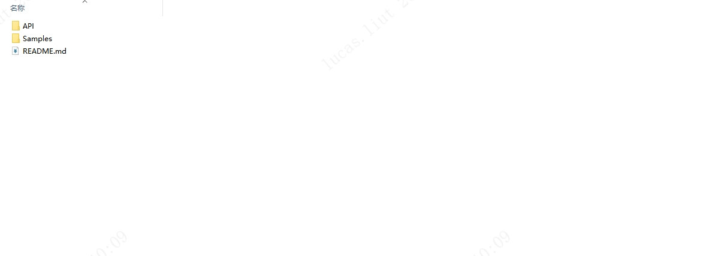

# 3.1.1. 基础介绍

Python SDK 开发包提供的 Sample 用于演示 SDK 的 API 接口使用，目录结构如下：

- API：主要包含 SDK 的通用头文件：Scepter_api.py，Scepter_define.py，Scepter_enums.py，Scepter_types.py。

- Samples：主要包含使用 ScepterSDK 开发的例程。

- README.md：SDK 的内容简介。
