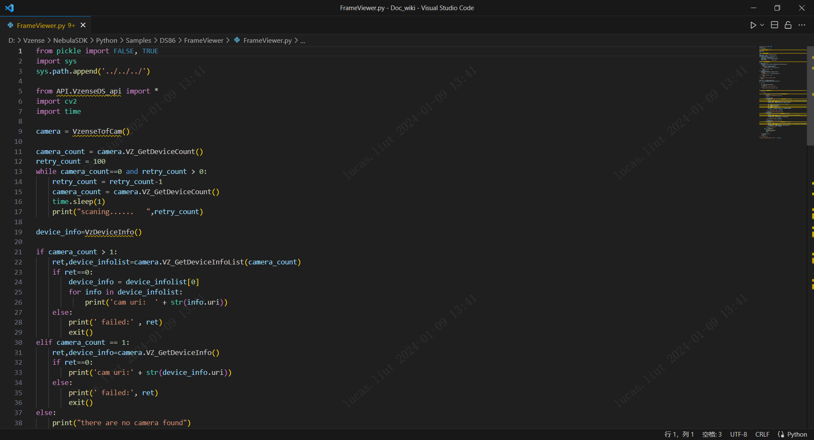
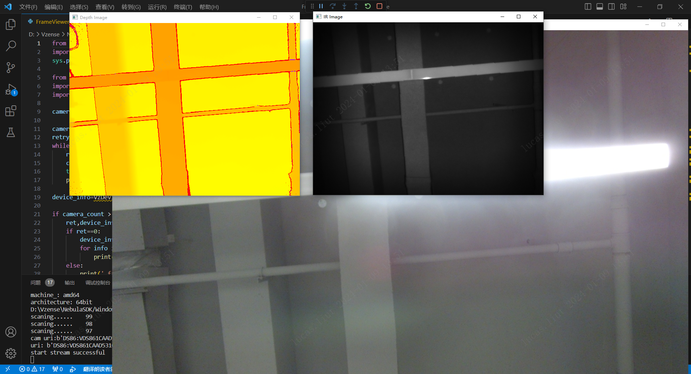

# 3.1.4. OpenCV 例程

OpenCV 例程用于展示如何搭配第三方库使用 Scepter SDK。例程使用 OpenCV 的图像映射功能展示彩色深度图像、IR 与 Color 图像。

1. 安装 opencv-python 模块。

   ```console
   pip install opencv-python
   ```

2. 根据实际产品选择对应的 sample，以 NYX650 为例

   

3. 运行 OpenCV 显示例程

   ```consle
   cd ScepterSDK\Python\Samples\NYX650\FrameViewer
   python FrameViewer.py
   ```

   
