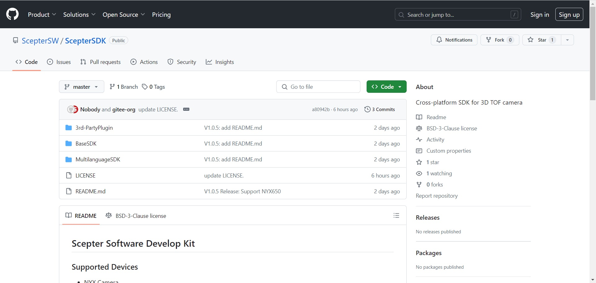

# 1. 简介

ScepterSDK 是基于 3D ToF 相机提供的软件开发包，该开发包目前适用于 Windows、Linux、ARM Linux 操作系统，为应用开发者提供一系列友好的 API 和应用示例程序。用户基于该开发包，可获取高精度的深度数据信息、灰度图像信息和彩色图像信息，方便用户开发刷脸支付、手势识别、投影触控、人脸识别、疲劳检测、三维重建、导航避障等 3D 应用。

文中所述ScepterSDK版本是**v24.10.3**。



ScepterSDK 下载链接：

<https://github.com/ScepterSW/ScepterSDK>

或

<https://gitee.com/ScepterSW/ScepterSDK>

您可以通过以下两种下载方式下载 ScepterSDK 开发包：

方式一通过 git clone 下载到本地；

方式二通过下载压缩包到本地。

<!-- tabs:start -->

#### **方式一**

① 打开下载链接，点击 Code，复制链接；

```shell
> git clone https://github.com/ScepterSW/ScepterSDK
```


② 打开终端，输入复制代码回车，等待下载完成。


#### **方式二**

打开下载链接，点击 Code，再点击 Download ZIP，即可将 ScepterSDK 压缩包下载到本地。

如需在 Ubuntu 系统下使用，请确保下载后的压缩包是在 Ubuntu 系统下解压，请勿在 Windows 系统解压后复制使用。


<!-- tabs:end -->

**SDK 主目录介绍**


ScepterSDK 提供的多平台和开发语言的开发包，包含如下内容：

**3rd-PartyPlugin：**

- ROS：目录包含 ROS 软件包。

- ROS2：目录包含 ROS2 软件包。

**BaseSDK：**

- Windows：目录包含个人计算机平台(x86_64) Windows PC 开发包, 使用标准编译器 VS2017。

- Ubuntu16.04：目录包含个人计算机平台(x86_64) Ubuntu16.04 开发包, 使用标准编译器 x86_64-linux-gnu(v5.4.0)。

- Ubuntu18.04：目录包含个人计算机平台(x86_64) Ubuntu18.04 开发包, 使用标准编译器 x86_64-linux-gnu(v7.5.0)。Ubuntu18.04 SDK 包与 Ubuntu20.04、Ubuntu22.04 兼容。

- AArch64：目录包含 64 位 Arm-Linux 开发包，使用标准编译器 aarch64-linux-gnu(v7.5.0)。

**MultilanguageSDK：**

- Python：目录包含 Python 开发包。

- CSharp：目录包含 C#语言开发包。

**LICENSE：**软件许可证条例文件。

**README.md：**ScepterSDK 简介与相关链接。

