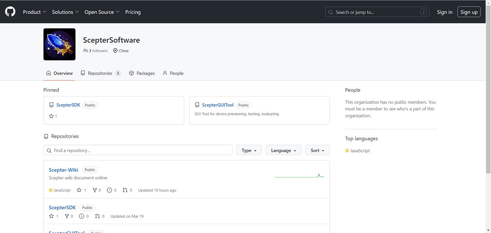

# 1. 简介

ScepterSDK 是基于 3D ToF 相机提供的软件开发包，该开发包目前适用于 Windows、Linux、ARM Linux 操作系统，为应用开发者提供一系列友好的 API 和应用示例程序。用户基于该开发包，可获取高精度的深度数据信息、灰度图像信息和彩色图像信息，方便用户开发刷脸支付、手势识别、投影触控、人脸识别、疲劳检测、三维重建、导航避障等 3D 应用。



您可以通过以下链接或 git clone 的方式来下载 ScepterSDK 开发包。

**ScepterSDK 下载链接：**：<https://github.com/ScepterSW/ScepterSDK>

镜像加速地址：<https://gitee.com/ScepterSW/ScepterSDK>

```consle
 git clone https://github.com/ScepterSW/ScepterSDK.git
```

**SDK 主目录介绍**

ScepterSDK 提供的多平台和开发语言的开发包，包含如下内容：

- BaseSDK (C/C++)

   - Arm-Linux(AArch64)：目录包含 64 位 Arm-Linux 开发包，使用标准编译器 aarch64-linux-gnu(v7.5.0)。

   - Ubuntu16.04：目录包含个人计算机平台(x86_64) Ubuntu16.04 开发包, 使用标准编译器 x86_64-linux-gnu(v5.4.0)。

   - Ubuntu18.04：目录包含个人计算机平台(x86_64) Ubuntu18.04 开发包, 使用标准编译器 x86_64-linux-gnu(v7.5.0)。Ubuntu18.04 SDK 包与 Ubuntu20.04、Ubuntu22.04 兼容。

   - Windows：目录包含个人计算机平台(x86_64) Windows PC 开发包, 使用标准编译器 VS2017。

- MultilanguageSDK

   - CSharp：目录包含 C#语言开发包。

   - Python：目录包含 Python 开发包。

- 3rd-Party Plugin

   - ROS：目录包含 ROS 软件包。

   - ROS2：目录包含 ROS2 软件包。

- LICENSE：软件许可证条例文件。

- README：ScepterSDK 简介与相关链接。