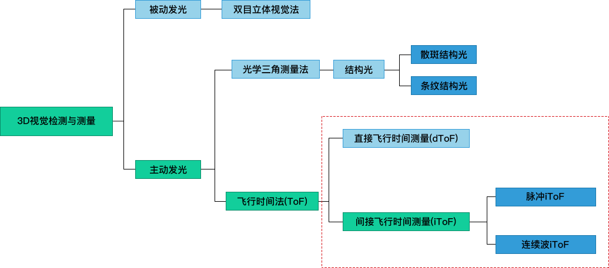
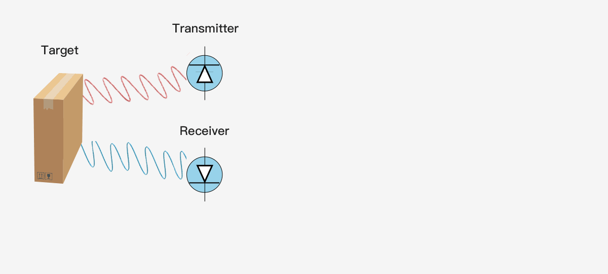
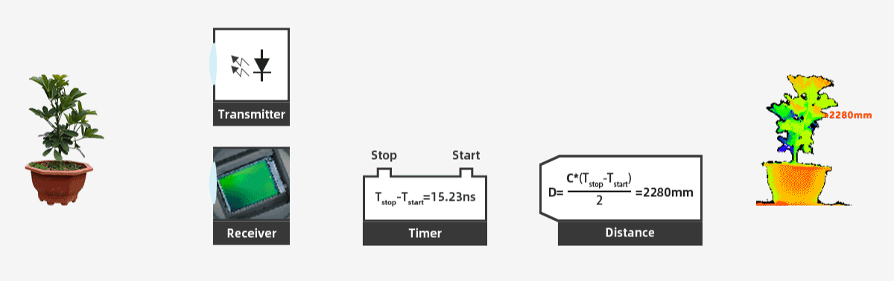

# 2. 3D 视觉技术的分类

双目视觉技术是通过三角测距法计算物体到相机的距离。同一物体在左右两个相机的成像位置是位置差的，不同的位置差可被反映到像素差，从而推算出距离；结构光技术是属于主动立体视觉技术，通过激光投射器投射出带有形状的光，这个形状照在物体上发生形变，然后推算出距离。

我们重点介绍 ToF（Time-of-Flight）技术，直译为飞行时间技术，广义上讲，所有测量介质飞行时间方式都属于 ToF 技术范畴。在以光为介质进行 ToF 测量时，其原理是，由 ToF 模组的光源向被测对象发出光子，在抵达被测对象并通过图像传感器接收反射回到 ToF 模组的光子，计量此段“光的飞行时间”，在光速已知的前提下，即可得到距离数据。

最简单的单像素 ToF 技术采用调制准直激光器作为发射器，单光电二极管作为接收器，可以用来提供单点的距离信息，若期望使用单像素距离传感器来提供整个场景的深度图，一般会采用某种扫描的形式，下图示是单像素 ToF 测距技术的原理。

3D ToF 技术是通过一次性成像来提供完整场景深度图，无扫描器件，随着半导体元器件尺寸的不断缩小，结构紧凑、高性价比的 ToF 深度相机在工业和消费电子领域得到了快速应用和发展。

