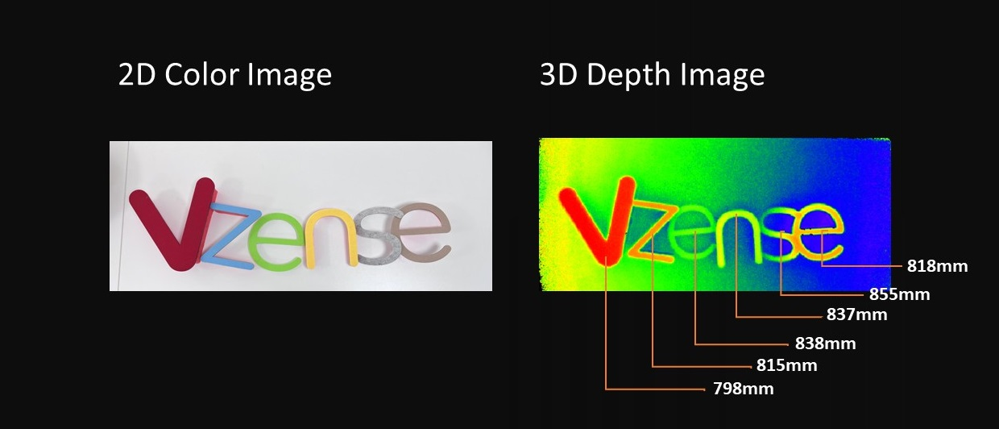

# 1. 3D 视觉技术简介

**让机器拥有“非凡”的视觉**

我们生活的世界是一个三维立体的空间，人类最重要的感知器官——眼睛，既可以为人类提供五颜六色的色彩信息，也可以在大脑中形成距离感，让我们可以感知到一个立体的世界。 自第一片 CCD 图像传感器在贝尔实验室诞生，在过去的几十年里，机器视觉和数码成像技术有了长足的进展，为社会各行各业赋予巨大的能量，人们的生活、工业自动化、航空航天等领域都开始与图像和视觉技术进行了广泛的链接。

机器视觉领域从萌芽到成长，以彩色视觉留存为切入点的二维图像技术经历了从模拟到数字，从静态到动态，从单色到彩色的演进过程。当前的三维视觉技术是人类为了提升机器视觉的维度，将立体图像呈现在眼前，可以满足以往 2D 视觉难以实现的应用场景，如 Face ID，手机，VR/AR，工业视觉等方向，在各行各业开始新一次的视觉革命！

如上图所示，不同于左侧传统彩色相机所拍摄出的图像，右侧立体视觉技术所展示出来的图像是一个由每个像素点到相机的距离值组成的。为了更好的呈现距离的差异，通常会将不同的距离值映射到色域空间，这样用户更容易理解深度图像的含义，如下图所示：

三维视觉技术的目的和发展方向就是通过各种方法来获取到更精准，更细腻，更快速的深度图像。
