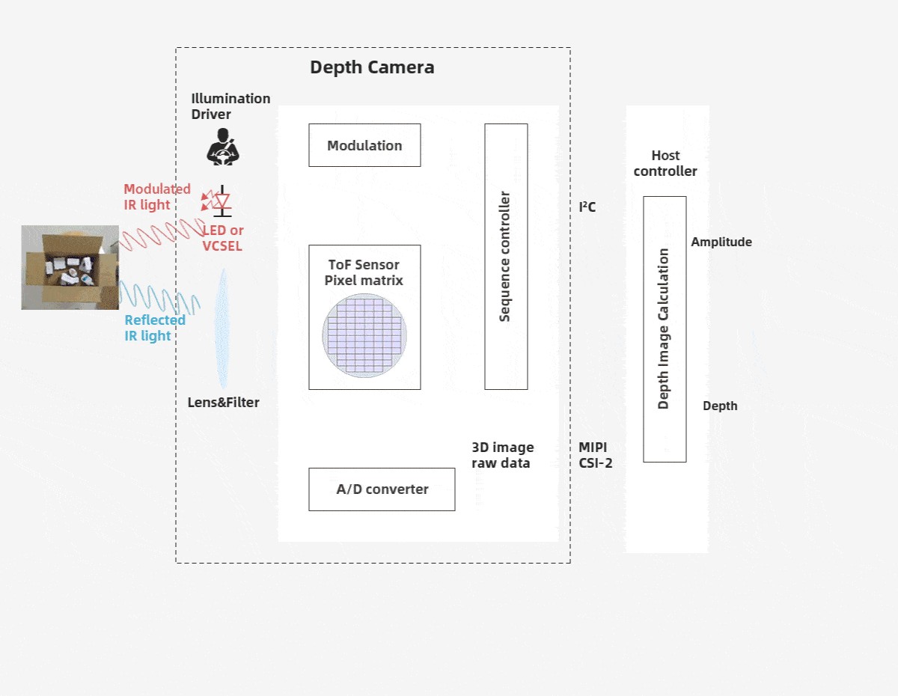

# 3. ToF 相机的组成

ToF 相机是指以光学系统为接受路径的面阵非扫描式 3D 成像深度信息捕捉技术，主要由照射单元，光学透镜，成像传感器，控制单元，计算单元等器件组成。

## 3.1. 照射单元

照射单元需要对光源进行脉冲调制之后再进行发射，调制的光脉冲频率可以高达 100MHz。因此，在图像拍摄过程中，光源会打开和关闭几千次，各个光脉冲只有几纳秒的时长。相机的曝光时间参数决定了每次成像的脉冲数。要实现精确测量，必须精确地控制光脉冲，使其具有完全相同的持续时间、上升时间和下降时间。因为即使很小的只是 1ns 的偏差即可产生高达 15cm 的距离测量误差。如此高的调制频率和精度只有采用精良的 LED 或激光二极管才能实现。一般照射光源都是采用人眼不可见的红外光源。

## 3.2. 光学透镜

用于汇聚反射光线，在光学传感器上成像，与普通光学镜头不同的是这里需要加一个带通滤光片来保证只有与照明光源波长相同的光才能进入，这样做的目的是抑制非相干光源减少噪声，同时防止感光传感器因外部光线干扰而过度曝光

## 3.3. 成像传感器

成像传感器是 TOF 相机的核心。该传感器结构与普通图像传感器类似，但比图像传感器更复杂，它包含 2 个或者更多快门，用来在不同时间采样反射光线。

## 3.4. 控制单元

相机的电子控制单元触发的光脉冲序列与芯片电子快门的开/闭精确同步。它对传感器电荷执行读出和转换，并将它们引导至分析单元和数据接口。

## 3.5. 计算单元

计算单元可以记录精确的深度图。深度图通常是灰度图，其中的每个值代表光反射表面和相机之间的距离。为了得到更好的效果，通常会进行数据校准。
