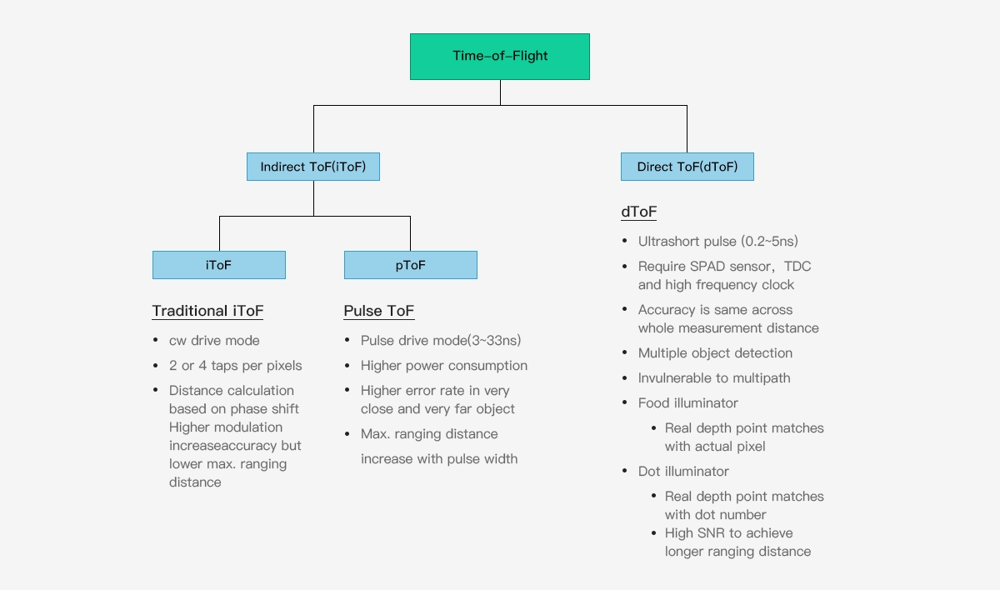
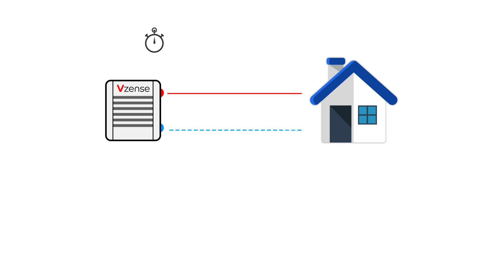
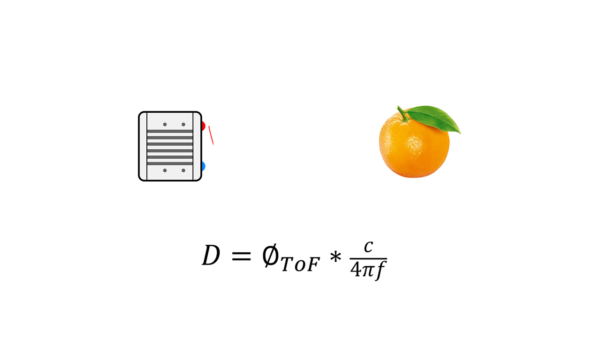
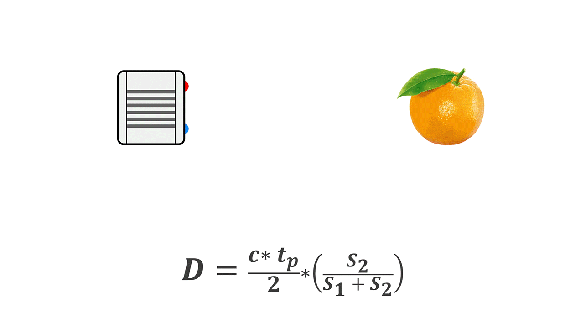

# 4. ToF 相机的实现原理

ToF 3D 相机技术按照具体的实现方式，又可以分为 iToF（indirect ToF）和 dToF（direct ToF）。iToF 又分为连续波（Continuous Waveform）ToF 和脉冲式（Pulse Based）ToF，如下图所示：

## 4.1. dToF 技术实现方式

dToF (direct time-of-flight) ，即直接飞行时间测距法，通过内部定时器计时的方式直接测量由发射端发出激光脉冲的时间 tstart 与经物体反射后回到接收端 tstop 的时间差，结合光速 c，获取距离深度数据 d，与下文提到得通过信号相位差来间接测量发射信号和接收信号的时间差的方式相比，这种测量时间差的方式更为直接，因此称为直接飞行时间测距法。

直接飞行时间测距原理直接且简单，但技术层面对发射端的光源、接收端的图像传感器，以及实现同步、时间检测相关电路都有着很高的要求。比如对发射端来说要产生这种短脉冲就有一定要求，而接收端的图像传感器也需要使用灵敏度极高的光探测技术来检测微弱的光信号，如单光子雪崩二极管（SPAD）技术。

## 4.2. CW iToF 技术实现方式

连续波 CW iToF 的基本原理是通过把光调制成固定频率 f 的正弦波，发射端按照频率 f 发射正弦波，在采集返回的光能量时，CW iToF 会开通多个窗口，对多个窗口收集的数据做采样，解析出一个周期内发射和接受之间的相位差信息，然后通过以下公式获得距离信息。

绝大多数连续波 ToF 系统都使用 CMOS 传感器，特别是背照式 CMOS 工艺技术大幅度提高了感光面积，提升了光子收集率和测距的速度，响应时间能够达到 ns 级；为实现相位解缠，CW ToF 会应用多调制频率——这种方法对于减少多径错误会很有帮助；CW iToF 是全 CMOS 成像系统，具备更好的弹性、更快的读出速度，但 CW iToF 方法也有一些缺点，它的图像传感器要求多调制频率下相关函数的四次采样，加上多帧处理，这样一来信号处理的复杂度会变高，可能会要求额外的应用处理器；对于更远的距离测量，或者场景内的环境光比较强，那么连续输出功率要求比较高，这对发热和稳定性会有影响。

## 4.3. Pulse iToF 技术实现方式

下图是 Pulse iToF 的原理示意，通过把光调制成固定频率 f 的方波，发射端按照频率 f 发射脉冲信号，接收端的传感器由两个电子快门（s1, s2）组成，S1 窗口的频率和相位与发射脉冲是一致的，S1 和 S2 窗口在打开（高电平）时，在各自的时间内积累由物体反射回来的光子，通过计算 s1 和 s2 不同的能量值比例，解析出信号相位，从而推算出发射信号和接收信号的时间差，进而获得距离数据。

相比 CW-iToF 连续波调试方式，Pulse iToF 解算深度更简单、计算量更低，对于平台后端处理能力要求也相应更低。从 Pulse iToF 的原理看，Pulse iToF 是在短时间窗内发射高强度光脉冲，从而可以减少背景光信号的影响，使其对环境光变化的适应性更强，对场景运动模糊等问题的抵御也更好。（引自黄烨峰的文章）

